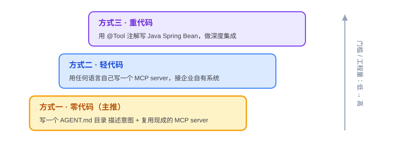
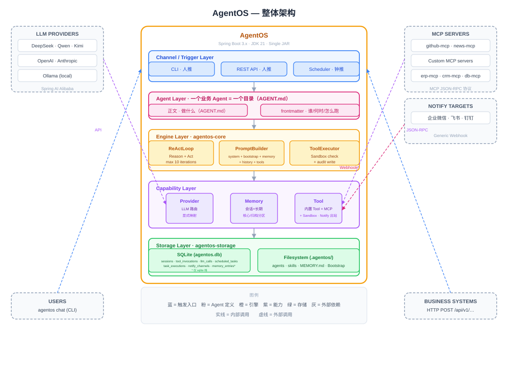

<p align="center">
  
</p>

<p align="center"><strong>企业能完全掌控的、Java 原生的、私有可审计的 Agent 统一底座。</strong></p>
<p align="center"><strong>A Java-native, self-hosted, auditable Agent OS for the enterprise.</strong></p>

<p align="center">
  
  
  
  
</p>

---

**阅读路径**

- **30 秒**：tagline → 顶部状态横幅 → [AgentOS 是什么](#agentos-是什么-为什么需要它) → [对比表](#为什么不是-openclaw--hermes)
- **3 分钟**：+ [五大核心能力](#五大核心能力设计目标) → [架构](#架构设计) → [Quickstart（预期行为）](#quickstart预期行为开发中)
- **10 分钟**：+ [与 Dify / Spring AI 的关系](#与-dify--spring-ai-的关系边界声明) → [安全设计原则](#安全设计原则) → [Roadmap](#roadmap) → [文档导航](#文档导航) → [Contributing](#contributing)

（术语说明：本文中的 **Agent / Profile / Provider / Tool / Skill / Channel / Workspace** 等概念，以[需求文档术语表](docs/DemandAnalysis.md)的定义为准。）

---

## AgentOS 是什么 / 为什么需要它

先分层：**agent runtime** 让一个 Agent 跑起来，**Agent OS** 让一群 Agent 在企业里被管起来。AgentOS 做的是后者——一个装好就跑、配置即用的常驻运行时底座：企业上一个新 Agent，放一个 Agent 目录（一份 `AGENT.md`）就能跑起来。

为什么现在做这件事，两个原因：

1. **严监管企业的刚性需求。** 银行、证券、政企要跑 Agent，得过安全审查、要全程可审计、要私有部署。现有开源 Agent OS 偏个人到小团队定位，企业级治理不是它们的重心（详见[业界调研](docs/IndustryResearch.md)）。
2. **Java 生态在 Agent OS 层的缺位。** Java 是企业后端的事实标准，但“装好就跑的 Agent OS”这一层在 Java 生态是空的。Java 体系的企业今天只能用 Node.js 或 Python 的 Agent OS，再在技术栈接缝处写大量胶水。AgentOS 补的就是这个缺位，并且直接站在 Spring AI 与整套 JVM 运维工具链上。

## 为什么不是 OpenClaw / Hermes

两句话讲清定位（详见[业界调研](docs/IndustryResearch.md)）：

1. 如果你的 Agent 要跑在银行、政企的生产环境里，它得过安全审查、要全程可审计、要融进现有 Java 体系——OpenClaw（Node.js，个人向）和 Hermes（Python，小团队向）都填不了这个位置。
2. AgentOS 与两者是同类不同定位：不比社区活力和可玩性，比私有部署、可审计和技术栈对齐——而完整的多租户/SSO/审计治理层在扩展阶段交付，我们不提前承诺。

> **名称说明**：OpenClaw 与 Hermes 为本文对两类真实开源项目的化名指代（社区型 / 工程型），代表性对标项目与完整对比见[业界调研](docs/IndustryResearch.md)。两者在各自定位上的优势（社区活力与能力丰富度 / 工程健壮性）都是真实的，本文只做“定位不同”的陈述。

| 维度 | OpenClaw | Hermes Agent | AgentOS |
|---|---|---|---|
| 语言生态 | Node.js | Python | Java（JDK 21 + Spring Boot 3.x） |
| 定位 | 个人 / 开发者优先，可玩性极强 | 小团队 / 工程健壮性优先 | 严监管企业 |
| 治理能力 | 企业级安全治理非其重心 | 部分企业方向投入，多租户/SSO/完整审计未见完整方案 | 多租户 / SSO / 完整审计 / Tool Policy——**扩展阶段交付** ⏳ |
| 分布式前景 | 未见公开规划（以各自官方信息为准） | 未见公开规划（以各自官方信息为准） | 单机做扎实 → Spring Cloud 生态分布式 → 分布式 Agent 协作（远期） |

> **面向安全评审的诚实声明**：核心阶段的沙箱为**应用层白名单校验**（`SandboxChecker`），不是容器 / microVM 级强隔离；容器化隔离按信号驱动在扩展阶段演进（见[安全设计原则](#安全设计原则)）。评估时请以此口径判断是否满足贵司的隔离要求。

## 与 Dify / Spring AI 的关系（边界声明）

**AgentOS 做运行时，不做编排。**

- **与 Dify / Coze 等编排平台是互补，不是竞争。** Dify 编排的是“流程”，AgentOS 承载的是“常驻的 Agent”。两者可以组合：Dify 作为应用层/客户端，调用 AgentOS 的 API，AgentOS 作基础设施层。
- **与 Spring AI / Spring AI Alibaba 是复用，不是重复造轮子。** 框架是“给你材料自己盖房子”，AgentOS 是“盖好的房子拎包入住”。AgentOS 内部的 LLM 调用层正是直接复用 Spring AI / Spring AI Alibaba 实现的——框架作组件，AgentOS 作运行时。

## 五大核心能力（设计目标）

阶段标注：✅ 核心阶段实现目标（运行时内核） / ⏳ 扩展阶段补齐。

| # | 能力 | 阶段 | 说明 |
|---|---|---|---|
| 1 | **Provider 多模型对接** | ✅ | 基于 Spring AI Alibaba 复用主流 LLM connector（通义、DeepSeek、Kimi、智谱等），`ProviderService` 统一屏蔽厂商差异；Provider Fallback 三层 failover 为扩展项 ⏳ |
| 2 | **ReAct 循环（自实现）** | ✅ | 不依赖框架的 Agent 抽象，循环行为对使用者完全透明：每一轮“思考-行动-观察”可审计、可调试、可干预；Tool 失败由 LLM 在循环内自行决策重试，框架级重试与流式中断处理在扩展阶段补齐 ⏳ |
| 3 | **Memory 三层记忆** | ✅/⏳ | 会话记忆 ✅ + 长期记忆 ✅（Markdown 默认档，`LongTermMemoryStore` 接口预留 SQLite/Mem0 档切换）+ 情景记忆 ⏳ |
| 4 | **Tool 体系** | ✅ | 核心阶段 9 个内置 Tool；三档接入（见下表），主推 `AGENT.md` 目录 + MCP 零代码 |
| 5 | **Web Service** | ✅ | 核心阶段 18 个 REST 端点（基础 10 + 收尾 8），覆盖会话、调用、信息查询与系统状态，以及通知渠道、定时任务的管理操作；流式 SSE、Prometheus metrics 等为扩展项 ⏳ |

**三档 Tool 接入：**

| 方式 | 代码量 | 推荐度 | 适用 |
|---|---|---|---|
| 方式一：写 Agent 目录（`AGENT.md`）+ 复用社区 MCP server | 零代码 | ⭐⭐⭐ 主推 | 业务方只描述意图，LLM 自己组合调用 |
| 方式二：用任何语言写 MCP server | 轻代码 | ⭐⭐ | 接入企业自有系统（ERP、CRM） |
| 方式三：写 Java `@Tool` Bean | 重代码 | ⭐ | 深度集成，性能最好 |



**三种触发源**：CLI 交互 / REST API / 定时任务（cron）。

## 架构（设计）



- **部署形态**：AgentOS 是**独立常驻进程**（单二进制），企业现有系统经 REST API 接入；Java 体系可通过方式三在进程内写 `@Tool` Bean 做深度集成。
- **Maven 多模块，9 个模块，单二进制交付**（GraalVM Native Image 为扩展阶段引入的优化方向）。
- **技术栈**：JDK 21 + Spring Boot 3.x + Spring AI Alibaba + 自实现 ReAct 循环 + SQLite（Spring Data JPA）+ Picocli 命令行。
- 审计相关的 `tool_invocations` / `llm_calls` 两张表 **day one 写入**，让“可审计”的数据地基从第一天就立起来。
- Sandbox 策略接口先行：核心阶段为应用层白名单（`SandboxChecker`），容器 / microVM 隔离按信号驱动在扩展阶段演进。

详见[技术方案](docs/TechnicalSolution.md)。

## Quickstart（预期行为，开发中）

> **注意**：以下为设计中的命令示意，当前仓库尚无可运行代码，构建与命令在未来版本交付后可用。仓库公开地址待发布，下述 clone URL 为占位符，发布时替换。

从源码构建（未来可用）：

```bash
git clone https://github.com/<org>/agent-os-poc.git   # 占位地址，待发布替换
cd agent-os-poc
mvn clean package          # 预期：产出单二进制可分发包（规划中）
```

初始化工作区并创建第一个 Agent（规划命令）：

```bash
agentos init               # 预期：在当前目录创建 .agentos/ 工作区（幂等，不覆盖已有文件）
agentos profile create daily-weather   # 预期：生成最小 AGENT.md 模板
agentos chat               # 预期：CLI 交互对话
agentos serve              # 预期：启动 Web Service，暴露 18 个 REST 端点
```

**首个版本将验证什么**——两个验收 Demo：

1. **每日天气**：定时任务触发，Agent 查天气并经通知渠道推送。
2. **每日科技日报**：`AGENT.md` 目录 + 公共 Skill 软连接绑定（渐进式披露，prompt 中只出现 Skill 元数据）实现零代码接入，可选配 MCP；定时汇总多源信息，生成体现用户记忆偏好的日报并推送。

**当前你能做的**（在可运行版本交付前）：

- 阅读 [docs/](docs/) 四份设计文档，提出评审意见（不一致、过度承诺、遗漏场景都是宝贵输入）；
- 通过 [Issue 列表](../../issues)（仓库公开后可用）参与能力边界与优先级的讨论；
- Watch 本仓库，获取首个可运行版本发布的通知。

## 文档导航

[docs/](docs/) 是本项目的权威设计来源：

| 文档 | 回答的问题 | 一句话 |
|---|---|---|
| [DemandAnalysis.md](docs/DemandAnalysis.md) | What | 需求文档：目标用户、场景、五大能力与功能需求 |
| [TechnicalSolution.md](docs/TechnicalSolution.md) | How | 技术方案：架构、模块、关键技术决策 |
| [AiProgrammingGuide.md](docs/AiProgrammingGuide.md) | 实施 | AI 辅助编程指南：Spec-Kit 流程与四周开发计划 |
| [IndustryResearch.md](docs/IndustryResearch.md) | 背景与定位 | 业界调研：Agent OS 格局、Java 生态缺位、定位与路线 |

**新贡献者阅读顺序建议**：IndustryResearch → DemandAnalysis → TechnicalSolution → AiProgrammingGuide。

## Roadmap

| 阶段 | 内容 | 状态 |
|---|---|---|
| **核心阶段（当前）** | 运行时内核：Provider / ReAct / Memory（两层）/ Tool（9 内置 + 三档）/ Web Service（18 端点） | 设计文档完成 ✅；实现开发中（未开始勾选实现项） |
| **扩展阶段** | 多租户 RBAC、SSO、完整审计查询、Tool Policy、IM Channel（企微/飞书/钉钉）、情景记忆、流式 SSE、Prometheus metrics、容器化沙箱、GraalVM Native Image、Memory 写入/清理等扩展端点 | ⏳ 规划中 |
| **远期** | 单机 → 底座分布式部署（多实例 + 外置状态，Spring Cloud 生态）→ 分布式 Agent 协作（跨节点互发现、互委托） | ⏳ 愿景 |

核心阶段细分进度以 [AiProgrammingGuide](docs/AiProgrammingGuide.md) 的任务清单为准。

## Contributing

POC 阶段的贡献以**设计评审、Issue 讨论、文档改进**为主：

**如何参与**（仓库公开后）：

- **提评审意见**：对四份设计文档提出评审意见（不一致、过度承诺、遗漏场景都是宝贵输入）——直接开 [Issue](../../issues)；
- **参与讨论**：通过 Issue 讨论能力边界与优先级（含 License 之外的所有开放项）；
- **改进文档**：直接提 PR。

**开发流程**：本项目按 Spec-Kit 流程开发（spec → plan → tasks），每个功能先成文、再评审、再实现。

**社区共建方向（预留）**：更多 Provider connector、MCP server 生态适配、IM Channel、Skill 库共建、文档与示例 Agent。

### 安全设计原则

定位严监管企业，安全是 day one 设计而非事后补丁：

1. **最小权限**：文件操作限制工作目录，Shell 命令白名单，HTTP 域名白名单；
2. **白名单强制**：核心阶段即落地 `SandboxChecker` 应用层校验（注意：是应用层白名单，非容器/microVM 强隔离，后者为扩展阶段 ⏳）；
3. **凭证不落地**：敏感配置经环境变量或独立本地配置注入，不明文写入 `AGENT.md`；
4. **全链路审计**：`tool_invocations` / `llm_calls` 从核心阶段第一天写入 SQLite（完整审计查询接口为扩展阶段 ⏳）。

## License

**Apache License 2.0**（见根目录 [LICENSE](LICENSE) 文件，随初始提交引入）。若维护者后续对许可证另有决定，以仓库 LICENSE 文件的实际状态为准。

## 致谢与借鉴

AgentOS 的设计站在开源 Agent OS 领域已验证的模式之上：Agent 配置与生命周期、Channel 抽象、三层记忆、单二进制部署等在社区型与工程型开源 Agent OS 上验证过的设计，以及 **Anthropic Agent Skills** 的目录 + 渐进式披露形态（在 AgentOS 中，一个目录定义的是一个 Agent）。AgentOS 把这套设计在 Java 生态重新实现，并补齐企业级 Agent OS 必需的治理能力（扩展阶段交付）。
