# AgentOS 技术方案

本文档定义 AgentOS 的技术方案，回答 How 的问题。前置阅读《项目篇 AgentOS 业界调研》和《AgentOS 需求文档》。本文档以需求文档定义的五大核心能力（对接 LLM、ReAct 循环、Memory 记忆、Plugin Tool、Web Service）为骨架展开，每个模块只给职责和功能说明，不展开代码细节。代码层面的实现细节在研发阶段补充。

> 承接需求文档的定位判断：核心阶段交付的是 AgentOS 的运行时内核，能力上对齐业界开源 Agent OS 的基础层；让 AgentOS 成为真正企业级 AgentOS 的治理层（多租户、SSO、完整审计、Tool 治理）在扩展和社区阶段补齐。本技术方案只覆盖核心阶段的运行时内核，并在架构上为治理层预留扩展点。

> **文档结构提示：** 全文分三部分。第一部分（第 1-10 章）是**底座**——让任意 Agent 都能可靠运行的引擎、能力和支撑设施，本身不是某个具体的业务 Agent。第二部分（第 11 章定义一个 Agent）讲底座之上怎么真正**定义一个业务 Agent**（Skill 定义做什么，Profile 绑定怎么跑，Web Service 是对外的定义入口）。第三部分（第 12-15 章）是两部分放到一起之后的整合验证、实施节奏和收尾。

---

# 第一部分：底座（AgentOS 内核）

## 1. 方案概述

AgentOS 是一个 **Spring Boot 3.x** 单体应用，跑在 **JDK 21** 上，基于 **Spring AI 官方模型 starter** 做 LLM 调用（MiniMax 走原生 starter `spring-ai-starter-model-minimax`，`spike/007-react-loop/README.md` 第二组 D5 实测定案；Spring AI Alibaba 只以 BOM 参与版本对齐），自己实现 **ReAct 循环** 作为 Agent 核心。整个 AgentOS 是一个可执行 JAR，单二进制部署，扩展阶段引入 **GraalVM Native Image** 进一步压缩启动时间和内存占用。

> **技术栈选型一句话总结**：JDK 21 + Spring Boot 3.x + Spring AI 官方 starter（SAA BOM 管版本）+ 自实现 ReAct 循环 + SQLite + Picocli 命令行。

### 1.1 关键技术决策

需求文档定义了五大核心能力，下面统一列出 7 个关键决策的取舍。先用一张表速览，再逐条展开。

| # | 决策 | 选择 | 理由 |
| --- | ------ | ------ | ------ |
| 1 | ReAct 循环 实现方式 | 自实现，不依赖 Spring AI Agent 抽象 | 完全可控，保留未来定制循环行为的空间 |
| 2 | Spring AI 使用边界 | 只用 Provider 抽象 + 协议转换 + `@Tool` schema 生成，禁用自动 tool 执行 | 避免 tool 被调两次，ReAct 循环完全由 AgentOS 自己掌控 |
| 3 | 执行模型 | 同步阻塞 + Java 21 virtual thread | 直观简洁，无需响应式编程，单节点撑高并发 |
| 4 | Tool 注册机制 | **`AgentOSTool`** 接口抽象（内置 Tool 直接实现、MCP 经适配器包装）加 `@Tool` 注解扫描（仅方式三） | 统一内置 Tool 和 MCP Tool 接口，ReAct 循环不感知 Tool 来源 |
| 5 | HTTP 服务层 | Spring MVC + Java 21 virtual thread | 同步直观，单机撑千级并发，扩展阶段 `SseEmitter` 支持流式 |
| 6 | Sandbox 策略 | 接口先行：`Sandbox` 抽象 + `SandboxChecker`（应用层 Path/Pattern 白名单）实现，扩展阶段按容器→microVM 演进 | `SecurityManager` 在 JDK 17 起废弃、JDK 21 已不可用，与 JDK 21+ 要求冲突；接口独立于白名单实现，未来换重隔离方案不用改调用方 |
| 7 | 持久化方案 | SQLite + Spring Data JPA + `MEMORY.md` 文件 | 单二进制，审计表 day one 写入，避免后期从日志反解析返工 |

#### (1) 决策一：自己实现 ReAct 循环

Spring AI 负责 LLM 调用、Function Calling 的协议格式转换、Provider 抽象这些底层工作，ReAct 循环 自己写，保证 Agent 核心完全可控，也保留未来定制循环行为的空间。

#### (2) 决策二：明确划清 Spring AI 的使用边界

这是最容易埋 bug 的地方，单列为一条决策。Spring AI 自身带有一套完整的 tool calling 自动执行机制（能自动执行 tool 再把结果回灌给模型）。

AgentOS **不使用**这套自动执行，只用 Spring AI 的两件事：

- 一是 Provider 抽象和向各家 LLM 的协议转换
- 二是 `@Tool` 注解的 JSON Schema 生成

Tool 的实际调度和执行完全由 AgentOS 自己的 **`ReActLoop`** 加 **`ToolExecutor`** 控制。换句话说，Spring AI 在 AgentOS 里只做协议适配器和 schema 生成器，不做循环引擎。研发时必须禁用 Spring AI 的自动 tool 执行，否则会出现 tool 被调两次的问题。禁用经**结构化强制**（设计评审 Q2 决议，2026-09-14）：全工程只允许经一个工厂方法构造 `ToolCallingChatOptions`，`internalToolExecutionEnabled(false)` 硬编码在工厂内，并配套"tool 永不被 Spring AI 自动执行"的防回归测试；工厂类与测试的落位见各阶段实施计划。

#### (3) 决策三：同步执行模型

核心阶段采用同步阻塞执行模型，跟 Spring MVC 一致。一次消息从进来、ReAct 循环 执行、Tool 调用、Provider 调用到最终响应返回，全程同步。这跟 Java 21 的 virtual thread 配合得很好，单节点支撑高并发不需要响应式编程。扩展阶段引入流式输出（SSE）和异步 Tool 调用。

#### (4) 决策四：Tool 注册机制以 `AgentOSTool` 抽象层为主干

内置 Tool 直接实现 `AgentOSTool` 五方法接口（方法清单见 6.1 AgentOSTool 抽象；schema 手写 JSON text block、`sandboxActions` 无默认实现，漏实现编译期报错——设计评审 Q9 决议，2026-09-14），MCP Tool 经适配器包装（见 6.4 Plugin Tool 方式二）；Spring AI 的 `@Tool` 注解只承载方式三——为业务方 Java Bean 生成 JSON Schema、扫描后包装注册。三路工具统一成 `AgentOSTool` 实例，ReAct 循环不感知 Tool 来源。注解的确切名称和用法以采用的 Spring AI 版本为准，研发前需对当前版本核实。

#### (5) 决策五：HTTP 服务层用 Spring MVC 加 Java 21 virtual thread

同步直观的代码加 virtual thread 的高并发能力，单机轻松撑住几千并发（按 DemandAnalysis.md - 8.1 性能 目标 100 并发的 10 倍余量论证，见第 14 章性能和可扩展性考虑）。扩展阶段要 SSE 流式返回时，Spring MVC 的 `SseEmitter` 也能支持。

#### (6) 决策六：Sandbox 先定接口，核心阶段只填一档实现

隔离强度和开销是一个跷跷板，从轻到重依次是应用层白名单校验、容器隔离（namespace + cgroups + seccomp）、microVM（Firecracker / Kata / gVisor）、完整虚拟机或物理隔离。为了不让核心阶段的实现选择绑死未来的架构，先抽象出一个 `Sandbox` 接口，表达"在受控环境里执行一个动作"这个意图，不携带任何一档实现特有的概念（不出现"容器镜像""VM 配置"字样）。核心阶段只实现 `SandboxChecker` 这一档：文件操作限制工作目录、Shell 命令白名单、HTTP 域名白名单、通知渠道独立域名白名单（`notify.allowed_domains`，第四周随通知交付，出处 DemandAnalysis.md - 5.6 Tool 体系、详见 6.7 Sandbox 检查），在应用层做校验，不使用 Java `SecurityManager`（它在 JDK 17 起已废弃、JDK 21 已不可用，与本项目 JDK 21+ 要求冲突）。MCP Tool 与 @Tool Bean 两类 Plugin Tool 不经 SandboxChecker 校验，治理边界详见 6.7 Sandbox 检查（设计评审 Q5③ 决议，2026-09-14）。扩展阶段按信号驱动升级：出现"要跑不可信代码或要多租户"时上容器隔离；出现"要跑完全不可信代码或要规模化多租户"时上 microVM。`Sandbox` 是纯校验接口（策略层：动作允不允许）；容器/microVM 级受控执行（执行层：在隔离环境里跑动作）是扩展阶段另立的 `execute_code` Runner 接口——校验与执行分离，各自演进互不绑死。

#### (7) 决策七：持久化用 SQLite 加 Spring Data JPA，Memory 长期记忆用 `MEMORY.md` 文件

默认 Markdown 档；接口预留 `memory.backend` 切换，SQLite/Mem0 档扩展阶段补齐（见第 5 章核心能力三：Memory 三层记忆）。Agent 目录放 `.agentos/agents/`，Session、Tool Invocation、LLM Call 落 SQLite。其中审计相关的 `tool_invocations` 和 `llm_calls` 两张表，从核心阶段就开始写入（查询接口先不做，放扩展阶段），让可审计这个差异化能力的数据地基在 day one 就立起来，避免后期从日志反解析返工。完整的向量检索方案在扩展阶段升级（详见第 9 章数据持久化）。

### 1.2 整体技术栈

AgentOS 的完整技术栈：

1. **JDK 21** 加 **Spring Boot 3.x**（virtual thread 处理高并发）
2. **Spring AI** 官方模型 starter（LLM Provider 抽象与协议转换；MiniMax 走原生 starter，`spike/007-react-loop/README.md` 第二组 D5）加 **Spring AI Alibaba BOM**（只做版本对齐，不用其 connector）
3. 自实现 **ReAct 循环**（Agent 核心循环）
4. **Spring MVC**（HTTP API 服务层）
5. **Picocli**（命令行工具）
6. **SnakeYAML**（AGENT.md frontmatter 的 YAML 解析）
7. **SQLite** 加 **Spring Data JPA**（Session、审计和元数据持久化；SQLite 无官方 Hibernate 方言，方言包 `org.hibernate.orm:hibernate-community-dialects` 引入、版本随 Spring Boot BOM 的 `hibernate.version` 托管，见 9.2 SQLite 关系型数据）
8. **MCP Java SDK**（MCP Client 集成；引入方式已由 `spike/008-mcp` 实测定案：经 `spring-ai-mcp`（1.1.2，版本由 spring-ai-bom 管理）传递引入 `io.modelcontextprotocol.sdk:mcp:0.17.0`，`spring-ai-starter-mcp-client` 不引入，见 `spike/008-mcp/README.md` 的 D1/D6 决议）
9. **Logback** 加 **SLF4J**（结构化日志）
10. **Micrometer** 加 **Prometheus**（指标采集，扩展阶段）

---

## 2. 整体架构

AgentOS 的整体架构按"五大核心能力加支撑模块"组织。五大核心能力是 AgentOS 运行时内核的主体，支撑模块是让这些能力跑起来需要的工程基础设施。

整体上，AgentOS 是一个 Spring Boot 单体应用，对外有两个人工触发入口，加一个内部自动触发入口：

1. **CLI Channel** 用于本地交互和调试，**Web Service** 用于业务系统通过 REST API 集成，这两个是"人推"；**`AgentScheduler`**（8.5 定时任务）按 cron 到点自动发起调用，是"钟推"。三个入口的消息最终都汇入同一个引擎，`AgentService` 作为统一入口不区分消息从哪个入口来。
2. 引擎是 **ReAct 循环**，它是整个系统的中枢，负责把"接收消息、组装 Prompt、调用 LLM、执行 Tool、回填结果、继续推理"这条链路驱动起来。引擎自己不直接干活，而是调度三块能力：
   1. **Provider** 负责 LLM 调用并向外对接各家大模型 API
   2. **Memory** 负责会话和长期记忆——会话记忆落 SQLite，长期记忆默认落 `MEMORY.md` 文件（按 `<Agent>/<user>/` 分档，见 5.1 模块组成）
   3. **Tool** 负责工具执行并通过 MCP Client 向外对接外部 MCP server

这三块能力之下是存储层，Session 和审计数据落 SQLite，Profile、Bootstrap、长期记忆 `MEMORY.md`、Skill 这些数据落文件系统。

这个架构有两个要点：

1. 所有能力收敛到一个引擎、两类存储（SQLite + 文件系统）、一个进程内，符合"单二进制、装好就跑"的定位，外部依赖（LLM 厂商 API、外部 MCP server）都在应用边界之外，AgentOS 自身不绑定任何一家。
2. 引擎和能力之间、能力和外部之间都通过抽象接口解耦，这让扩展阶段加新 Channel、新 Provider、新 Tool 时只需在边缘扩展，不动核心引擎。

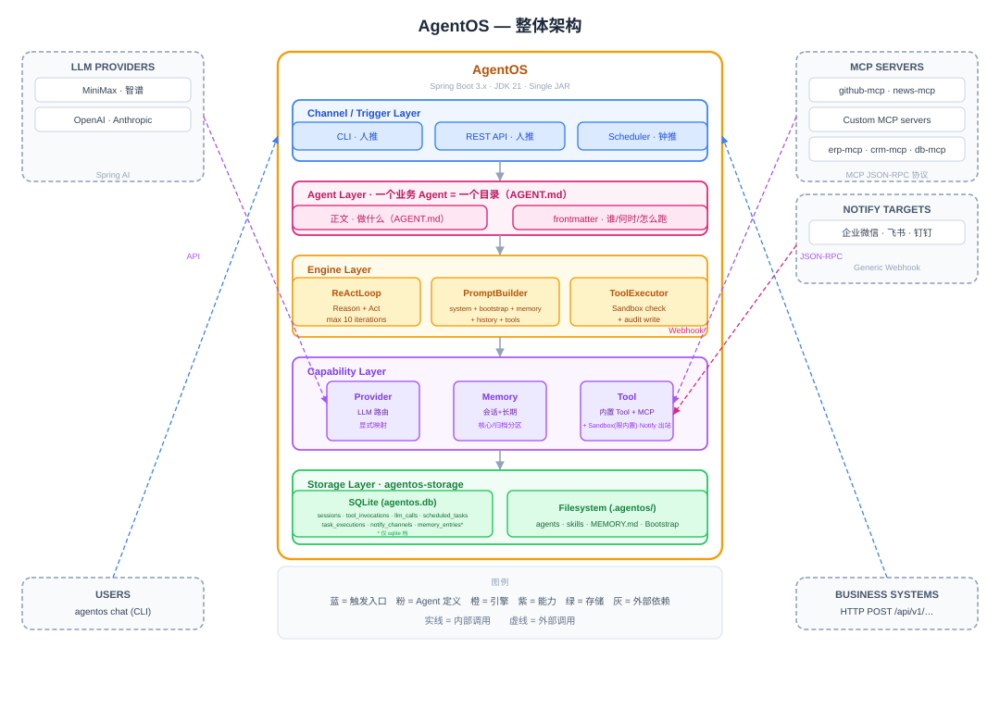

### 2.1 分层视图

从上到下分五层。五层的分类维度并不完全相同，先声明清楚：**接入层、引擎层、能力层**是运行时消息处理路径（一次调用的执行次序，消息自上而下流经）；**Agent 层**是静态定义来源——消息不流经它，引擎组装 prompt 时经 `ContextLoader`/`AgentLoader` 从 Agent 目录取内容（见 8.2 Profile 配置 / 8.3 上下文加载）；**存储层**是持久化地基（Session、审计数据与 Agent 定义、记忆等文件的落盘处）。

1. **接入层**（CLI Channel、Web Service 的 REST API、`AgentScheduler` 定时触发），负责消息进出；钟推只进不出，其结果出口见本章末"简化成一句话"与 6.8 通知推送。
2. **Agent 层**（`.agentos/agents/` 下的 Agent 目录：`AGENT.md` 正文定义做什么、frontmatter 定义怎么跑），是业务 Agent 的定义处；定义被底座使用由 core 侧的加载派生承担——`AgentLoader` 把 frontmatter 派生成 Profile（8.2 Profile 配置），`ContextLoader` 每迭代现读 `AGENT.md` 正文、Bootstrap 与 Skill 元数据供给引擎（8.3 上下文加载）。
3. **引擎层**（`ReActLoop`、`PromptBuilder`、`ToolExecutor`），是 Agent 的大脑。
4. **能力层**（Provider、Memory、Tool），给引擎提供 LLM 调用、上下文、执行能力。
5. **存储层**：Session 与审计数据落 SQLite（agentos-storage，见 9.2 SQLite 关系型数据）；Agent 目录、Skill、长期记忆 `MEMORY.md`、Bootstrap 这些数据落文件系统（见 9.3 文件系统数据）。

`AgentService` 未列入引擎层：它是接入层与引擎层之间的统一编排入口，三种触发源的消息在此收口，依次绑定 ProfileContext（Profile 与 user）、驱动 ReAct 循环、持久化 Session（职责见 4.2 模块组成）。

配置与密钥加载不在五层清单内：由 `agentos-cli` 模块的 `ConfigLoader` 承载，详见 8.8 配置与密钥加载。

### 2.2 五大能力之间的关系

五大能力不是平行的功能模块，它们之间有明确的协作关系：

- **ReAct 循环（能力二）** 是引擎，负责把"用户消息到 LLM 思考到 Tool 执行到结果回填到继续"这件事跑起来。
- **Provider（能力一）** 给 ReAct 循环提供 LLM 调用能力，每迭代思考都要调一次。
- **Memory（能力三）** 给 ReAct 循环提供上下文，每次组装 prompt 时提供长期记忆（会话历史由 `PromptBuilder` 独立注入，见 4.2 模块组成 / 5.3 Memory 注入到 system prompt）。
- **Tool（能力四）** 给 ReAct 循环提供执行能力，LLM 决定调哪个 Tool 后由 `ToolExecutor` 负责执行（含 Sandbox 校验，见 4.2 模块组成 / 6.7 Sandbox 检查）。
- **Web Service（能力五）** 是这套内部能力的对外出口，把前四个能力包装成 REST API 供业务系统集成，它不参与 Agent 内部循环，而是循环的触发入口和结果出口之一（另外两个入口是 CLI Channel 和 `AgentScheduler` 定时触发，见 8.5 定时任务）。

> **简化成一句话**：Provider、Memory、Tool 三个能力供养 ReAct 循环这个引擎；引擎跑出的结果，人推场景经 CLI、Web Service 原路返回，钟推场景无人等待响应、由 Agent 调 `notify` 主动推送（见 6.8 通知推送）。

---

## 3. 核心能力一：对接 LLM（Provider 抽象）

LLM 调用的复杂度都被 **Spring AI 官方 starter** 吸收掉了。AgentOS 在其上做一层薄包装，把 Spring AI 的 `ChatModel`（按 provider name 显式映射，见 3.2 Provider 名到 ChatModel 的显式映射；调用时可经 `ChatClient` 封装使用）转成 AgentOS 内部的 **`ProviderService`** 抽象。Provider 接入优先用 Spring AI 官方 starter（MiniMax→minimax starter、智谱→zhipuai starter，`spike/007-react-loop/README.md` 第二组 D5/D8）；官方没有 starter 的 Provider 才经 OpenAI 兼容腿显式构造接入（兜底模式，`spike/007-react-loop/README.md` 第二组 V9）。

### 3.1 模块组成

#### (1) `ProviderService` 模块

职责是统一管理所有 LLM Provider，对 ReAct 循环屏蔽不同 LLM 厂商的差异。ReAct 循环调 LLM 时传入 Profile 和 Prompt，`ProviderService` 按 Profile 配置选对应的底层 `ChatModel` 完成调用。每次 LLM 调用同时落 `llm_calls` 审计表（Provider、模型、token 用量、耗时；拿不到用量数据时 token 列落 NULL 而非 0——0 是实测为零、NULL 是拿不到，审计表不造数，设计评审 Q8 决议口径，见 DemandAnalysis.md - 10 数据模型 注）；失败的调用与总超时打断前已完成的调用照常落库（见 4.3 关键设计点）。人推、钟推与 11.3 扩展阶段 `generate` 的写入点统一在本模块，与 `tool_invocations` 由 `ToolExecutor` 落库对等（见 4.2 模块组成）。

#### (2) Function Calling 适配模块

职责是把 AgentOS 内部的 **`AgentOSTool`** 抽象转成 Spring AI 的工具调用格式。Spring AI 已经做好了向各家 LLM 协议的转换（OpenAI tools、Anthropic tools、Gemini function declarations），AgentOS 不需要关心每家协议的差异。注意这里只用 Spring AI 的格式转换，不用它的自动执行（见决策二）。

#### (3) Provider 配置模块

通过 `application.yaml` 配置 Provider 的连接参数：API key 一律只写 `${环境变量名}` 占位符，真实密钥只存仓库外脚本 `~/.agent-os-poc/script/agent-os-env.sh`（source 加载），禁止明文进配置文件、完整进日志或命令行（debug 最多前 5 位前缀）；base URL 非敏感、可直接明文写 yaml，但 OpenAI 兼容腿必须不带 `/v1`——Spring AI 的 `OpenAiApi` 会自动追加 `/v1/chat/completions`，带了会 `/v1/v1` 双写 404（直接写 `https://api.minimax.cn`）。Spring AI 自动配置根据 yaml 创建对应的 `ChatModel` Bean（环境变量 Provider 命名规则、导出变量清单与 Spring AI 属性对照，详见 docs/design/detail/model-config.md）。**响应文本后处理边界（决策记录）：** 核心阶段不对模型思考标签做后处理——`ProviderService` 原样透传模型返回的文本，不剥离 `<think>` / `</think>` 一类思考内容标签。已知现象（model-config.md - 5.4 MiniMax 工具调用与思考标签 实测）：MiniMax-M3 走 OpenAI 兼容端点时思考内容默认混在返回正文里；当前默认组合（MiniMax 原生腿 + MiniMax-M2.7）是否发生未实测。W1 实施期用默认组合实测输出形态，再决定是否引入剥离与剥离落点；若引入，落点在本模块出口、按 Provider 配置生效。挂账见 DemandAnalysis.md - 12 风险与未决事项。

注意：显式 new 出来的 ChatModel 不吃 `spring.ai.retry.*` 配置（那只注入自动配置创建的 Bean），显式构造的实例必须显式传 RetryTemplate（`spike/007-react-loop/README.md` 第二组 D6 实证）。重试基线（核心阶段）：**禁用框架级 LLM 自动重试**——自动配置通道在 application.yaml 显式设 `spring.ai.retry.max-attempts=1`（不设则 Spring AI 默认 10 次尝试 + 退避最长 3 分钟，重试链会把 7.4 关键设计点的 llm 档 60s 预算撑穿）；显式构造通道所说的"受控 RetryTemplate"即单尝试模板（无退避重试）。LLM 调用失败直接报错进 ReAct 循环、由模型决定下一步，框架级自动重试（指数退避）归扩展阶段，与 Tool 调用重试同口径（DemandAnalysis.md - 8.2 可靠性）。

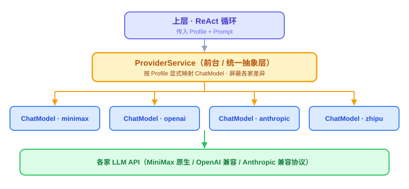

### 3.2 Provider 名到 ChatModel 的显式映射

这是一个需要讲清楚的关键点。配多个 Provider（openai / anthropic / minimax starter）时，Spring 容器里会有多个 `ChatModel` Bean。仅靠"扫描容器里所有 `ChatModel`"无法可靠区分哪个是 deepseek、哪个是 kimi，因为 Bean 类型相同、Bean name 未必等于 provider name。

AgentOS 的做法是维护一份显式的 **provider name 到 `ChatModel` 的映射**，而不是靠类型扫描自动来。

具体是在 Provider 配置里为每个 Provider 声明唯一的 provider name（现行四个 Provider：`openai` / `anthropic` / `minimax` / `zhipu`；`deepseek`、`kimi` 为将来新增预留），`ProviderService` 启动时按这个 name 建立映射表，Profile 通过 provider name 引用。这样多 Provider 并存时不会有歧义。

#### (1) Model 清单是配置不是代码

支持的 Provider / Model 集合不写死在代码里，由一份 Model 配置声明（application.yaml 声明启用哪些 Provider 及其 model 清单），启动时从环境变量读取各 Provider 的 api-key、缺省 model（`*_API_KEY` / `*_DEFAULT_MODEL`，见 docs/design/detail/model-config.md）；base-url 明文写 application.yaml，`*_BASE_URL` 环境变量不直接映射给 Spring AI——Spring AI 自动追加协议路径，且 OpenAI 兼容腿与 MiniMax 原生腿的 `*_BASE_URL` 值带 `/v1`，直接映射会 `/v1/v1` 双写 404（口径见 model-config.md - 2.3 导出的环境变量 → Spring AI 属性对照；`*_BASE_URL` 的用途仅供 curl / OpenAI SDK 等非 Spring AI 工具，见 model-config.md - 4.3 非 Spring AI 工具），据此装配出 `Map<provider 名, ChatModel>`——配置里没启用的 Provider 不进映射表，新增 Provider 加配置与四元组、不动映射代码。模型名拼写的校验由 `AgentLoader` 启动校验执行（见 8.2 Profile 配置），运行时热路径不重复校验。

#### (2) 装配机制已经 spike 实测（spike/007-react-loop，第二组 V5 四键并存）

两条装配通道——有 Spring AI 官方 starter 的 Provider 走自动配置（`@Qualifier` 按 Bean 名注入，Bean 名以容器实测为准，如 `openAiChatModel` / `miniMaxChatModel`）；同协议多实例或无官方 starter 的厂商走显式构造（builder 造 `OpenAiApi` + `ChatModel`，在注册表方法体内局部构造、不注册独立 Bean，防 `@ConditionalOnMissingBean` 令自动配置退位；显式构造的实例必须显式传受控 RetryTemplate——核心阶段基线为单尝试不重试，见 3.1 模块组成，另见 007 README 第二组 D6）。样例代码见 spike/007-react-loop/README.md 第五节与第二组代码的 ProviderRegistry。"**显式映射、不靠类型扫描**"这个原则经两组实测守住，否则多 Provider 跑不起来。

### 3.3 关键设计点

**核心阶段不做 fallback 和 hedge racing。** Provider 故障时直接报错给 Agent。fallback 链路、circuit breaker、hedge racing 放扩展阶段，通过 Profile 的 `fallback` 字段声明备用 Provider。

**成本透明在核心阶段做基础版。** 每次 LLM 调用记录 token 使用量、Provider、模型，写入 `llm_calls` 表（见第 9 章数据持久化）。扩展阶段做完整的成本聚合和 Web 看板。

---

## 4. 核心能力二：ReAct 循环

ReAct 循环是 AgentOS 最核心的一段代码。输入一条用户消息，输出 Agent 的最终响应，中间可能调用若干次 LLM 和若干次 Tool。

### 4.1 ReAct 循环 算法

ReAct 是 **Reason** 加 **Act** 的简称。算法步骤：

1. 接到用户消息追加到 Session 对话历史
2. 组装 Prompt（按 4.2 模块组成的五部分：system prompt 加 Bootstrap 加 Memory 注入加对话历史加可用 Tool 列表）
3. 调用 LLM Provider 获取响应
4. 如果响应**没有** Tool 调用，返回最终响应
5. 如果**有** Tool 调用，AgentOS 执行 Tool 并把结果作为 tool 消息追加到对话历史
6. 回到组装 Prompt 步骤继续循环
7. 达到最大迭代次数（默认 10 次）强制收尾——不是报错，收尾语义见 4.3 关键设计点

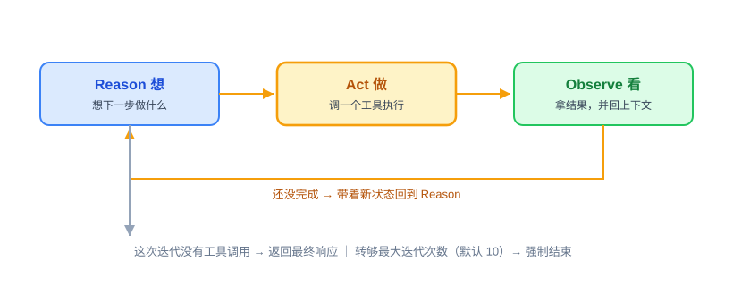

### 4.2 模块组成

#### (1) `ReActLoop` 模块

Agent 的核心循环引擎。输入 Session 和用户消息，输出最终响应。内部维护当前迭代次数，调用 `ProviderService` 调 LLM，调用 `ToolExecutor` 执行 Tool，把每次迭代的响应和工具结果累积到 Session 对话历史。核心循环逻辑精简，约数十行 Java，不依赖 Spring AI 的 Agent 抽象，让实现者完整掌握 Agent 的工作机制。

#### (2) `PromptBuilder` 模块

组装每次 LLM 调用的 Prompt。按五部分顺序拼接：

1. system prompt（`AGENT.md` 正文，这个 Agent 的指令，由 `ContextLoader` 提供，含当前 Agent 已绑定 Skill 的 name/description/本地路径（由 ContextLoader 拼入，见 8.3 上下文加载）；末尾附当前日期时间——LLM 自己不知道今天几号，定时场景的"今天"全靠这一行）
2. Bootstrap 文件（AGENTS.md、SOUL.md、USER.md，由 `ContextLoader` 加载到系统提示词）
3. Memory 注入（**仅长期记忆**：核心记忆区加归档记忆区，由 `MemoryService` 提供；会话历史不在此段，由第 4 段独立注入一次——`MemoryService` 的会话记忆职责只服务于 Session 读写，不重复进 prompt）
4. 对话历史（按 `maxHistoryTurns` 截断后的 Session messages）
5. 当前 Profile 可用的 Tool 列表（按 Function Calling 格式）

#### (3) 相邻同角色合并（同会话并发裁决，2026-09-25）

组装对话历史时合并相邻同角色消息——user+user、assistant+assistant 内容拼接；tool 行永不合并（OpenAI 协议腿每条 tool 消息须独立携带 `tool_call_id`，合并即丢配对）。合并只作用于 prompt 注入视图，存储行不动。起因：轮级原子穿插（见 7.2 核心阶段端点）与客户端重试残留使连续 user 行成为常态产物；官方 Anthropic Messages API 对连续同角色为合并、不报错（文档原句 "Consecutive `user` or `assistant` turns in your request will be combined into a single turn"，2026-09-25 查证），未实测的是 MiniMax /anthropic 兼容层——组装侧合并保证三条协议腿行为一致、不赌兼容层宽容度；W1 实测挂账见 DemandAnalysis.md - 12 风险与未决事项。

#### (4) `ToolExecutor` 模块

执行 LLM 返回的 Tool 调用请求。从 `ToolRegistry` 找到对应 Tool，执行入口按固定次序过四道：① 入参 JSON Schema 校验（三路全覆盖、失败不可重试，设计评审 Q3 决议 2026-09-23，检查项与失败语义见 6.7 Sandbox 检查）→ ② `sandboxActions(inputJson)` 申报动作（入参已经 ① 保证合法，申报提取不会因坏入参失败，见 6.1 AgentOSTool 抽象 / 6.7 Sandbox 检查）→ ③ `Sandbox.check` 白名单（仅内置；失败同 ① 口径：不可重试，见 6.7 Sandbox 检查）→ ④ 执行 Tool。把结果包装成 `ToolResult` 返回给 ReAct 循环，并写入 `tool_invocations` 表。校验器实施倾向自研基础关键词子集——agentos-core 是纯契约层（唯一三方依赖 SnakeYAML，agentos/CLAUDE.md 构建章约束），确需引 JSON Schema 校验库则该约束与技术栈清单（1.2 整体技术栈）同步修订、不得只改 TS；实施前核验 Spring AI 解析 tool call 入参是否已有等价校验（有则双保险；审计落点与不可重试语义无论如何由 AgentOS 侧定义）。Sandbox 校验收口在此层**单一咽喉**：所有内置 Tool 的执行必经 ToolExecutor，校验在执行入口统一调用一次、各 Tool 实现不自行调用——校验逻辑只有一处、测试只测一处、新增工具天然受检（设计评审 Q5①/Q9 决议，2026-09-14）。失败时返回可重试标识，由 Agent（LLM）自行决定是否重试；框架级自动重试放扩展阶段。可重试取值统一口径（设计评审 Q4 裁决，2026-09-24）：瞬态失败（超时、暂时不可达）→ `retryable=true`，确定性失败（文件不存在、权限拒绝、server 业务错）→ `retryable=false`——即 6.4 Plugin Tool 方式二 既有 MCP 分类升格为三路统一口径，校验关失败（① schema、③ 白名单）均为确定性、不可重试，同此规则。retryable 语义对模型的呈现：融入失败的 error_message 文本——确定性失败附"（不可重试）"类标注、瞬态失败以超时/暂时不可达等成因文字表达，模型凭文字判断；结构化 `retryable` 字段只落 `tool_invocations` 审计、不单独输出进 prompt。

#### (5) `AgentService` 模块

三种触发源共用的统一入口，也是一次处理的编排者：`process(Session, String)` 做的是——先把当前 Profile 与 user 放进 `ProfileContext`（ThreadLocal，虚拟线程下每个请求天然独立；user 来源：CLI `--user` / Web `X-User-Id` / 钟推 `schedules.user`，缺省 `default`，与 Session.user_id 同源同值），再调 `ReActLoop.run` 跑完循环，最后在 `finally` 里依次"写终止标记（`last_termination`）→ 清掉 `ProfileContext`"：消息按轮原子提交入库（提交纪律见 9.2 SQLite 关系型数据）——正常完成（含迭代耗尽收尾）时整轮一次提交，总超时、LLM 报错、入库提交失败三类异常零提交、缓冲丢弃，终止标记照写，终止的统一收尾见 4.3 关键设计点（同会话并发裁决，2026-09-25；2026-10-05 轮原子提交裁决）。`ProfileContext` 解决的是"工具执行时怎么知道当前是哪个 Agent 与哪个用户"：`AgentOSTool.execute` 的签名不带 Profile，按 Profile 过滤工具子集这类需求从 `ProfileContext` 读，不改工具接口；`NotifyTools` 则按渠道名称查询全局通知渠道注册表。

#### (6) 线程规则（方案 C）

（设计评审 Q1/Q6/Q10/Q11 决议，2026-09-14）

1. 规则一：ReAct 循环**内部**禁止切换执行线程（禁 `@Async`/跨线程 `CompletableFuture`，否则 `ProfileContext` 静默丢失）。
2. 规则二：请求**边界**允许异步（扩展阶段引入），但跨线程传递上下文必须经 `AsyncContextBridge` 三步处理——入口线程取出上下文快照、创建后台任务时随任务携带、后台线程重新绑定为 ThreadLocal 并在任务结束时清理。类本身随扩展阶段首个调用点落地，核心阶段零调用点、不建空壳类。
3. 后台线程创建：AgentOS 自建后台线程统一按"每任务新建一条 Java 21 虚拟线程"创建，不复用线程池（避免 ThreadLocal 残留脏数据）；HTTP 请求线程为虚拟线程，第一天即启用 `spring.threads.virtual.enabled=true`（Boot 3.5.16 官方属性，亦见 7.1 模块组成；若实现期实测不可用，允许改用等效机制并回改本节）。
4. 编码风格：边界处绑定一次 ThreadLocal，循环内部与新增组件内部改用显式参数传递。
5. Tool 调用并行（DemandAnalysis.md - 5.4 ReAct 循环 核心阶段不做；全部异步功能里唯一会破坏规则一的功能）的启用触发条件届时单独决策、单独排期。届时候选技术 ScopedValue 在 JDK 21 为**预览特性**（JEP 446，启用需 `--enable-preview`），其传播模型是结构化并发作用域内随 StructuredTaskScope 子任务自动继承，不是任意跨线程继承。
6. 钉住风险注记：JDK 21 的 synchronized 会钉住虚拟线程载体线程（JDK 24 才修复），SQLite JDBC 驱动内部有本地锁；按 DemandAnalysis.md - 8.1 性能 的 100 并发 Session 目标加短写事务的规模判断可接受，出现载体饥饿再处理。

### 4.3 关键设计点

#### (1) `MAX_ITERATIONS` 限制

核心阶段默认 10 次，防止 Agent 陷入 Tool 调用死循环，可在 Profile 里覆盖。

#### (2) 消息累积与提交纪律（同会话并发裁决，2026-09-25）

每次迭代都把 LLM 响应和 Tool 结果追加到内存中的消息列表；消息落库采用**轮原子提交**——循环正常完成（含 MAX_ITERATIONS 耗尽收尾）时，轮首 user 消息、全部迭代对（assistant 工具调用消息与该次迭代的全部工具结果）、收尾消息，在循环结束时一次事务写入 `session_messages` 表（`sessions.messages_json` 单列废除，表定义见 9.2 SQLite 关系型数据），一轮只产生一个提交事务；进程崩溃、总超时打断、LLM 调用报错、轮末提交失败四种异常结束时消息缓冲全部丢弃、零提交，已执行迭代不留正文。库中不变式：`session_messages` 只含完整轮——每条已提交 user 消息都带完整回复链，"残留未回复 user 消息"的特例不复存在。审计与消息解耦：`tool_invocations`/`llm_calls` 逐次即时落库、不随消息缓冲丢弃（2026-10-05 轮原子提交裁决非协商项），失败追溯以审计表为准。所有会话的消息行永久完整保留（存储口径；钟推每次触发创建单轮新会话，不存在无限增长），prompt 注入按 `max_history_turns` 轮边界截取（注入口径，算法见 9.2 SQLite 关系型数据）——存储口径与注入口径分离（Session 重构裁决 S8，2026-09-20）。（2026-10-05 轮原子提交裁决）

> **工具结果裁剪（未决）：** 核心阶段 Tool 返回结果不做体积上限、裁剪、淘汰、压缩、截断，完整进入 Session messages 并随每次迭代的 prompt 进入 LLM 请求；大结果场景（如 `read_file` 大文件、HTTP 大响应体）会快速挤占上下文预算。是否增加裁剪（截断、过滤、摘要）已在 DemandAnalysis.md - 12 风险与未决事项挂账，核心阶段结束后结合实测决议。

#### (3) 上下文长度管理

核心阶段策略简单：保留 system prompt 和最近 N 轮对话注入 prompt，超出部分不注入——仅注入口径，存储侧消息行（`session_messages`）仍永久完整保留（存储/注入两口径分离见上文"消息累积与提交纪律"），N 由 Profile 配置默认 20 轮。扩展阶段引入总结压缩。

> **触发源差异化（未决）：** 核心阶段三个触发源（人推：CLI `chat` 与 Web `invoke`；钟推：`AgentScheduler`。invoke 的 channel 为独立常量 `invoke`、每次调用创建单轮新会话，与多轮 chat 会话不混同，见 9.2 SQLite 关系型数据 / 7.2 核心阶段端点）共用同一套组装策略，不按触发源差异化。受 LLM 上下文窗口限制，是否按触发源调整组装内容（Bootstrap、长期记忆注入量、对话历史轮数）已在 DemandAnalysis.md - 12 风险与未决事项挂账，核心阶段结束后结合实测决议。

#### (4) 核心阶段不做的事项

Tool 调用并行（一次响应里多个 Tool 调用按顺序执行）、Agent 间任务委托、流式响应。这些放扩展阶段。

#### (5) 终止语义（四类结束的统一收尾，另设第五类触发）

ReAct 循环的结束共四种：正常完成（LLM 不再请求 Tool 调用）、达到 MAX_ITERATIONS 耗尽、总超时打断、LLM 调用报错中断（Provider 故障直接报错、无框架级重试，见 3.1 模块组成）；**第五类触发并入 failed（同会话并发裁决，2026-09-25）**：某轮入库提交失败（busy_timeout 打满、磁盘满等；BUSY 错误面实测样本 2026-10-09，spike/009-sqlite D3：org.sqlite.SQLiteException、消息原文「[SQLITE_BUSY] The database file is locked」、vendorErrorCode=5、写方等待 ≈5198 ms 后超时——即 busy_timeout 5000 ms 到点；供正式实现的报错与有限重试出口设计引用）时按 failed 终止——Web 返回 500 内部错误（503 保留给 Provider 故障，见 7.4 关键设计点），CLI 打印错误说明，钟推记 `task_executions.success=false`（+`error_message`）。**轮原子提交下的统一收支（2026-10-05 轮原子提交裁决）：正常完成与 MAX_ITERATIONS 耗尽按正常完成收尾——整轮一次事务提交；总超时、LLM 报错、提交失败三类异常一律零提交（本轮全部已执行迭代不留正文），已提交的完整轮不丢。**共同收尾：正常完成时消息整轮一次提交；三类异常零提交、审计照留（`tool_invocations`/`llm_calls` 逐次即时落库），失败追溯以审计表为准；总超时打断只发生在步边界（计时机制见 7.4 关键设计点）；finally 无消息提交动作，只写终止标记并清理 `ProfileContext`；若收尾的终止标记写入也失败，仅日志兜底、该列留旧值，失败追溯以 `task_executions` 与审计表为准。差异如下：

- 终止标记：`sessions` 表新增可空列 `last_termination` 记录上次结束方式（`normal` / `exhausted` / `interrupted` / `failed`，见 9.2 SQLite 关系型数据）。核心阶段无归档概念（Session 重构裁决 S5，2026-09-20）：`sessions` 表不设 `status` 列、无归档/清理流程，会话数据永久保留；人推多轮会话异常结束后同 session-id 仍可继续对话。下文"Session 标 `interrupted` / `failed`"均指写入 `last_termination` 列。
- MAX_ITERATIONS 耗尽不是错误：把"已达最大迭代次数（默认 10）"的说明连同最后一次迭代的可用内容作为最终响应写入 Session 正常返回，触发源拿到的是可用回复，不是空错误（耗尽按正常完成收尾、整轮提交——2026-10-05 轮原子提交裁决）。
- 总超时：Web Service 返回 504，CLI 打印超时说明，钟推记 `task_executions.success=false`（+`error_message`），Session 标 `interrupted`；本轮零提交，已执行迭代不留正文（2026-10-05 轮原子提交裁决）。
- LLM 报错：Web Service 返回 503（7.4 关键设计点的错误码规范"503 Provider 故障"），CLI 打印错误说明，钟推记 `task_executions.success=false`，Session 标 `failed`；本轮零提交、审计照留（2026-10-05 轮原子提交裁决）。
- **用户主动中断（挂账）：** 不在上述四类异常清单内（核心阶段 CLI 为单进程顺序输入、无中断功能），此类结束的消息提交语义未定义——挂账至中断功能立项；届时必须一并裁决该类结束的提交行为（含是否修订「session_messages 只含完整轮」不变式）。

---

## 5. 核心能力三：Memory 三层记忆

Memory 是 AgentOS 区别于普通 chatbot 的核心能力。三层记忆是完整设计，核心阶段做会话和长期两层，情景记忆放扩展。

> **架构调整说明：** Memory 做成三层记忆的统一门面，对 ReAct 循环只暴露一个 `MemoryService` 接口，内部再分会话记忆和长期记忆。这样对外叙述的"三层记忆"和内部实现一致，ReAct 循环不需要分别去问 Session 和 `MEMORY.md` 两个地方（prompt 侧仅长期记忆进 prompt，见 4.2 模块组成）。

### 5.1 模块组成

#### (1) `MemoryService` 模块（统一门面）

对 ReAct 循环暴露统一的记忆读写接口。内部把会话记忆委托给 `SessionManager`（底层是 SQLite 的 Session 存储），把长期记忆委托给 `LongTermMemoryStore` 后端（默认 `MarkdownMemoryStore`，底层是 `MEMORY.md` 文件）。ReAct 循环组装 prompt 时，长期记忆经 `MemoryService` 一个入口获取；会话历史不经 `MemoryService`，由 `PromptBuilder` 独立注入（见 4.2 模块组成的五部分）。这是相对原设计的关键调整，避免 Memory 概念横跨两个模块却没有统一入口。（设计评审 Q1 决议，2026-09-18）

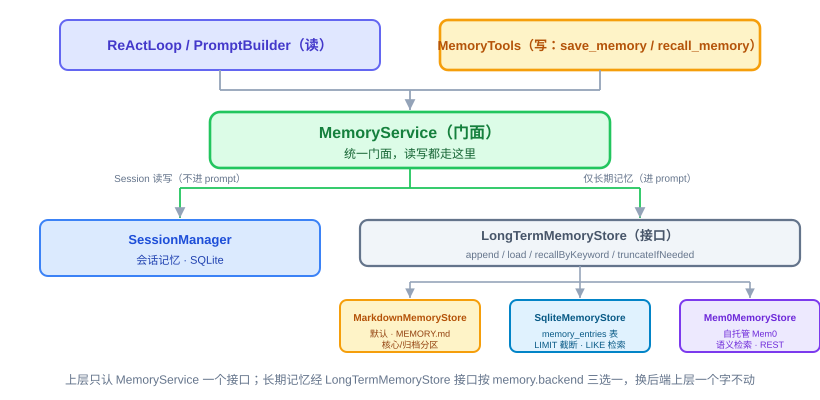

#### (2) `LongTermMemoryStore` 后端接口（可插拔）

长期记忆抽成一个后端接口，把"长期记忆的读写契约"和"具体存哪、怎么存"解耦——这是早期方案评审定下的"接口墙"在实现层的落地。对外四个方法：

- `append(agent, user, content, scope)`（追加内容到指定分区，`scope` 取 `MemoryScope.CORE` 或 `ARCHIVAL`，默认 `ARCHIVAL`）
- `load(agent, user)`（返回核心记忆区全量 + 归档记忆区截断后的内容）
- `recallByKeyword(agent, user, query)`（按关键词检索，只在归档记忆区做匹配，核心区不参与检索因为它本来就会被全量注入）
- `truncateIfNeeded(agent, user)`（对归档记忆区执行超限截断，`load` 内部调用它；核心记忆区永不截断）。**截断为视图级（见本节"并发写保护与写入语义"段，Q2 决议 2026-09-18）：只裁当次注入 prompt 的归档段视图，文件本体不动，被裁条目仍可经 `recall_memory` 检索。** 预算按字符数计，配置键 `agentos.memory.archival-max-chars`（application.yaml 默认 20000，注释指向 TechnicalSolution.md - 5.1 模块组成；W1 按默认模型组合实测校准；配置值全局唯一、作用于每一档（不按 Agent 配不同值）——无验收场景，与 7.4 关键设计点的超时覆盖裁决（2026-09-17 Q5）同口径）。超限时保留归档区最近内容、裁掉最旧。各后端按同一字符预算实现：Markdown 档直接裁归档段字符串；SQLite/Mem0 档落地时按同预算对齐（5.5 核心阶段不做的部分的"sqlite 用 LIMIT 条数"是其近似口径，届时修正）。（设计评审 Q3 决议，2026-09-18）

身份参数 `(agent, user)` 由 `MemoryService` 内部从 `ProfileContext` 取得后代入——对上层（PromptBuilder / MemoryTools / ReActLoop）方法签名不变（见 5.3 Memory 注入到 system prompt）。

所有实现共同遵守四条行为契约：①不缓存（每次重新读文件/查库/调 API）；②核心记忆区永不被截断，截断只作用在归档区；③写核心还是写归档由 Agent 经 `scope` 显式指定，系统不猜；④`recall` 是关键词检索不做复杂化。核心阶段**不做自动抽取**，分区完全由 Agent 通过 `save_memory` 的调用时机和 `scope` 参数手动决定，这是信号驱动升级原则在 Memory 模块的体现——自动从对话历史提炼记忆放到扩展阶段。

#### (3) 后端实现三档

核心阶段交付 Markdown 默认档；`LongTermMemoryStore` 接口预留 `memory.backend` 切换，SQLite/Mem0 档随后补齐。递进对应早期方案评审讲的三级演进：

- **`MarkdownMemoryStore`（默认）。** 底层操作 `.agentos/memory/<agent>/<user>/MEMORY.md`（每 `<Agent, User>` 二元组一份，见 5.2 MEMORY.md 文件设计）一个 Markdown 文件，按 `## 核心记忆` / `## 归档记忆` 两个 header 分区（详见 5.2 MEMORY.md 文件设计）；截断是字符串裁归档段，检索是 `String.contains` 行匹配。零依赖、人可读、git 可跟踪，记忆量不大时的首选。
#### (4) 并发写保护与写入语义（单实例进程内）

写只有一个原语——锁内"读-改-写"整文件（append 在此原语内完成；分区顺序核心区在前，scope=CORE 条目插在文件中部的核心区段内，纯尾部追加覆盖不了这种插入），按档文件绝对路径各持一把进程内 `ReentrantLock`（`Map<路径, 锁>`；同一档内写互斥，不同档互不阻塞）（与 8.5 定时任务的调度锁同款机制，停泊虚拟线程、不钉载体线程）。整文件替换走临时文件加原子移动——临时文件与 MEMORY.md 同目录（同一文件系统 rename 才保证原子），进程写一半被杀不留半个文件，残留临时文件在下次写入前清理。`load`/`recall` 读不持锁、不保证强一致：替换瞬间并发读看到新旧任一完整档，契约①（不缓存、每次重读）保证下一迭代自愈。归档区超限截断定为**视图级**（"视图"＝每次组装 prompt 时在内存里现裁出来的那份归档段内容——只在当次调用里存在，不落盘、也不是数据库视图（SQL VIEW）；MEMORY.md 文件本体一个字不动）：`truncateIfNeeded` 只裁注入 prompt 的归档段视图、不回写文件，文件保留完整历史、被裁条目仍可被 `recall_memory` 检索——该语义与 `SqliteMemoryStore` 的 `LIMIT N`（不删行）、Mem0 档 get/search 一致，被裁条目三档均可检索，且 5.5 核心阶段不做的部分"md 裁字符串、sqlite 用 LIMIT"的现有描述本就是视图级，此处是向 5.5 核心阶段不做的部分对齐而非改口径；落盘级截断会使 `load` 成为写路径、读路径被迫持锁（打穿第 14 章性能和可扩展性考虑的 1000 并发读论证），故与并发写保护一并定案。核心阶段为单实例部署，多实例并发控制随扩展阶段分布式改造处理。并发写保护配套防回归测试：同一档的 N 条虚拟线程 × M 次 append 栅栏对齐后同时起跑，断言 N×M 条全部在档、且"## 核心记忆 / ## 归档记忆"两个分区 header 完整；落位见各阶段实施计划。（设计评审 Q2 决议，2026-09-18）

- **`SqliteMemoryStore`。** 记忆按条入库到 `memory_entries` 表（随对应 JPA 实体由 `ddl-auto=update` 创建，与 sessions/审计表同口径；结构演进见 9.2 SQLite 关系型数据），截断变成归档查询的 `LIMIT N`、检索变成 SQL `LIKE`、核心区用 `WHERE scope='CORE'` 全量取。仍**零外部依赖**（复用已有 SQLite），记忆量上千、要结构化查询时的升级档。
- **`Mem0MemoryStore`。** 接一个**自托管** Mem0 记忆层（数据不出域），Java 侧走 REST 集成，`append/load/recall` 翻译成 Mem0 的 add/get/search——提炼、冲突消解、语义检索都交给 Mem0。凭证与地址走环境变量占位。这是"真需要智能记忆"时的外部集成档，对应早期评审"记忆若非核心差异化能力、集成可自托管方案是理性选择"的判断。

换后端只改 `memory.backend` 一行配置，`MemoryService` 以上（`PromptBuilder`/`MemoryTools`/`ReActLoop`）一个字不动——这就是接口墙的价值兑现。`recallByKeyword` 也预留了语义升级空间（Mem0 档已是语义检索），切换底层不影响上层。

#### (5) `MemoryTools` 子模块

把长期记忆暴露给 Agent 调用，包含 `save_memory` 和 `recall_memory` 两个内置 Tool，走 `AgentOSTool` 五方法接口（schema 手写，与其他内置 Tool 同一套声明方式，见 6.1 AgentOSTool 抽象）、注册到 `ToolRegistry`，跟其他内置 Tool 一视同仁；sandboxActions 申报空清单——记忆读写无涉外动作可申报（见 6.7 Sandbox 检查，设计评审 Q5 裁决 2026-09-24）。

#### (6) 会话记忆

由 `SessionManager` 实现。`SessionManager` 是进程内会话存取的门面，归 `agentos-core` 模块：按 session_id 读取/创建 Session（创建由各触发途径显式发起——CLI 启动 / `POST /api/v1/sessions` / 钟推每次触发 / invoke 每次调用 / generate（扩展阶段），见 8.4 Channel 接入 / 7.2 核心阶段端点 / 8.5 定时任务；无隐式 getOrCreate，按 id 查无此 id 即报错）、追加消息、按 `max_history_turns` 轮边界截取读取、消息按轮原子提交入库（提交纪律见 9.2 SQLite 关系型数据）、循环终止时写终止标记（由 `AgentService` 在 finally 调用，终止语义见 4.3 关键设计点）；session_id 对调用方不透明，channel/user/profile 三元组以独立列存于 Session 行（见 9.2 SQLite 关系型数据）。第一周内存版，第三周起落 SQLite（表结构与建表口径见 9.2 SQLite 关系型数据，模块清单见第 10 章项目工程结构）。`MemoryService` 把它作为三层之一统一对外。（设计评审 Q4 决议，2026-09-18）

#### (7) 长期记忆隔离模型（按 `<Agent, User>` 二元组分档，设计评审 Q5 决议 2026-09-20）

每个二元组一份独立的 MEMORY.md：按 `<Agent, User>` 隔离，路径布局 `<agent>/<user>/`（按 Agent 聚合，将来 Agent 下线可整目录归档，衔接 11.3 扩展阶段）；user 来源与缺省 `default` 见 4.2 模块组成（CLI `--user` / Web `X-User-Id` / 钟推 `schedules.user`）；user 格式约束 `[a-z0-9-_]{1,32}`、非法值入口显式拒绝报错不做静默转换（见 9.2 SQLite 关系型数据）；跨 Agent / 跨用户共享信息不通过 Memory 承载（共享需要受控的发布/审核机制，受控机制核心阶段不做），将来单独立项设计；三档后端对齐——`memory_entries` 扩展阶段建表时以 `agent_id`/`user_id` 两列（或分表）承载同一隔离键（见 9.2 SQLite 关系型数据）。

### 5.2 MEMORY.md 文件设计（默认后端 `MarkdownMemoryStore`）

默认后端的档位置 `.agentos/memory/<agent>/<user>/MEMORY.md`（首次 `save_memory` 时自动创建目录与文件；init 不预建，见 8.1 工作区初始化），内部用两个一级分区组织，每条记忆带日期 header：

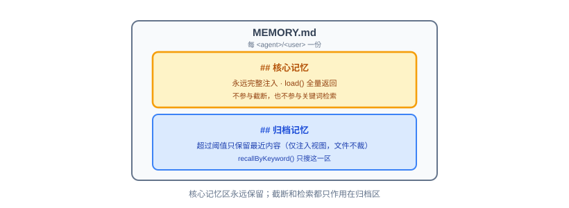

格式不做更严格的规定，Agent 写什么 LLM 自己理解就行，简单但有效；两个分区只是组织方式上的区分。换到 `SqliteMemoryStore` 时同一套"核心/归档"语义落到 `memory_entries` 表的 `scope` 列，换到 `Mem0MemoryStore` 时落到 Mem0 的 metadata——分区约定不变，存储形态随后端而变。

### 5.3 Memory 注入到 system prompt

ReAct 循环每次组装 prompt 时，`MemoryService` 把长期记忆（经 `LongTermMemoryStore.load()` 取得，身份（当前 `<Agent, User>`）由 `MemoryService` 从 `ProfileContext` 取得）提供给 `PromptBuilder`；会话历史由 `PromptBuilder` 按 `maxHistoryTurns` 截断后独立注入。长期记忆每次重新读不做缓存（契约一），这样 Agent 调用 `save_memory` 后下一迭代立刻能看到——Markdown 档每次读一个小文件、SQLite 档每次查库、Mem0 档每次调 API，性能都可接受。扩展阶段可在门面背后加 in-memory cache 加失效机制。

### 5.4 MEMORY.md 跟 USER.md 的区别

| 文件 | 来源 | 读写方 | 用途 |
|------|------|--------|------|
| `USER.md` | 用户手写 | AgentOS 只读不写 | 用户的"初始设定"（Bootstrap 文件） |
| `MEMORY.md` | Agent 通过 `save_memory` 写入 | AgentOS 读写 | Agent 的"成长记录"（长期记忆） |

两者都进 system prompt，但来源和生命周期不同。

### 5.5 核心阶段不做的部分

- 自动抽取（由 LLM 自己决定何时调 `save_memory`，Markdown/SQLite 两档不自动从对话提取；Mem0 档的自动抽取是其自带能力，用不用取决于是否切到该后端）
- 内置向量库（核心阶段 md/sqlite 两档不引入向量依赖；需要语义检索时切到 `Mem0MemoryStore` 由外部服务承担，不在 AgentOS 进程内自建向量层）
- 情景记忆（放扩展）
- Memory Wiki（结构化 claim/evidence、矛盾检测）
- 记忆压缩（超长简单截断，md 裁字符串、sqlite 用 LIMIT）
- 知识图谱后端（门槛比向量更高，真需要时集成 Graphiti 类可自托管方案，不自造）

---

## 6. 核心能力四：Tool 体系

Tool 是 Agent 可以调用的外部能力。AgentOS 的 Tool 分两类：**内置 Tool** 由 AgentOS 提供，**Plugin Tool** 由业务方扩展。Plugin Tool 有三种接入方式，按门槛从低到高排。

> **模块调整说明：** 核心阶段 Tool 相关合并为一个 `agentos-tool` 模块（内置 Tool、MCP Client、`ToolRegistry`、Sandbox 都在里面），不拆成 builtin/skill/mcp 三个模块。原因是它们共享同一个 `AgentOSTool` 抽象和 `ToolRegistry`，耦合度高，核心阶段没必要拆细。
>
> 另外，一个 Agent 目录（`AGENT.md` 及其 `skills/` 绑定视图）不是 Tool，而是上下文来源：正文和已绑定 Skill 元数据进入 system prompt，Skill 正文经 `read_file` 按需读取。因此 `AgentLoader`/`ContextLoader` 归上下文层，不放进 Tool 体系。

### 6.1 AgentOSTool 抽象

AgentOS 内部统一的 Tool 抽象接口。内置 Tool、`@Tool` 注解的 Plugin Tool、MCP Tool 都被包装成 **`AgentOSTool`** 实例注册到 `ToolRegistry`，ReAct 循环不感知具体 Tool 的来源。

`AgentOSTool` 接口约定五个核心方法（设计评审 Q9 决议，2026-09-14）：

- `getName`
- `getDescription`
- `getInputSchema`（JSON Schema；亦为 ToolExecutor 执行入口入参 schema 校验的依据——三路全覆盖、无豁免，设计评审 Q3 决议 2026-09-23）
- `execute`（接收 JSON 输入返回 `ToolResult`）
- `sandboxActions(inputJson)`（返回本次调用待校验的 SandboxAction 清单，供 ToolExecutor 在执行入口统一校验，见 6.7 Sandbox 检查。无默认实现——新增内置 Tool 不实现就编译不过，受检是编译期保证；MCP Tool 与 @Tool Bean 的适配实现返回空清单 = 豁免，对齐 6.7 Sandbox 检查的覆盖边界；内置 MemoryTools 亦返回空清单，但语义是"无涉外动作可申报"、非豁免（设计评审 Q5 裁决，2026-09-24））

`ToolResult` 包含成功标识、结果内容、错误信息、是否可重试（取值口径与对模型的呈现方式见 4.2 模块组成：语义融入 error_message 文本、结构化字段仅落审计）。

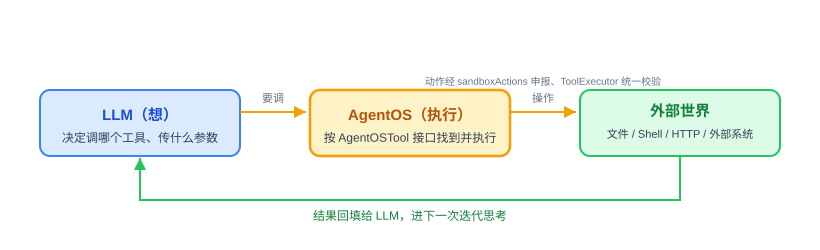

### 6.2 内置 Tool（九个）

核心阶段提供九个内置 Tool，分五组：

- **`FileTools`**：`read_file`、`write_file`、`list_dir`，路径动作经 `sandboxActions` 申报、由 ToolExecutor 统一校验（见 6.7 Sandbox 检查）
- **`ShellTools`**：`shell` Tool 直接执行白名单内的可执行文件与参数数组，带超时；不经 Shell 解释
- **`HttpTools`**：`http_get`、`http_post`，带域名白名单
- **`MemoryTools`**：`save_memory`、`recall_memory`（归 Memory 模块，但作为内置 Tool 注册；sandboxActions 申报空清单——五组中唯一的空申报特例，其余四组默认申报对应动作，见 6.7 Sandbox 检查）
- **`NotifyTools`**：`notify`（把消息推送到全局注册表中按名引用的通知渠道，详见 6.8 通知推送）

这九个覆盖"让 Agent 能读写文件、跑命令、调外部 API、记事、往外推通知"的最短链路。

### 6.3 Plugin Tool 方式一：零代码 AGENT.md 目录 加复用 MCP

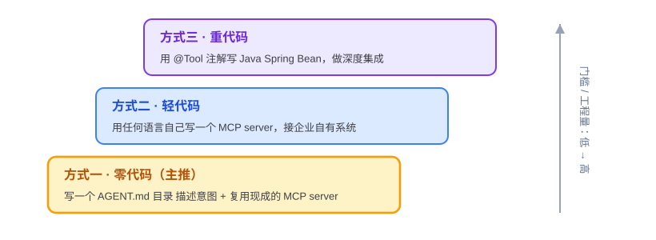

AgentOS **主推**的接入方式。业务方不写代码，只写一个 Agent 目录描述要做的事，LLM 自己理解任务、自己组合调用 MCP 工具。

定义一个 Agent = 写一个目录 `.agentos/agents/<name>/`：`AGENT.md` = frontmatter（运行配置）加任务说明正文，外加可选的 `skills/` 公共 Skill 软连接、`scripts/*.py`、`REFERENCE.md`。一个目录就是一个自足的 Agent。

加载走三层渐进式披露：`AGENT.md` 正文常驻；当前 Agent 绑定 Skill 的 name/description/本地路径每迭代注入；Skill 正文、参考与脚本经底座 `read_file`/`shell` 按需读取或运行。AgentOS 不解析任务步骤、不做工作流引擎。

> 注意 `AGENT.md` 的解析由 `AgentLoader` / `ContextLoader`（8.3 上下文加载）负责，不在 Tool 模块里——它是 prompt 的输入源、不是可执行 Tool（见 AiProgrammingGuide.md - 4.6 实施过程中的协作模式 纠偏表（Agent 目录不是 Tool，加载归 ContextLoader）与 11.1 术语）。

### 6.4 Plugin Tool 方式二：自己写 MCP server

业务方用任何语言写 MCP server，通过 MCP 协议暴露工具，AgentOS 作为 MCP Client 连接进来。MCP server 配置在 `.agentos/mcp_servers.yaml`，外层为 `servers:` 列表，每条声明 `name`、`transport`、`command`、`env` 四字段（字段语义与外层结构已由 `spike/008-mcp` 实测验证，见 `spike/008-mcp/README.md` 的 D8 决议）。

#### (1) `McpClientService` 子模块

MCP server 的连接维护和工具注册。AgentOS 启动时连接所有配置的 MCP server，调 `tools/list` 拿工具列表，把每个 MCP 工具包装成 `AgentOSTool` 注册到 `ToolRegistry`。失联、超时、错误恢复的核心阶段最小行为（`spike/008-mcp/README.md` 的 D7 决议）：单个 server 连接失败记日志跳过、不阻断其余 server 与启动；SDK 无自动重连，调用失败返回可重试标识、由 LLM 决定是否重试；超时用 SDK 的 `requestTimeout` 与 `initializationTimeout` 双档映射 7.4 关键设计点的 Tool 档预算（配置化不硬编码）。子进程环境变量用最小集（仅 `mcp_servers.yaml` 声明的 `env` 加 PATH 等运行必需项），不继承 AgentOS 进程全量环境变量——SDK 默认全量继承（追加非替换），进程密钥可能经 server 回显进入工具结果与审计表（`spike/008-mcp/README.md` 的 D8 决议安全发现）。

#### (2) `McpToolAdapter` 子模块

把 MCP Tool 适配成 `AgentOSTool` 接口，再自适配成 Spring AI 的 ToolCallback 进入手动循环的 toolCallbacks（适配路径定案：候选二，`spike/008-mcp/README.md` 的 D5 决议）。**暴露名全名方案（Q2c 裁决，2026-09-23）：** MCP 工具对外暴露名一律 `<server 名>__<工具名>`（双下划线分隔；`__` 在各家 LLM 协议的工具名白名单 `a-zA-Z0-9_-` 内，`#` 一类字符会令每次带工具列表的请求被拒）。适配层注册时存映射（暴露名 → server 会话 + 原始工具名），调用按映射转发、不做字符串切分；配套防回归测试断言"全名进、原始名出"（落位见各阶段实施计划）。**注册期校验（失败一律"跳过 + 记日志、不阻断启动"，对齐 D7 口径）：** ① `mcp_servers.yaml` 加载时校验 server 名——字符集 `[a-z0-9-_]`、长度 ≤24、禁含 `__`、禁以 `_` 结尾（保证"全名中第一个 `__` 即分隔符"严格成立）、同名条目后条跳过；② 拼出的最终暴露名做 LLM 字符集与长度校验（精确白名单实施期对实际接入的 LLM 协议核实、Spring AI 透传不改动），超限或含非法字符的该工具跳过；③ 注册时最终唯一性断言保留——内置/方式三先行注册、MCP 随后，仍撞名时后注册者（MCP 工具）跳过。Tool 调用时通过 MCP 协议（JSON-RPC over stdio；SSE 传输放扩展阶段，D2 决议）转发给对应 MCP server 执行，结果包装成 `ToolResult` 返回：成功拼接全部 text 段；server 业务错（isError）与坏参数 → 不可重试；超时 → 可重试（判定需遍历异常 cause 链找 TimeoutException，D4/D7 附）。

### 6.5 Plugin Tool 方式三：写 Java Spring Bean

用 Spring AI `@Tool` 注解标注 Java 方法，AgentOS 启动时自动扫描注册。工程量最大但集成深度最好，适合需要直接调用企业内部 Java 服务、复用现有 Spring Bean、跟 Spring Security 集成做权限控制的场景。运行形态跟内置 Tool 一样——直接在进程内调用 Java 方法，不走 MCP 协议、不起独立进程、不序列化，性能最好；写法不同：方式三标 `@Tool` 注解、schema 由 Spring AI 生成，内置 Tool 实现五方法接口、schema 手写（见决策四与 6.1 AgentOSTool 抽象）。

### 6.6 ToolRegistry

统一管理所有 Tool。三路工具三条注册通道：内置 Tool 以实现 `AgentOSTool` 接口的 Bean 直接注册（不经 `@Tool` 扫描）；方式三 Plugin Tool 由 Spring 容器扫描 `@Tool` 注解的方法、包装注册（schema 由注解生成，见决策四）；方式二 MCP 工具由 `McpClientService` 启动连接后经 `McpToolAdapter` 包装注册，暴露名 `<server 名>__<工具名>`（见 6.4 Plugin Tool 方式二）。**工具子集规则（Q2 裁决，2026-09-23）：** `tools` 字段只认内置与方式三裸名——缺省（不写或为空）= 全部内置与方式三工具可见，显式列举即收窄；`mcp_servers` 字段声明的 server，其全部工具整组并入子集（server 内按工具收窄归扩展阶段 Tool Policy）。子集在每次组装 prompt 时现算、不缓存——启动期被跳过的 server/工具天然不在子集内。缺省开放的取舍显式声明：`tools` 字段的作者是配置 Agent 的可信管理员（可信方），与 `SandboxChecker`"未知动作默认拒绝"（防运行时模型误操作、不可信方，见 6.7 Sandbox 检查）威胁模型不同，两者失败方向允许相反。

### 6.7 Sandbox 检查

Sandbox 遵循"接口先行"原则：先定一个不携带任何实现细节的抽象接口，核心阶段只在接口后面挂一档实现，未来加重隔离方案时只新增实现类，不改接口、不改调用方。

#### (1) `Sandbox` 接口

只有一个方法，表达"在受控环境里执行一个动作"这个意图：

```text
Sandbox.check(SandboxAction action)   # 返回 void；校验失败抛 SandboxViolationException

SandboxAction  = { type: ActionType, target: String, args: String[] }
ActionType     = FILE_READ | FILE_WRITE | SHELL_COMMAND | HTTP_REQUEST | NOTIFY
# target / args 的语义随 type 解释：
#   FILE_READ / FILE_WRITE → target=路径，args=空
#   SHELL_COMMAND          → target=可执行文件，args=参数数组（两者合成完整 argv，不经 Shell 解释）
#   HTTP_REQUEST           → target=URL，args=空
#   NOTIFY                 → target=webhook URL，args=空
```

> **返回值契约：** `check` 返回 void、失败走异常，是刻意设计——不设 boolean 返回值，调用方就没有"漏判返回值即静默放行"的失败模式：想忽略校验结果都不行。
>
> ActionType 取五值（文件读 / 文件写 / Shell 命令 / HTTP 请求 / 通知推送）——文件读写分开便于未来按读/写分权限；`SandboxChecker` 的 `check` 把 `FILE_READ`、`FILE_WRITE` 两 case 同路由到 `checkFilePath`。
>
> `args` 是通用多操作数槽位、不限定归属类型，语义随 ActionType 各自定义——当前只有 `SHELL_COMMAND` 填用，其余类型传空列表；未来新动作类型若需要多操作数，直接复用本字段、不改接口结构（枚举加值、字段复用都是只加不改的兼容演进）。
>
> 构造纪律：`SandboxAction` 一律经静态工厂方法构造（按动作类型各一个，如 `fileRead(path)` / `shell(executable, argv)` / `httpRequest(url)` / `notify(url)`），不经裸构造器——SandboxAction 是 record，未来加组件会改构造器签名，走工厂的调用方零改动、编译错误只指向工厂方法一处。

接口签名里不出现"白名单""容器镜像""VM 配置"这类某一档实现特有的词——用最重的 microVM 实现去反向套这个签名，也应该能干净套入，这是校验接口是否中立的办法。

#### (2) `SandboxChecker`（核心阶段唯一实现）

配置在 `application.yaml`（`file.allowed_paths`、`shell.allowed_commands`、`http.allowed_domains`、`notify.allowed_domains`），内部按 `ActionType` 路由到四个私有校验方法：

- `checkFilePath`（路径标准化后比对白名单，需处理 `../` 路径穿越）
- `checkShellCommand`（精确比对可执行文件（`SandboxAction.target`）白名单；解释器仅在管理员显式列入时允许，并授予宿主机进程权限。警示：参数数组（`SandboxAction.args`）不校验——解释器一旦列入白名单即视为放通其全部文件/网络行为，文件白名单对其不生效；列入解释器属高危运维决策。"参数不校验"是本档实现的选择、不是接口的缺失：args 已随 SandboxAction 进入接口，未来收紧校验时接口零改动）
- `checkHttpUrl`（解析 host 后做通配符匹配）
- `checkNotifyUrl`（校验独立的 `notify.allowed_domains`，不复用 `http.allowed_domains`）

任意校验失败抛 `SandboxViolationException`，本次 Tool 调用终止、循环继续：ToolExecutor 捕获后以失败结果回喂模型（`ToolResult.success=false`、`retryable=false`）——白名单拒绝不会因重试而消失：它取决于管理员侧配置（四张白名单在 application.yaml、改配置需重启；通知渠道 URL 由注册表运行时解析、注册表可经 API 修改），重试本身不改变任何前提。标志只表达"重试不改变结果"，不限制模型换参数或换工具再次调用（与校验①及 6.4 Plugin Tool 方式二的"坏参数 → 不可重试"同口径）。不触发 4.3 关键设计点，ReAct 迭代计数照常。异常信息复用既有失败审计路径写入 `tool_invocations`（`success=false`、`error_message`），不需要为 Sandbox 单独新增审计逻辑。

> **异常 message 脱敏：** `SandboxViolationException` 的 message 只含动作类型与目标域名（或路径），不含完整 URL——NOTIFY/HTTP 的 URL 内含等同凭证的 token（见 6.8 通知推送），message 会经 `error_message` 落审计表，按密钥红线（日志与命令行最多 5 位前缀，见 8.8 配置与密钥加载）同口径脱敏。实现上收一个统一的拒绝出口（如私有 `reject(actionType, host)`），四个 check 方法拒绝时都走它，脱敏纪律收在一处。

#### (3) 校验挂载点（单一咽喉）

`ToolExecutor` 在执行入口按固定次序过两道校验。① 入参 JSON Schema 校验：按 `getInputSchema()` 做基础关键词检查（type / required / enum / properties / items，对应六项：JSON 可解析、根类型为对象、必填字段存在、字段类型匹配、取值在枚举内、无未知字段）；pattern / format 等高级关键词声明了也跳过、不报错（内置手写 schema 不使用高级关键词；MCP server 若声明，核心阶段不保证执行其约束）。三路全覆盖、无豁免；失败 = 不可重试失败结果回喂模型（`ToolResult.success=false, retryable=false`）并照常落审计，不触发 4.3 关键设计点、ReAct 迭代计数照常；错误信息含工具名、字段名与原因、不含字段实际值。未知字段拒绝的连带效应：内置手写 schema 漏声明可选参数从"静默漂移"变"显式误拒"（错误信息点名漏声明字段，修复方向=补声明）；MCP server 自报 schema 不规范导致的误拒同理模型可自纠，反复误拒的治理动作是管理员在 `mcp_servers.yaml` 下线/更换该 server（设计评审 Q3 决议，2026-09-23）。② 白名单：统一调用 `sandbox.check(...)`，动作清单来自各 Tool 的 `sandboxActions(inputJson)` 申报（见 6.1 AgentOSTool 抽象；入参已经 ① 保证合法，申报提取不会因坏入参失败）——`FileTools`、`ShellTools`、`HttpTools`、`NotifyTools`（经 `WebhookNotifyAdapter`，NOTIFY 动作）只负责申报动作，不在自己 `execute` 里自行调用；校验通过才执行真正的 IO（设计评审 Q5① 决议，2026-09-14）：

> **未知动作默认拒绝：** `SandboxChecker` 对未知 ActionType 一律默认拒绝——白名单类安全机制的失败方向必须是"拦下"而非"放行"；误拦可修白名单纠正，漏拦是安全事故（设计评审 Q5② 决议，2026-09-14）。

> **覆盖边界（只覆盖内置 Tool）：** Sandbox 校验不覆盖 Plugin Tool——MCP 工具（方式二）与 `@Tool` Bean 工具（方式三）均不经过 `Sandbox.check`。依据：MCP server 由管理员在 `mcp_servers.yaml` 配置，属信任边界外的可信组件；方式三 Bean 是与 AgentOS 同进程运行的业务方自写代码，同一信任级。应用层白名单防的是模型犯傻误操作、不是全量 Tool 治理，Profile `tools` 子集与扩展阶段 Tool Policy 承担其余治理（见本节要点二）。该豁免仅指白名单这一道关；入参 schema 校验是契约校验（参数是否按说明书传），三路全覆盖、无豁免（设计评审 Q3 决议，2026-09-23）。

MemoryTools（`save_memory` / `recall_memory`）申报**空清单**：两者经 `LongTermMemoryStore` 存取，存储位置由底座按当前 `<Agent, 用户>` 身份派生（`.agentos/memory/<agent>/<user>/MEMORY.md`，见 5.1 模块组成），模型入参为 `content`/`scope`（save_memory）与检索关键词（recall_memory），均不含模型可控的路径或地址——无涉外动作可申报（ActionType 也无记忆类取值）。不申报 `FILE_WRITE` 的原因：那会把记忆可用性耦合进 `file.allowed_paths` 配置（白名单未配记忆目录即存记忆失败），且 SQLite/Mem0 档不落文件、申报随后端漂移——空清单是三档后端统一的唯一答案。内置空清单的语义是"无涉外动作可申报"，与覆盖边界中 MCP/@Tool 的"豁免"不同源：前者在治理边界内、只是没有可拦的输入，后者在治理边界外。失败与审计照常：调用落 `tool_invocations`，失败分类随 4.2 模块组成的可重试统一口径（如记忆档目录不可写＝确定性失败、不可重试）。配套防回归测试断言九个内置工具的 sandboxActions 申报与本节枚举一致（四组对样本入参返回对应动作类型、MemoryTools 恒返回空清单）；落位见各阶段实施计划。（设计评审 Q5 裁决，2026-09-24）

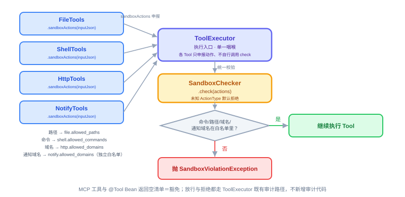

*图注：五组内置工具中四组申报涉外动作、受白名单校验；MemoryTools 申报空清单——无涉外动作可申报、非豁免（见上）。*

#### (4) 扩展阶段按信号驱动升级

接口不变，只新增实现类：

| 阶段 | 实现 | 升级信号 |
| ------ | ------ | ------ |
| 核心阶段 | `SandboxChecker`（应用层 Path/Pattern 白名单） | — |
| 扩展阶段一 | 容器隔离（namespace + cgroups + seccomp），经 `execute_code` Runner（新接口）承载，`Sandbox.check` 继续作为前置校验保留 | 要跑相对不可信代码，或要做多租户 |
| 扩展阶段二 | microVM（Firecracker / Kata / gVisor），经 `execute_code` Runner（新接口）承载，`Sandbox.check` 继续作为前置校验保留 | 要跑完全不可信代码，或要规模化多租户 |

> **要点一：** 应用层白名单是"劝阻级"防线，防的是模型犯傻误操作，防不住蓄意绕过，核心阶段不建议用它跑完全不可信的代码或对外做多租户。
>
> **要点二：** Sandbox 加白名单是核心阶段唯一的 Tool 治理手段，而 Profile 级的 Tool Policy（哪个 Agent 能用哪些 Tool）放在扩展阶段。核心阶段 Profile 的 `tools` 字段已经能限定 Agent 可用 Tool 子集（限定范围只含内置与方式三裸名；MCP 工具由 `mcp_servers` 字段按 server 整组引入，server 内的工具粒度收窄归扩展阶段，见 6.6 ToolRegistry），算是 Tool 治理的雏形，完整的 allow/deny 策略扩展阶段补。

### 6.8 通知推送（`NotifyTools`）

一句话：**入站有 Channel Adapter 负责"消息怎么进来"，出站现在缺一个对称的东西负责"消息怎么出去"——`NotifyTools` 补的就是这一块。**

在两个验收 Demo 出现之前，AgentOS 没有真正需要"主动往外推一条消息"这件事——CLI 和 Web Service 都是别人发消息进来、Agent 回一句话，回复方式是同步返回，不需要额外的推送机制。但"每日天气""每日科技日报"这类定时触发的 Demo 不一样：`AgentScheduler` 到点自动跑，没有人在等着看响应，Agent 必须**主动**把结果送到人能看到的地方（企业 IM 群），这就需要一个"往外推"的能力。

#### (1) 没有这个模块会怎样

每个业务方定义 Agent 时都要自己在 Skill 里手写"调 `http_post` 打这个 webhook URL"，或者自己去找一个企业微信/飞书的 MCP server 配上——每个 Skill 各写一份，重复且不统一，跟前面 Sandbox、Memory 强调的"接口先行"原则相反。

#### (2) `NotifyChannelAdapter` 接口

跟 6.7 Sandbox 检查同样的思路：先定一个不携带具体渠道细节的抽象接口，表达"把一条内容送到某个通知目标"这个意图：

```text
NotifyChannelAdapter.send(NotifyTarget target, String content)

NotifyTarget = { channelType: String, config: Map<String, String> }
```

#### (3) `WebhookNotifyAdapter`（核心阶段唯一实现）

用通用 HTTP webhook 承接所有场景——企业微信、飞书、钉钉的群机器人都提供 webhook 地址，核心阶段不用逐家接它们的专用 API（签名算法、AccessToken 刷新这些认证细节核心阶段不做），直接把 `content` 包成对方 webhook 约定的 JSON 格式发一次 POST。NOTIFY 动作由 `NotifyTools` 经 `sandboxActions` 申报、ToolExecutor 在执行入口统一校验（见 6.7 Sandbox 检查），适配器只负责发送；校验独立的 `notify.allowed_domains` 白名单——通知渠道域名（webhook URL 内含 token 等同凭证）不进入通用 HTTP 白名单，`http_post` 打不到它们。

#### (4) `NotifyTools` 内置 Tool

归 `agentos-tool`，走五方法接口注册（见 6.1 AgentOSTool 抽象）：

```text
notify(content: String, channel: String)
```

`channel` 参数（必填）是通知渠道的全局注册名。通知渠道通过 `/api/v1/notify-channels` 做 CRUD（核心阶段经 API/Swagger 操作；管理台页面放扩展阶段，下同），持久化在 SQLite 的 `notify_channels` 表；每项包含 `name`、`type`、`url` 和可选的 `description`。Agent 在 `AGENT.md` 正文中用自然语言按名引用渠道，LLM 调用时传 `channel` 和 `content`，`NotifyTools` 再从注册表解析适配器和 URL。具体 webhook 地址不进入对话，增加或修改渠道也无需改 Agent；`AGENT.md` frontmatter 不包含 `notify_channels` 字段。删除渠道时核心阶段不做引用检查（M2，2026-09-26）：被 Agent 正文按名引用的渠道可被直接删除，之后 `notify` 调用报渠道不存在——确定性失败、不可重试（4.2 模块组成 口径）；引用检查随扩展阶段 Tool Policy 补。

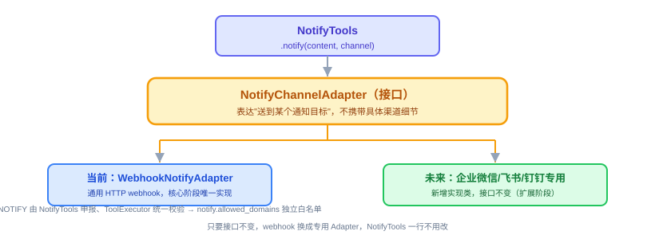

#### (5) 跟已有机制的关系

- **审计：** `notify` 跟其他 Tool 一样走 `ToolExecutor` 现有的成功/失败审计路径，写入 `tool_invocations`，不新增审计逻辑。
- **Sandbox：** NOTIFY 动作经 NotifyTools 申报、进 ToolExecutor 统一校验（见 6.7 Sandbox 检查），通知域名独立白名单。
- **跟入站 Channel 的对称关系，但不是同一个东西：** `ChannelAdapter`（8.4 Channel 接入）解决"什么触发 Agent 开始跑"，`NotifyChannelAdapter` 解决"Agent 跑完把结果送到哪"——语义方向相反，所以分开建模，不合并成一个抽象；同一个企业微信群，可能同时是某个 Agent 的入站 Channel、又是另一个 Agent 的出站通知目标。
- **和 Plugin Tool 方式二（MCP）的边界：** 如果业务方需要企业微信官方富文本卡片消息这种更复杂的格式，`notify` 简单场景之外仍然可以走 MCP 方式二自己接一个专用 MCP server，两条路并存，`notify` 只是把"最常见的纯文本/webhook 推送"这个重复劳动统一掉，不是要吃掉 MCP 方式二的场景。

---

## 7. 核心能力五：Web Service

Web Service 是 AgentOS 的对外完整门面，业务系统通过 REST API 接入。前面四大能力是 AgentOS 的内部能力，Web Service 是对外暴露。没有 Web Service，AgentOS 只是一个 CLI 工具，无法跟企业现有业务系统集成。这也是 AgentOS 区别于偏个人定位的 OpenClaw、Hermes 的关键能力。

### 7.1 模块组成

#### (1) `WebServer` 模块

启动 Spring MVC 服务器，`agentos serve` 命令触发，默认端口 `8080`，开启 Java 21 virtual thread（`spring.threads.virtual.enabled=true`，Boot 3.5.16 官方属性，第一天即启用；若实现期实测不可用，允许改用等效机制并回改本节——设计评审 Q1 决议，2026-09-14）。

#### (2) `ApiController` 集合

按资源分八个 Controller：`SessionApiController`（会话管理）、`AgentApiController`（无状态调用）、`ProfileApiController`（Profile 查询）、`MemoryApiController`（Memory 查询）、`ToolApiController`（Tool 信息）、`SystemApiController`（系统状态）、`NotifyChannelApiController`（通知渠道注册 CRUD）、`ScheduleApiController`（定时任务运行控制，见 8.5 定时任务；其中 `NotifyChannelApiController`/`ScheduleApiController` 随第四周收尾端点交付，见第 13 章实施节奏）。每个 Controller 只做参数校验、响应包装、错误处理，实际逻辑委托给核心层的服务。

#### (3) `GlobalExceptionHandler` 模块

统一异常处理，把异常转成标准 JSON 响应信封 `ApiResponse`（`code`、`message`、`data`、`timestamp`；成功与错误共用一个信封）。全部端点自第三周交付起，成功与错误响应均包此信封（权威口径：api.md - §0 先看结论 第 1 条）；`GlobalExceptionHandler` 第三周交付时即采用同一结构返回错误，后续复用、不另建 ErrorBody。

#### (4) OpenAPI 文档模块

通过 `springdoc-openapi` 自动生成 OpenAPI 3.0 文档，暴露在 `/swagger-ui`（随第三周交付）。

### 7.2 核心阶段端点（基础 10 个 + 收尾追加 8 个，共 18 个）

> 需要用户身份的端点经 `X-User-Id` 请求头传入，缺省 `default`；核心阶段自报、无验证（认证属扩展阶段，见 7.5 核心阶段不做的部分）；非法头值（不符合 `[a-z0-9-_]{1,32}` 格式约束）由 Controller 校验并返回 400、不做静默转换。
>
> 请求/响应体、参数约束、错误码全集等线上契约细节统一见 docs/design/detail/api.md；本节保留端点清单与设计考虑。

#### (1) 会话管理（4 个）

1. `POST /api/v1/sessions`（创建：请求体指定 profile，user 取 `X-User-Id` 头（缺省 `default`，落 sessions 表 `user_id` 独立列）；服务端生成四元组 session_id（`<channel>-<user>-<profile>-<uuid>`）并随响应体返回）
2. `POST /api/v1/sessions/{id}/messages`（发消息：user 以 Session 为准，头可省略）
3. `GET /api/v1/sessions/{id}`（单查：返回 7 项元数据（session_id、profile_name、channel、user_id、created_at、last_active_at、last_termination）+ messages 全量）
4. `GET /api/v1/sessions?cnt=<N>`（列表：按 last_active_at 倒序取前 N（缺省 100），各触发途径不区分；每项 3 字段 session_id / last_active_at / messages 首条预览（无 messages 则空串））

（原 `DELETE /api/v1/sessions/{id}` 归档端点移扩展阶段——核心阶段无删除 API，见 7.3 扩展阶段补齐的端点；DELETE 出、GET 列表进，基础 10 / 总数 18 数字不变。）

> **同一会话并发发消息的行为定义（同会话并发裁决，2026-09-25；2026-10-05 轮原子提交裁决改写提交粒度）：** 平台层不设闸——无锁、不排队、不拒绝。并发请求各自在起点读"当时已提交"的快照、各自线性展开，消息按轮原子提交落库：**轮级原子穿插**（单写者下事务串行，每轮整轮原子入库、轮内消息行 id 连续；穿插只发生在轮与轮之间，单请求内部顺序完整）。客户端超时重试在两次尝试都完成时产生重复完整轮，业务方自律避免向同一会话并发发送。并发请求各自在 finally 写 `last_termination`/`last_active_at`，终态取最后完成者；失败标记可能被后完成请求覆盖，失败追溯以 `task_executions` 与审计表为准。发消息进行中单查会话仅见已完成轮（进行中的轮整轮未提交、不可见）；单查的元数据与消息分两次读取、不保证跨表快照一致（实施期可用 `readOnly` 只读事务消除，二选一）。风险面仅 Web 多轮会话：CLI 单进程顺序输入，invoke/钟推每次新建单轮会话。

#### (2) Agent 调用（1 个）

1. `POST /api/v1/agents/{name}/invoke`（无状态调用：每次调用创建一个新 Session（单轮），channel=`invoke`（独立常量）、user 取头值；消息按轮原子提交（单轮会话即整轮一次事务），终止收尾写 last_termination；响应体返回本次 session_id 及最终回复（契约细节见 api.md），供业务系统查 `GET /api/v1/sessions/{id}`。无状态指不留活跃会话，审计与记忆照常落）

#### (3) Profile / Memory / Tool 信息（3 个）

1. `GET /api/v1/profiles`
2. `GET /api/v1/memory?agent=<name>`（agent 必选；`X-User-Id` 头定用户，缺省 `default`）
3. `GET /api/v1/tools`

#### (4) 系统状态（2 个）

1. `GET /api/v1/health`
2. `GET /api/v1/info`

#### (5) 收尾追加（8 个）

"收尾"均指第四周的收尾工作，下同。notify-channels CRUD 4 个（GET 列表/POST 注册/PUT 更新/DELETE 删除，见 6.8 通知推送）＋ schedules 管理 4 个（见 8.5 定时任务）

### 7.3 扩展阶段补齐的端点

**`Agent` 目录的上传/查看/更新/删除**（业务方通过 API 而不是手动把目录丢进 `.agentos/agents/` 来创建新 Agent，含一句话生成 `AGENT.md`，这才是"纯 API 定义一个新 Agent"的完整闭环）；Memory 的 append/clear/search；Tool describe 和调用历史；LLM call 历史和 token 统计；**AgentScheduler 调度定义的增删改**（改某个 Agent frontmatter 的 `schedules` 定义；按 Agent 查询其 schedules 定义也在本项，区别于 8.5 定时任务已交付的按任务查运行状态）；Webhook 触发；SSE 流式响应；Prometheus metrics；Session 清理 `DELETE /api/v1/sessions/{id}`（核心阶段原"归档"端点移入，届时语义=真删除/清理——核心阶段会话数据永久保留、无 DELETE API，见 7.2 核心阶段端点；删除时应用层同删 `session_messages` 消息行——外键未启用、无级联，同会话并发裁决 2026-09-25）；Session messages 分页查询（核心阶段单查返回 messages 全量、不分页，扩展阶段支持分页）、task_executions 执行历史与 Agent 目录删除后遗留 scheduled_tasks 孤儿行的清理/归档策略（M3，2026-09-26；孤儿行处置随 2026-09-29 E1-A（修订）并入本挂账）；管理台展示 generate 会话（channel=`generate`、profile_name=`nan`，定义见 9.2 SQLite 关系型数据）时 profile 段 `nan` 的呈现方式届时随管理台一并定——核心阶段仅 API/Swagger 原始 JSON、无管理台展示面（2026-10-09 Q5（generate 会话化）裁决）。

> **核心阶段为什么不做：** 核心阶段"定义一个 Agent"的路径是业务方手写一个 `.agentos/agents/<name>/` 目录（`AGENT.md`[+ 脚本 / 子指令]）、重启生效（AGENT.md 正文与 Skill 绑定的修改因 `ContextLoader` 每次组装 prompt 都重新读取、不需要重启也能生效；frontmatter 派生字段需重启，见 8.3 上下文加载），核心阶段不提供 Agent 定义类写端点（Agent 目录创建/更新/删除；收尾（第四周）交付的 notify-channels 与 schedules 端点管理的是运行数据、不属 Agent 定义），这跟"业务系统通过 API 动态创建新 Agent"是两件事——后者需要 Agent 目录上传接口（含一句话生成）、`AgentScheduler` 的运行时增删接口一起补齐，缺了这条链路就不完整，所以放在同一批扩展阶段一起做，不拆开先做一半。

### 7.4 关键设计点

- **错误码规范：** 标准 HTTP 状态码加内部错误码（400 参数错误、404 资源不存在、500 内部错误、503 Provider 故障、504 总超时；内部错误码=errorCode 封闭集，封闭值与失败响应形状见 api.md - §4 失败路径契约）。
- **CORS：** 核心阶段开放所有源方便调试，扩展阶段加白名单。
- **请求大小限制：** 单条消息最大 32KB。Session 单查返回 messages 全量、核心阶段不分页（扩展阶段支持分页）；会话列表条数由 `cnt` 参数控制（缺省 100）。
- **超时：** 分步预算，不硬编码。三档默认值一律在 `application.yaml`：LLM 单次调用默认 60s、Tool 单次执行默认 30s、Agent 调用循环总超时默认 300s，超总超时返回 504。**按 Agent 覆盖仅限 Tool 单次执行超时与总超时两档**（Profile `settings.timeout`，键 `tool`/`total`）；**LLM 单次调用超时仅全局、不按 Agent 覆盖**——该超时在 Spring AI 底层 HTTP 客户端构建时定死，调用时的 options 参数无超时字段可携带；"LLM 超时按 Agent 覆盖"已经设计评审（2026-09-17，Q5）从需求层移除、扩展阶段亦不列，重新引入须有新需求场景并实测框架能力（裁决记录见 DemandAnalysis.md - 12 风险与未决事项 注）。三档计时与打断机制：LLM 单次调用超时 = 底层 HTTP 客户端连接/读取超时（全局值）；Tool 单次执行超时 = 各执行器自带超时机制（Shell 进程等待超时、HTTP 连接层超时、MCP `requestTimeout`/`initializationTimeout` 双档映射，先例见 6.4 Plugin Tool 方式二）；总超时 = `ReActLoop` 在每步开始前检查累计用时——因此总超时不是立刻打断，实际最大超出 = 当前正在执行那一步的剩余预算；打断收尾按 4.3 关键设计点执行（Web 返回 504、CLI 打印超时说明、钟推记 `task_executions.success=false`）；本轮零提交（未落库的轮视为未完成，不报进度）、审计照留，finally 只写终止标记（同会话并发裁决，2026-09-25；2026-10-05 轮原子提交裁决）。
- **HTTPS：** 应用内只出 HTTP、不做 TLS——内网部署下证书管理不上收到每个应用；需要 HTTPS 由企业侧反向代理终结 TLS 后转发，`server.ssl` 不启用、不列实现项（2026-09-26 裁决，对应 DemandAnalysis.md - 8.5 安全）。

### 7.5 核心阶段不做的部分

- 认证机制（无认证假设内网，扩展补 API Key 加 JWT）
- 流式响应 SSE
- WebSocket
- RBAC 权限
- 限流

这些放扩展阶段。

### 7.6 业务系统集成场景

- **同步调用**（最常用，业务系统调 invoke 等返回，适合 stateless 短任务）
- **会话保持**（先创建 Session 再多次发消息，适合连续对话）
- **Webhook 触发**（告警系统、CI/CD、外部调度系统调 Agent，打通监控的感知到分析到行动闭环；端点属扩展阶段，见 7.3 扩展阶段补齐的端点——核心阶段外部事件源可自行定时调 invoke 代替）
- **跨语言集成**（任何能发 HTTP 请求的语言都能接，核心阶段不出 SDK，扩展阶段才出）

---

## 8. 支撑模块

五大核心能力之外，AgentOS 还有几个支撑模块让整个系统跑起来。这些不是运行时内核的核心能力，但缺一不可。

### 8.1 工作区初始化

**`InitCommand` 模块。** `agentos init` 命令的执行逻辑，创建 `.agentos/` 工作目录及完整结构：

```text
.agentos/
├── agents/            # 每个子目录 = 一个 Agent（AGENT.md + skills/软连接 + scripts/ REFERENCE.md）
├── skills/            # 公共 Skill 实体库（SKILL.md + 可选附属资源）
├── memory/            # 长期记忆根目录（按 <agent>/<user>/ 分档，首次 save_memory 时自动创建；见 5.1 模块组成）
├── mcp_servers.yaml   # MCP 配置
├── logs/              # 日志
├── AGENTS.md
├── SOUL.md
├── USER.md            # Bootstrap
└── agentos.db          # SQLite（本命令不创建；由 JPA 在首次启用 SQLite 持久化时自动创建，核心阶段 7 张表见 9.2 SQLite 关系型数据与 DemandAnalysis.md - 5.1 工作区初始化）
```

创建目录、写默认模板。`agentos init` 幂等，边界细则（2026-10-01 Q8（init 幂等边界）裁决，细化 DemandAnalysis.md - 5.1 工作区初始化 的"不覆盖"口径）：①目录缺失则补建——四个子目录（agents/、skills/、memory/、logs/）任一被删，重跑 init 重建空目录；②文件缺失则跳过不补——Bootstrap 文件（AGENTS.md / SOUL.md / USER.md）与 mcp_servers.yaml 被删除即视为用户不要，init 不恢复模板；③文件已存在则一律不覆盖——哪怕内容为空（口径承接 DemandAnalysis.md - 5.1 工作区初始化）。有意取舍：用户删掉或清空的模板文件不会被 init 恢复，需要时新建一个临时工作区跑 init 取回模板，或手工重写。配套防回归测试：删除 SOUL.md 与 logs/ 后重跑 init，断言 logs/ 已重建、SOUL.md 仍不存在、其余生成物内容未被改动；清空 SOUL.md 内容后重跑 init，断言其内容仍为空（未被模板覆盖）；落位见各阶段实施计划。init 只建 `memory/` 空根目录、不预建具体记忆档（首次 `save_memory` 时按 `<agent>/<user>/` 自动创建，见 5.1 模块组成）；init 本身不创建 Agent，第一个 Agent 由 `agentos profile create <name>` 生成——该命令组名沿用 profile，实际操作的是 `.agentos/agents/` 下的 Agent 目录：生成一份最小 `AGENT.md` 模板（与 DemandAnalysis.md - 5.2 定义一个 Agent 一致）。`init` 生成的 `mcp_servers.yaml` 模板注释载明 server 名规则：`[a-z0-9-_]`、长度 ≤24、禁含 `__`、禁以 `_` 结尾（规则依据见 6.4 Plugin Tool 方式二）——server 名的作者是在模板上写配置的用户，规则写在模板里才会被看到。`agentos profile create` 生成的 `AGENT.md` 模板对 `schedules.id` 注释载明 Agent 内唯一约束与字符集规则（`[a-z0-9-_]`、禁含 `__`、禁以 `_` 结尾；全局寻址用组合 task_id = `<agent>__<id>`，2026-09-29 E1-A（修订）裁决，见 8.2 Profile 配置 / 9.2 SQLite 关系型数据）。模板注释并载明 Agent 目录名保留字——禁用 `nan`（generate 会话 profile 哨兵，规则见 8.2 Profile 配置；2026-10-09 Q5（generate 会话化）裁决）。模板 `schedules` 段注释另载明两件事：`timezone` 可选、缺省 = 进程系统时区；cron 表达式为 Spring CronTrigger 六段式并给一行示例（2026-09-30 Q6 裁决，规则见 8.5 定时任务）——规则写在模板里才会被看到（与 mcp_servers.yaml 的 server 名规则同一先例）。

### 8.2 Profile 配置

#### (1) `AgentLoader` 模块

扫 `.agentos/agents/` 各子目录，`deriveProfile` 把每个 `AGENT.md` 的 frontmatter 派生成一个 `Profile`，注册到 `ProfileRegistry`。启动时做合法性校验：Provider 是否存在、`tools` 字段列出的工具名是否已注册（只认内置与方式三裸名；写了 `<server>__<工具>` 式 MCP 全名会在此报错——MCP 工具不经 `tools` 字段治理，见 6.6 ToolRegistry）、frontmatter `mcp_servers` 引用的 server 名是否存在于 `mcp_servers.yaml`、Channel 是否支持（核心阶段仅校验合法性、不影响任何触发路径——所有已注册 Agent 均可被 CLI chat / Web invoke / 钟推三种入口触发，按渠道过滤归扩展阶段；2026-09-29 Q2（channels）裁决）、Bootstrap 文件是否存在、frontmatter 声明的 `settings.model`（如声明）是否属于对应 Provider 的可用模型清单（`*_MODEL_LIST`，即 model-config.md - 2.2 脚本注册区的命名模式 承诺的"校验"职能由此项兑现）、frontmatter 中的 user 字段（`schedules.user`）是否符合格式约束（`[a-z0-9-_]{1,32}`，见 5.1 模块组成 / 9.2 SQLite 关系型数据）、frontmatter `schedules` 的 id 是否与同 Agent 内其它 schedule 撞名（Agent 内唯一，2026-09-29 E1-A（修订）裁决——替代 2026-09-26 E1-A 的"跨 Agent 全局唯一"口径；同 Agent 内同 id 后条跳过并记日志，对齐 6.4 Plugin Tool 方式二的列表撞名口径，列表有序故牺牲者确定）、Agent 目录名与 `schedules.id` 的字符集约束（`[a-z0-9-_]`、禁含 `__`、禁以 `_` 结尾——`__` 为组合 task_id = `<agent>__<id>` 的分隔符，规则约束与 6.4 Plugin Tool 方式二的 server 名同款，保证组合键分隔符无歧义、可人工判读），并含保留字校验：Agent 目录名禁用 `nan`（generate 会话的 profile 哨兵，2026-10-09 Q5（generate 会话化）裁决；`schedules.id` 不受限——哨兵不进入 schedule 命名）、frontmatter `cron` 须可被 Spring `CronTrigger` 解析（六段式）、`timezone`（如声明）须可被 `ZoneId.of` 解析（2026-09-30 Q6 裁决；任一失败仅该条 schedule 跳过并记日志，Agent 本体照常注册，对齐同清单撞名跳过口径）。校验失败的 Agent 不注册（invoke 返回 404、message 点名校验失败原因，契约见 docs/design/detail/api.md），不阻断启动并记录错误日志（2026-09-26 M1 裁决）。

#### (2) `ProfileRegistry` 模块（归 `agentos-core`）

Agent 派生 `Profile` 的内存索引，按 name 提供快速查找。Channel 接收消息时通过它拿到具体 Profile。派生自 `AGENT.md` frontmatter 的字段：`name`、`description`、`identity`（`agent_name`、`prompt`）、`provider`（`name`、`temperature`。模型不固定在 provider 块，按三级选择：Provider 缺省取环境变量 `*_DEFAULT_MODEL` → Agent 级覆盖用 frontmatter `settings.model`（派生进 Profile）→ 运行时动态路由；切换靠每次调用的 options 参数带 model，不走环境变量。详见 docs/design/detail/model-config.md）、`tools`、`mcp_servers`、`channels`、`schedules`（id、cron、timezone、message、user——timezone 可选，缺省 = 进程系统时区（规则见 8.5 定时任务）；user 可选，定时触发的会话与记忆身份，缺省 `default`，见 8.5 定时任务 / 5.1 模块组成）、`bootstrap`、`settings`（`max_iterations`、`max_history_turns`、`model`（Agent 级模型覆盖；三级选择与出处见 model-config.md - 5.2 多 model 支持）、`timeout`（`tool`/`total`——仅这两档按 Agent 覆盖，LLM 单次调用超时仅全局，见 7.4 关键设计点））。`notify_channels` 不属于 Profile 或 frontmatter；通知渠道由 SQLite 全局注册表管理，Agent 只在正文中按名称引用。核心阶段支持多个 Agent 并存，同一实例上同时可用，这是"OS"在核心阶段的最小体现。

### 8.3 上下文加载（Bootstrap + AGENT.md 正文）

> **调整说明：** Bootstrap 与 `AGENT.md` 正文全量注入；Agent `skills/` 绑定的公共 Skill 每迭代只注入 name/description/本地路径，正文与附属资源不预载，经 `read_file`/`shell` 按需取。

**`ContextLoader` 模块。** 按 Profile 的 `bootstrap` 字段读取 Bootstrap，同时现读 Agent 自己 `AGENT.md` 正文；每次组装 prompt 时重新扫描 Agent `skills/` 的相对软连接，验证真实目标位于公共 Skill 根，只注入 Skill frontmatter 的 name/description 与 Agent 本地绝对读取路径。Skill 正文、脚本和参考不在这里预载，由模型经 `read_file`/`shell` 现取。全部无缓存，修改或重新绑定后下一迭代立即生效。

**软连接目标校验失败的降级口径：** 断链（目标已删）与逃逸（真实目标不在公共 Skill 根下）同一处置——跳过该 Skill，不注入其元数据，prompt 照常组装，记 ERROR 日志（错误信息含 Skill 名与失败原因）。单条失败不中断组装，与 8.2 Profile 配置 M1 裁决（2026-09-26）的"不阻断、降级服务"方向一致；与 6.4 Plugin Tool 方式二 / 8.2 Profile 配置 既有"跳过 + 记日志"模式同款（2026-09-30 Q3 裁决）。

### 8.4 Channel 接入

Channel 是 Agent 对外的消息接入入口，主要解决"消息进来、响应出去"。HTTP 接入归 Web Service，不在 Channel 范畴内。

**`CliChannel` 模块。** `agentos chat [--profile <name>] [--message <msg>] [--user <id>]` 命令的实现，读 stdin 写 stdout 实现交互式对话；**启动时创建一个新 Session**，`session_id` 保存在 CLI 进程内——进程退出即失联，下次启动是新会话（`--message` 单发同此）；启动后同一 Session 多轮持续，每次输入调 `AgentService.process`，支持 `/quit` 退出。`--user` 缺省 `default`，非法值在参数解析时显式报错拒绝、不做静默转换；`--profile` 缺省时：恰有一个已注册 Agent 则自动选用，零个或多个已注册 Agent 时报错并列出已注册名单、退出（零个时提示先执行 `agentos profile create`），不猜测（2026-09-30 Q4 裁决）；channel 常量 `cli`。扩展阶段补企业微信、飞书、钉钉、Slack 等 IM Channel，每个通过 Channel Adapter 插件机制扩展，所有 IM Channel 底层都调 Web Service 的 Agent 接口，不重复实现 Agent 逻辑。

### 8.5 定时任务（第三种触发源）

定时任务不是新增的核心能力，而是给 `AgentService` 加第三条触发路径。CLI 和 Web Service 都是"人推"——需要有人发起一次调用；`AgentScheduler` 是"钟推"——按 cron 表达式到点自动生成一条消息，调用链路跟人推完全一样，`ReActLoop` 不感知消息从哪个入口来。

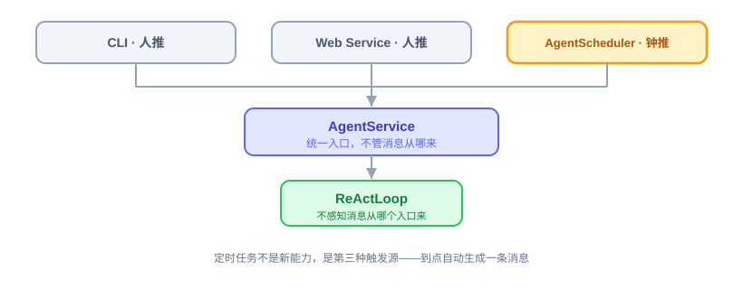

#### (1) `AgentScheduler` 模块（归 `agentos-core`）

基于 Spring 的 `ThreadPoolTaskScheduler` 加 `CronTrigger` 动态注册任务，不用静态的 `@Scheduled` 注解，因为触发规则要按 Profile 配置动态生成，编译期写死的注解做不到。Profile 新增 `schedules` 字段声明 id、cron 表达式、时区、要发给 Agent 的消息内容——cron 表达式为 Spring `CronTrigger` 六段式（秒 分 时 日 月 周；如 `0 0 8 * * *` = 每天 08:00:00 触发）；`timezone` 可选，缺省 = 进程系统时区（Java `ZoneId.systemDefault()`，即部署机器操作系统的当前时区）——cron 的触发时刻按该时区解释，不定义则同一份配置在不同时区的机器上触发时刻不同，部署文档须提示这一依赖（2026-09-30 Q6 裁决）。AgentOS 启动时扫描所有 Profile 的 `schedules` 字段逐个注册。

#### (2) 并发控制

每个定时任务用一把进程内的 `ReentrantLock`（按任务 id 维度）防止同一任务重叠执行——上一次还没跑完，下一次触发点到了就跳过，不排队、不并行跑两份。核心阶段是单实例部署，这把锁只解决"同一进程内不重叠"，**不是**分布式锁，多实例部署下的分布式协调放扩展阶段。每次 cron 触发把 `AgentService.process` 提交到一条新建虚拟线程执行，不在 `ThreadPoolTaskScheduler` 的调度线程上直接跑——`ThreadPoolTaskScheduler` 默认池大小为 1，一次任务最长 300 秒（7.4 关键设计点的总超时默认值，可被该 Agent 的 `settings.timeout.total` 覆盖；计时为步边界检查，见 7.4 关键设计点），直接跑会阻塞其他 Agent 的 cron 到点触发；`ReentrantLock` 只防同一任务重叠，防不了跨任务阻塞（设计评审 Q10 决议，2026-09-14）。

#### (3) 失败处理

定时任务执行失败只记日志，不能让调度器本身崩溃、影响后续任务触发；失败的这次调用依然走 `AgentService.process` 内部完整的 `llm_calls`/`tool_invocations` 审计路径，跟人推触发的失败没有区别。

#### (4) 会话身份

钟推每次触发落一个新 Session：channel 固定为 `scheduler`；user 取该任务 `schedules.user`（缺省 `default`）——会话与记忆档同键隔离，不同用户的定时任务会话互不混流。`schedules.user` 是 frontmatter 既有结构的可选字段，不为钟推新设运行时概念。每次 cron 触发创建一个新 Session（单轮会话：一次触发 = 一轮会话，无历史累积、无跨触发复用；session_id 四元组格式见 9.2 SQLite 关系型数据，本次会话 id 随创建写入 `task_executions.session_id`）。不复用、无物理裁剪——单轮无无限增长问题。

#### (5) 状态持久化与可管理（第四周收尾补齐）

光"到点自动跑"还不够——运营方要能看见有哪些定时任务、跑过几次、上次成没成，也要能手动补跑一次、临时停掉一个任务。为此把任务状态和执行历史落 SQLite（重启不丢），并做成可查可管的一等公民（核心阶段经 API/Swagger 操作，管理台页面放扩展阶段）：

- **两张表**（首建走 `ddl-auto=update`，建表与演进口径见 9.2 SQLite 关系型数据）：`scheduled_tasks` 存任务登记信息与运行状态（`task_id` 主键、`profile_name`、`cron`、`zone`、`message`、`user`、`enabled`、`next_run_at`、`last_run_at`、`last_status`、`run_count`、`updated_at`），`task_executions` 存每次执行的历史（成功失败都记：`task_id`、`session_id`、`started_at`、`success`、`error_message`、`duration_ms`）。定义来源仍是 AGENT.md frontmatter 的 `schedules`——这两张表只存"状态 + 历史"，不作为定义源，重启时从文件重新注册。
- **契约在 core、实现在 storage**（依赖倒置）：`ScheduledTaskStore` 接口（`register`/`recordExecution`/`isEnabled`/`setEnabled`/`list`/`executions`）放 `agentos-core`，`AgentScheduler` 依赖它；JPA 实现 `JpaScheduledTaskStore` 放 `agentos-storage`。`AgentScheduler` 启动扫描时顺带 `register` 登记，每次 `execute` 成功失败都 `recordExecution` 留痕（与 constitution 审计原则（AiProgrammingGuide.md - 3.2 /speckit.constitution 原则六：审计 day one 落库）同源）；`register` 的更新语义为**有则更新、无则插入**，以 `task_id`（组合键，见 9.2 SQLite 关系型数据）为匹配键（2026-10-01 Q7 裁决）：定义字段（`profile_name`、`cron`、`message`、`zone`、`user`）以文件为准——文件是任务定义的唯一权威，其中 `zone` 声明了写声明值、未声明每次 register 重算缺省值（进程系统时区，2026-09-30 Q6 裁决）；`next_run_at` 是定义的派生投影，register 按现行 `cron` + `zone` 重算（改 cron 重启后 `GET /schedules` 展示即跟随）；每次 `execute` 成功失败的 `recordExecution` 留痕在同一事务内刷新 `next_run_at`（从 `CronTrigger` 取下次触发时刻，与 register 同一"现行 cron + zone"算法；`runOnce` 到点触发与 `runNow` 手动立即执行都经这条留痕路径）——常驻运行下 `GET /schedules` 展示不再停留在上次重启的计算值；运行字段（`enabled`、`run_count`、`last_run_at`、`last_status`）以表为准（表是状态真相源），停用等运营动作跨重启保留；`updated_at` 随本次写入刷新。新建任务（表中无对应行）：定义字段按文件落值、运行字段按默认值（`enabled=true`、`run_count=0`、`last_*` 空）。register 只登记文件里存在的任务、不做孤儿行清理——文件侧已删任务的遗留行处置挂账 M3（见 7.3 扩展阶段补齐的端点）。`runOnce` 先看 `isEnabled`（停用则跳过、不记执行），管理台"立即执行"走 `runNow` 手动触发一次（无视启用状态）。停用任务到点跳过不经留痕，`next_run_at` 维持停用前值（至下次重启 register 重算为止）。
- **四个管理端点**（`ScheduleApiController`，前缀 `/api/v1/schedules`，{id} 即 task_id = `<agent>__<schedule-id>` 组合键、定义见 9.2 SQLite 关系型数据）：`GET /schedules` 列任务与状态、`GET /schedules/{id}/executions` 查执行历史、`POST /schedules/{id}/run` 立即执行一次、`PUT /schedules/{id}` 启用/停用。管理台"定时任务"页调这四个端点（核心阶段经 API/Swagger 操作，管理台页面放扩展阶段），可查可管——这是相对"管理台只读"的一处明确扩展（仅限定时任务这一子系统的运行控制）。

#### (6) 核心阶段 vs 扩展阶段的边界

核心阶段的 `schedules` **定义**只能写在 `AGENT.md` frontmatter 里，跟着进程启动一起注册，改 cron / 新增任务要重启（或触发重新加载）才生效；第四周收尾补齐的是任务的**状态持久化与运行控制**（查看 / 执行历史 / 立即执行 / 启用停用），不含通过 API 增删改 cron 定义。"业务方通过 Web Service 上传一个 Agent 目录（`AGENT.md` 带 `schedules` frontmatter）、由此定义一个新 Agent 并让它定时自动运行"这个完整闭环，依赖的是 7.3 扩展阶段补齐的端点里的两个能力——Agent 目录上传接口（含一句话生成）、`AgentScheduler` 的运行时增删接口——核心阶段这条链路要靠手动丢目录走通，扩展阶段补上后才是纯 API、免重启的闭环。

### 8.6 三种运行模式

| 命令 | 模式 | 说明 |
| ------ | ------ | ------ |
| `agentos chat` | 交互对话 | 本地 CLI 交互 |
| `agentos serve` | Web Service | 启动 REST API 服务（定时任务随 `serve`/`gateway` 一起常驻调度） |
| `agentos gateway` | 守护进程 | 核心阶段与 `serve` 同义（预挂 CLI Channel），多 Channel 挂载扩展阶段启用 |

三种模式共享同一份 Profile 配置和 Session 存储，差异只是接入层。

### 8.7 命令行工具

**`AgentOSCli` 模块。** Picocli 命令行入口，整个 AgentOS 的 `main` 函数，注册 13 个子命令：

```text
init
status                               # 查看配置和运行状态（DemandAnalysis.md - 5.11 命令行工具）；无需 Spring 上下文、直接读工作区文件
chat [--profile <name>] [--message <msg>] [--user <id>]   # 交互对话；--message 发单条消息后退出；--user 缺省 default；--profile 缺省：单 Agent 自动选用，多/零个报错列名单（与 DemandAnalysis.md - 5.11 命令行工具 同步）
serve
gateway
profile list / create / show / delete  # 操作 .agentos/agents/ 下的 Agent 目录；delete 不删记忆档 memory/<name>/（保留并输出提示——记忆属用户数据；归档策略扩展阶段定）
provider list
tool list
session list / session show           # 会话可查性：list 按 last_active_at 倒序取前 N（cnt 缺省 100），每项 session_id、last_active_at、messages 首条预览（无 messages 空串）；show --session-id=<SID> 返回 7 项元数据 + messages 全量（与 7.2 核心阶段端点的 GET /sessions/{id} 同口径）
```

每个子命令一个 `@Command` 类。不需要 Spring 上下文的命令（`init`、`status`、`profile list`/`create`/`show`/`delete`、`provider list`，共 7 个，均为纯文件/配置读取）直接走文件操作启动快；需要 Spring 上下文的命令（`chat`、`serve`、`gateway`、`tool list`、`session list`、`session show`，共 6 个）以完整 Spring 上下文启动——tool list 因内置 Tool 以 Bean 注册（见 6.6 ToolRegistry）、session list/show 因读 SQLite 会话数据；两类合计 13，与上方命令清单一致（2026-09-30 Q5（启动分类）裁决）。

> **只读会话查询的启动代价（2026-09-30 Q5（启动分类）裁决）：** `session list` / `session show` 以完整 Spring 上下文启动，启动即创建 Provider Bean（模型连接对象）并执行 8.8 配置与密钥加载的密钥基础校验——环境变量未就绪时命令直接报错退出，查一个历史会话也须先配齐 LLM API Key；`mcp_servers.yaml` 声明的 MCP server 亦随启动尝试连接（失败按 6.4 Plugin Tool 方式二跳过、不阻断）。查历史与 LLM 调用无关，此依赖是完整启动的传导副作用，核心阶段不做懒加载 Provider 规避；密钥校验分级（只读命令降为警告）放扩展阶段。

### 8.8 配置与密钥加载

**`ConfigLoader` 模块** 负责统一加载 LLM API key、Provider 凭证、MCP server 凭证等敏感配置。核心阶段做基础版：密钥类凭证（API Key / Auth Token）只从环境变量读取，禁止从任何配置文件读取——密钥在磁盘上的唯一落点是仓库外脚本 `~/.agent-os-poc/script/agent-os-env.sh`（权限 600，`source` 加载；导出 schema 与新增 vendor 步骤详见 docs/design/detail/model-config.md）；application.yaml 与 AGENT.md frontmatter 一律只写 `${环境变量名}` 占位符，加载时从环境变量解析，非敏感配置（如 base-url）直接写 application.yaml；密钥不写进命令行或日志，debug 最多输出前 5 位前缀（如 `sk-cp***`）。MCP server 子进程的环境变量用最小集（仅 `mcp_servers.yaml` 声明的 `env` 加 PATH 等运行必需项），不继承 AgentOS 进程全量环境变量——SDK 默认全量继承（追加非替换），密钥可能经 server 回显进入工具结果与审计表（`spike/008-mcp/README.md` 的 D8 决议安全发现）。环境变量按 Provider 命名：每个 Provider 一组四元组（`*_API_KEY` / `*_BASE_URL` / `*_DEFAULT_MODEL` / `*_MODEL_LIST`），现有 `OPENAI_*` / `ANTHROPIC_*` / `MINIMAX_*` / `ZHIPU_*` 并列、互不覆盖；OPENAI/ANTHROPIC 的取值可整体替换——当前填 MiniMax 兼容端点（只有 MiniMax 账号）；配置加载时做必填项和格式的基础校验，缺失或非法时给清晰报错。完整的加密存储、密钥轮转、对接企业 KMS/Vault 放扩展阶段。单列这个模块，是因为对企业级底座，配置和密钥的加载校验是 day one 该有的，不能散落各模块无人负责。

---

## 9. 数据持久化

### 9.1 持久化选型说明

核心阶段选 **SQLite** 加 **Spring Data JPA** 做关系型持久化，**`MEMORY.md`** 文件加关键词检索做长期记忆（默认 Markdown 档；接口预留 `memory.backend` 切换，SQLite/Mem0 档扩展阶段补齐，见第 5 章核心能力三：Memory 三层记忆）。

**为什么核心阶段不用向量数据库：** LanceDB 在向量加全文检索上做得好，是 Memory 自然的升级方向，但它的 Java 本地嵌入式支持还在开发中，当前 Java SDK 只支持远程的 Cloud 或 Enterprise，不符合 AgentOS 单二进制部署的定位。其他向量库（Qdrant、Chroma、Milvus）都需要外部进程，pgvector 要外部 PostgreSQL。JVector 这种纯 Java 嵌入式向量库是另一条路但成熟度待验证。

核心阶段的判断是先用 SQLite 加 `MEMORY.md` 跑通最短链路，让实现者先掌握 AgentOS 的核心机制，向量检索这种检索体验优化放扩展阶段。

**扩展阶段升级路径：**

- **方案 A：** 等 LanceDB Java 本地嵌入式 GA 后切换，保持单二进制
- **方案 B：** 接 PostgreSQL pgvector，企业部署多起一个 PG 服务，社区最成熟
- **方案 C：** 用 JVector 纯 Java 嵌入式向量索引跟 SQLite 双写，保持单二进制

具体选哪个扩展阶段决议。核心阶段 `LongTermMemoryStore` 接口已预留升级空间（`recallByKeyword` 可升级为带 `mode` 的 `recall`），切换底层不影响上层 Tool。

### 9.2 SQLite 关系型数据

通过 Spring Data JPA 集成，`application.yaml` 配置数据源指向 `.agentos/agentos.db`。

> **工程风险提示（建表与演进口径）：** 首次建表及后续新增表统一由 `hibernate.ddl-auto=update` 依据 JPA 实体创建（`update` 在 SQLite 上除逐条 `CREATE TABLE` 外，2026-10-09 实测（Spring Boot 3.5.16 + Hibernate 6.6.53.Final）：给实体加字段后启动，既有表被自动 `ALTER TABLE ADD COLUMN`，SQLite 支持该语句——自动加列真实存在但治理上禁用（口径见下句），建新表仍是 `update` 唯一放行的演进场景）。既有表的结构演进不依赖 `update` 自动迁移——实测证明 `update` 能自动加列，但治理口径定为：列变更（含加列）只走版本化手工迁移脚本、禁依赖 `update` 自动加列（SQLite `ALTER TABLE` 仅支持 ADD COLUMN / RENAME）；扩展阶段建议引入 Flyway 并将 `ddl-auto` 降为 `validate`，实体定义与迁移脚本以脚本为准。

**工程要求：** 启用 WAL 模式 + busy_timeout + `synchronous=FULL`（virtual thread 并发与"已写入数据不丢"承诺下必须：FULL 保证进程崩溃与 OS 断电均不丢已提交事务，需求依据 DemandAnalysis.md - 8.2 可靠性"已写入的 Session 数据保证不丢"；每轮 2~4 次毫秒级 fsync，相对 60s 级 LLM 调用可忽略）；fsync 实测注记（2026-10-09，spike/009-sqlite D5）：FULL 单次提交均值 0.102 ms（Apple M4 / APFS 本地盘；实验控制局限见该 README D5 行）；消息提交节奏为**轮原子提交**（正常完成时整轮一次事务：轮首 user 消息 + 全部迭代对 + 收尾消息；异常结束零提交，处置见 4.3 关键设计点）；钟推每次 cron 触发创建一个新 Session（单轮会话，见 8.5 定时任务）；所有会话的消息行永久完整保留（`session_messages` 行表）——存储口径与 prompt 注入口径分离（注入仍按 `max_history_turns` 截断，见 4.2 模块组成）；审计数据在 `tool_invocations`/`llm_calls` 完整保留。SQLite 方言需显式引入 hibernate-community-dialects（org.hibernate.community.dialect.SQLiteDialect）并在 application.yaml 指定，Spring Boot 3 + Hibernate 6 对 SQLite 无官方方言；2026-10-09 实测版本组合（spike/009-sqlite D6）：Spring Boot 3.5.16 BOM 仲裁下 hibernate-community-dialects 6.6.53.Final 与 sqlite-jdbc 3.49.1.0 整体回归可用——Tests run: 17、Failures: 2（= 方言两坑的坐实断言、非回归缺陷，不得记为全绿）；WAL、busy_timeout 与 synchronous 需在 JDBC 连接层设置（连接串参数或 SQLiteConfig，经 dataSourceProperties 透传，如 jdbc:sqlite:...?journal_mode=WAL&busy_timeout=5000&synchronous=FULL；2026-10-09 实测（spike/009-sqlite D2）：三参数经连接串生效——回读 journal_mode=wal、busy_timeout=5000、synchronous=2（FULL 官方数值）；无参重开库 busy_timeout 缺省 3000（xerial 驱动缺省，非 SQLite 核心缺省 0）；拼错参数名被驱动静默忽略、无告警——参数拼写以本句为准），HikariCP 默认不透传 pragma。**存量迁移口径（同会话并发裁决，2026-09-25）**：`messages_json` 单列废除走开发库重建、不做数据搬运（`ddl-auto=update` 不删列，旧列留库不用）。

核心表七张 + 一张条件表：

1. **`sessions`**：Session 元数据
2. **`session_messages`**：会话消息行表（逐行存一条消息，字段、提交纪律与轮边界截取见下文定义）
3. **`tool_invocations`**：每次 Tool 调用记录（字段定义见 DemandAnalysis.md - 10.4 Tool Invocation）
4. **`llm_calls`**：每次 LLM 调用记录（字段定义见 DemandAnalysis.md - 10.5 LLM Call）
5. **`scheduled_tasks`**：定时任务登记信息与运行状态（第四周收尾补齐，见 8.5 定时任务）
6. **`task_executions`**：定时任务每次执行的历史，成功失败都记（第四周收尾补齐，见 8.5 定时任务）
7. **`notify_channels`**（name/type/url/description，见 6.8 通知推送）
8. **`memory_entries`**（扩展阶段 SqliteMemoryStore 档引入时建表，核心阶段 Markdown 档不建；scope 列区分 CORE/ARCHIVAL，隔离键 `agent_id`/`user_id` 两列（或按二元组分表），扩展阶段建表时定、与 5.1 模块组成隔离模型一致）

> **相对原方案的调整：** `tool_invocations` 和 `llm_calls` 在核心阶段就做写入（不一定做查询接口），因为"可审计"是 AgentOS 的差异化卖点之一，审计数据的地基应该 day one 就立起来（day one 指核心阶段交付物即含审计写入；实施顺序上随第三周 SQLite 落地，见第 13 章实施节奏），纯靠日志后期要做审计还得反解析返工。查询接口和审计报表放扩展阶段，但写入核心阶段就有。`scheduled_tasks`/`task_executions` 是第四周收尾把"定时任务"做成可查可管的一等公民时补的两张表，让任务状态与执行历史重启不丢（见 8.5 定时任务）。

#### (1) `sessions` 实体字段

| 字段 | 说明 |
| ------ | ------ |
| `session_id` | 主键，四元组 `<channel>-<user>-<profile>-<uuid>`：uuid（v4 全串）在会话创建时生成，格式属实现细节，generate 会话的 profile 段取 `nan`（见 profile_name 行括注）；对调用方是不透明串——内部三元组信息有独立列（profile_name/channel/user_id），无需解析 id |
| `profile_name` | 关联 Profile；generate 会话此列记 `nan`（保留字，规则见 8.2 Profile 配置），与四元组 profile 段同值镜像——不适用标记：执行时该 Agent 的 profile 尚不存在；是语义声明、不是占位（2026-10-09 Q5（generate 会话化）裁决） |
| `channel` | 接入 Channel（取值五常量：`cli` / `web` / `invoke` / `scheduler` / `generate`；`generate` 为扩展阶段 generate 端点的单轮会话专用，2026-10-09 Q5（generate 会话化）裁决） |
| `user_id` | 用户标识（格式 `[a-z0-9-_]{1,32}`） |
| `last_termination` | 上次结束方式：`normal` / `exhausted` / `interrupted` / `failed`（可空=尚未完成过一轮或终止标记写入失败；语义见 4.3 关键设计点） |
| `created_at` | 创建时间 |
| `last_active_at` | 最后活跃时间 |

#### (2) `session_messages` 实体字段（同会话并发裁决，2026-09-25）

| 字段 | 说明 |
| ------ | ------ |
| `id` | 主键，INTEGER AUTOINCREMENT，全局自增=插入序；同会话按 id 排序即对话顺序（保留 AUTOINCREMENT：扩展阶段有会话删除端点，防 rowid 复用；该关键字社区方言建表不会生成——2026-10-09 实测，spike/009-sqlite D4 坑 1，且 SQLite 禁 ALTER 追加——首建后须按官方建表语法重建补齐，治理口径见「工程风险提示」段） |
| `session_id` | 所属会话（逻辑外键 → `sessions.session_id`；SQLite 默认不启用外键约束，核心阶段无删除、不产生孤儿行，扩展阶段真删除时应用层同删本表行，见 7.3 扩展阶段补齐的端点） |
| `payload_json` | 一条消息的 JSON 原文整段存（消息内字段集不保证恒定、不拆列；按 role 的查询走本表 `role` 投影列——2026-10-08 Q6（session_messages 加 role 列与轮边界截取读取路径）裁决） |
| `role` | 消息角色，取值 `user` / `assistant` / `tool`；payload_json 的冗余投影列（payload_json 仍是消息字段唯一来源），随消息行同事务写入，供轮边界截取定位锚点 |
| `created_at` | 写入时刻 |

索引 `(session_id, id)`，维持不变——锚点扫描发生在每轮开始时、倒序扫描深度约为最近 N-1 轮的行数，核心阶段量级下无需为 role 过滤加 `(session_id, role, id)` 复合索引（2026-10-08 Q6（session_messages 加 role 列与轮边界截取读取路径）裁决）。**提交纪律**：与 4.3 关键设计点同源——**轮原子提交**，整轮一次事务：轮首 user 消息、全部迭代对（assistant 工具调用消息与该次迭代的全部工具结果）、收尾消息在循环正常完成时一次写入（单写者下事务内行 id 连续）；进程崩溃、总超时、LLM 报错、轮末提交失败四种异常零提交，本轮全部已执行迭代不留正文、审计照留（失败追溯以审计表为准）。**轮边界截取（prompt 注入）**：按 `role` 列定位——进行中的轮计为最近一轮，轮开始时对该会话消息行按 id 倒序扫描、过滤 role=user，库内取其余 N-1 轮（N = `max_history_turns`；N=1 时库内取零轮、跳过扫描；N>1 时数到倒数第 N-1 条 user 行即以其 id 为锚点、取 id 不小于锚点的全部行；库内 user 行不足 N-1 条时取全量——新会话库内无历史，即注入仅当前轮），当前轮消息由内存缓冲承载，执行期注入恒不超过 N 轮——不按行数 LIMIT（一轮含 user+assistant+若干工具行，按行数截会拦腰截轮）；客户端重试产生的重复 user 行计入锚点、接受。（同会话并发裁决，2026-09-25；2026-10-08 Q6（session_messages 加 role 列与轮边界截取读取路径）裁决）

#### (3) `scheduled_tasks` 实体字段（第四周收尾补齐）

| 字段 | 说明 |
| ------ | ------ |
| `task_id` | 主键，组合键 `<agent>__<schedule-id>`（agent=Agent 目录名、schedule-id=frontmatter `schedules.id`；两侧字符集约束见 8.2 Profile 配置。全局唯一由构造保证——agent 目录名天然唯一（一目录一 Agent）乘 Agent 内 id 唯一，不靠注册期跨 Agent 查重；2026-09-29 E1-A（修订）裁决，替代 2026-09-26 E1-A 的"裸 id 全局唯一"口径。`__` 分隔符与 6.4 Plugin Tool 方式二的 MCP 工具全名同款。task_id 对调用方为不透明寻址键、结构化归属看 `profile_name` 独立列，与 session_id 同哲学） |
| `profile_name` | 归属 Profile |
| `cron` | cron 表达式 |
| `zone` | 时区——register 时写入解析后的实际值：frontmatter 声明了 `timezone` 写声明值，未声明写缺省值（进程系统时区，见 8.5 定时任务）；行内自含，`GET /schedules` 展示与排障不依赖二次解析（2026-09-30 Q6 裁决） |
| `message` | 到点发给 Agent 的消息 |
| `user` | schedules.user 快照（缺省 `default`），钟推触发时会话与记忆身份的来源 |
| `enabled` | 是否启用（管理台开关，默认启用；停用状态跨重启保留——register 运行字段以表为准，见 8.5 定时任务，2026-10-01 Q7 裁决） |
| `next_run_at` | 下次触发时刻——register 按现行 `cron` + `zone` 重算初值；此后每次执行随 `recordExecution` 留痕在同一事务内刷新（`runOnce` 到点触发与 `runNow` 手动立即执行同样覆盖，刷新口径见 8.5 定时任务；2026-10-03 Q2（next_run_at）裁决） |
| `last_run_at` | 上次触发时刻 |
| `last_status` | 上次结果 `success` / `failed` |
| `run_count` | 累计触发次数 |
| `updated_at` | 状态更新时间 |

#### (4) `task_executions` 实体字段（第四周收尾补齐）

| 字段 | 说明 |
| ------ | ------ |
| `id` | 主键，自增 |
| `task_id` | 关联 `scheduled_tasks` |
| `session_id` | 本次触发新建的钟推会话 id（每次 cron 触发创建一个新 Session，见 8.5 定时任务；会话创建即把 id 写入本行） |
| `started_at` | 开始时间 |
| `success` | 是否成功 |
| `error_message` | 失败信息（可空） |
| `duration_ms` | 执行耗时 |

### 9.3 文件系统数据

`.agentos/` 里几类数据放文件系统不放 SQLite：Agent 目录（`AGENT.md` + 脚本 / 子指令）、Bootstrap 文件、Memory（`MEMORY.md`）、MCP 配置、日志。文件系统的优势是用户可以直接编辑、git 跟踪、备份。Agent 目录和 Bootstrap 这种用户主动维护的数据放文件系统比放数据库友好。选址判据按数据形态（不包括日志）分三类：① 运行期由系统或管理 API 写入并维护状态的数据进 SQLite，数据库是其状态真相源（如会话 sessions、执行流水 task_executions，以及经 API 增删改查的 notify_channels、动态维护启停与下次时刻的 scheduled_tasks）；② 用户预先手写、git 跟踪、运行期系统只读载入的定义与配置数据放文件系统，文件是其唯一定义真相源（如 Agent 目录、Bootstrap、MCP 配置；经 API 如 GET /profiles 暴露仅作为只读视图，不改变其文件选址）；③ 有单独明确指定的按其指定为准（特例优先）——审计表 tool_invocations/llm_calls 依「审计 day one 落库」原则（AiProgrammingGuide.md - 3.2 /speckit.constitution 原则六）进 SQLite；记忆档 MEMORY.md 虽由 Agent 运行期写入，但核心阶段按 Markdown 文件形态追加维护（见 5.2 MEMORY.md 文件设计）。备注：以上选址以核心阶段单实例部署为前提；多实例部署的共享存储与分布式协调属扩展阶段范围（多实例并发控制见 5.1 模块组成 的 (4) 并发写保护与写入语义 小节 与 8.5 定时任务 的 (2) 并发控制 小节，集群化方向见 DemandAnalysis.md - 6.4 治理和运维层），届时另行设计。

---

## 10. 项目工程结构

AgentOS 是 Maven 多模块项目，由 9 个模块组成（模块源码目录位于仓库 `agentos/` 下；聚合 pom 与 Maven wrapper 留在仓库根，构建命令仍在仓库根执行）：

| 模块名 | 职责 |
| -------- | ------ |
| `agentos-core` | 核心抽象和接口：`AgentOSTool` 接口、`Session`、`SessionManager`（会话存取门面，定义见 5.1 模块组成）、`Profile`、`ContextLoader`、`AgentLoader`（扫 `.agentos/agents/`、`deriveProfile`）、`ReActLoop`、`PromptBuilder`、`ToolExecutor`、`AgentService`、`AgentScheduler`（定时触发）、`ProfileRegistry`（8.2 Profile 配置）、`ScheduledTaskStore`（定时任务状态契约，8.5 定时任务）、`AgentLifecycleService`（扩展阶段，编排"定义一个 Agent（Agent 目录落盘 + 派生 Profile + 注册 + Scheduler）"） |
| `agentos-provider` | 核心能力一：`ProviderService`、Function Calling 适配、Provider 配置（provider name 到 `ChatModel` 显式映射） |
| `agentos-memory` | 核心能力三：`MemoryService` 统一门面、`LongTermMemoryStore` 后端接口（含 Markdown/SQLite/Mem0 三档实现）、`MemoryTools`（`save_memory` / `recall_memory`） |
| `agentos-tool` | 核心能力四：内置 Tool（`FileTools`、`ShellTools`、`HttpTools`、`NotifyTools`）、`McpClientService`、`McpToolAdapter`、`ToolRegistry`、`Sandbox` 接口 + `SandboxChecker` 实现、`NotifyChannelAdapter` 接口 + `WebhookNotifyAdapter` 实现（三合一模块） |
| `agentos-channel-cli` | CLI Channel：`CliChannel`、`agentos chat` 命令实现 |
| `agentos-web` | 核心能力五：`WebServer`、8 个 `ApiController`（其中 `NotifyChannelApiController`/`ScheduleApiController` 随第四周收尾端点交付，见第 13 章实施节奏）、`GlobalExceptionHandler`、OpenAPI 文档 |
| `agentos-storage` | 持久化层：SQLite、`SessionRepository`、`ToolInvocationRepository`、`LlmCallRepository`、`JpaScheduledTaskStore`、`NotifyChannelRepository`、`MemoryEntryRepository`（扩展阶段） |
| `agentos-cli` | 命令行入口：Picocli 主入口、13 个子命令、`ConfigLoader` |
| `agentos-boot` | Spring Boot 启动模块：主类、自动配置、依赖聚合 |

模块之间通过接口解耦。扩展阶段加新 Channel 或新 Tool 实现只加新模块不改 core；扩展阶段的 IM Channel（独立进程/机器部署）调 `agentos-web` 的 Agent 接口，核心阶段 CLI Channel 与 `AgentScheduler` 同进程直调 `AgentService`——两种接入同走 `AgentService.process` 链路，审计与 Session 语义一致。

打包：

```bash
mvn clean package
```

生成 fat JAR，`java -jar` 启动，扩展阶段通过 **GraalVM Native Image** 编译成原生二进制。

---

# 第二部分：定义一个 Agent（业务能力）

## 11. 定义一个 Agent：一个目录 + Web Service

前面十章是**底座**——让任意 Agent 都能可靠运行的引擎、能力、支撑设施，本身不是某个具体的业务 Agent。这一章讲底座之上怎么真正"定义出一个业务 Agent"，以及这个动作通过哪个入口对外暴露。形态**借鉴 Anthropic Agent Skills**（目录 + 渐进式披露），但在 AgentOS 里，这样一个目录定义的是一个 **Agent**。

### 11.1 术语：一个目录 = 一个 Agent

#### (1) 底座 / Agent 两层，分清楚

这是这一章最关键的一条：

- **底座 = 系统基础能力**：Provider、ReAct、内置 Tool（`read_file`/`shell`/`http_get`/`notify`/`save_memory`…）、Memory、Sandbox、定时、Web（第 1~10 章）。所有 Agent 共享。
- **Agent = 一个目录** `.agentos/agents/<name>/`：`AGENT.md`（frontmatter = profile；正文 = 任务指令）+ 可选 `skills/` 公共 Skill 软连接、`scripts/`、`REFERENCE.md`。Agent 目录决定全部运行配置和可见资源。

#### (2) 借 Anthropic Agent Skills 的形态、但定义的是 Agent

Anthropic 把这种目录叫一个 Skill（Claude 这个大 Agent 的一项可加载能力）；我们借的是目录的**形态**，不是命名——在 AgentOS，**一个目录 = 一个 Agent**。每个 Agent 独立自足，只调用底座的系统基础能力。

> **早期宪章修订：公共实体与 Agent 绑定分离。** Skill 内容存 `.agentos/skills/<name>/`；Agent 通过自身 `skills/<name>` 下的受控相对软连接选择可见集合。软连接集合是唯一绑定真相源，不再使用 frontmatter `skills:`。公共 CRUD 保留，但删除被引用 Skill 默认拒绝并返回引用 Agent。

#### (3) 派生 Profile

底座（第 1~10 章的一切）都吃 `Profile`，所以 `AgentLoader.deriveProfile(agentDir)` 把 `AGENT.md` 的 frontmatter 映射成一个 `Profile`，让 Agent 目录**零改动复用整台底座**。

#### (4) 渐进式披露（收进一个 Agent 内部）

Agent 的**正文**在被触发时进 system prompt（它就是这个 Agent 的"人格 + 干什么"）；目录里的**子指令 / 参考 / 脚本不预载**（本文"子指令"指 Skill 正文与 REFERENCE 等按需读取的指令性内容），按正文指引**用底座既有能力按需取**——读子指令 / 参考用 `read_file`；在可信单机部署中，脚本可通过 `shell` 调用管理员显式白名单内的解释器。该操作以 AgentOS 进程的操作系统权限运行，不构成文件或网络隔离；不可信或多租户代码应使用未来基于容器/microVM 的 `execute_code` Runner。没有新工具、没有能力库、没有全局索引。

> **底线不变（见 AiProgrammingGuide.md - 4.6 实施过程中的协作模式 纠偏表：Agent 目录不是 Tool，加载归 ContextLoader）**：`AGENT.md` 正文由 `ContextLoader` 注入 system prompt（与 Bootstrap 文件同层）；**一个 Agent 目录不是一个可执行 Tool**——它的子资源经底座既有的 `read_file`/`shell` 取用，不新造机制。

### 11.2 核心阶段：一个目录定义一个 Agent（文件系统）

核心阶段走文件系统，一步到位：

1. 在 `.agentos/agents/<name>/` 放一个目录：至少一份 `AGENT.md`；需要 Skill 就在 `skills/` 创建指向公共实体的相对软连接，需要脚本则放 `scripts/`。
2. 启动时 `AgentLoader` 扫 `.agentos/agents/`，对每个目录 `deriveProfile` → `ProfileRegistry.register`；有 `schedules` 的交 `AgentScheduler`。
3. 运行时：正文与已绑定 Skill 元数据进 system prompt，Skill 正文/参考/脚本按需经 `read_file`/`shell` 取用；`ContextLoader` 每次现扫、不缓存。

配合运行时注册（11.3 扩展阶段的改造点在核心阶段就立好，供扩展阶段的 Watcher/API 调用）；核心阶段新增 Agent 仍需重启生效——AGENT.md 正文与 Skill 绑定的修改因 ContextLoader 每迭代现读而免重启。

### 11.3 扩展阶段：`/api/v1/agents` + 一句话生成 + 实时监听 + 文件浏览器

业务系统 / 运营要完全通过 API 或页面管理、不摸文件系统。对外只有**一类资源——Agent**（一个目录）。`AgentLifecycleService`（在 7.1 模块组成已有的 `AgentApiController` 上扩展）：

- `POST /api/v1/agents/generate`：一句话经 LLM 生成一份 **`AGENT.md` 草稿**原样返回（不写 Agent 目录、不注册；每次调用创建单轮会话——channel=`generate`、profile_name=`nan`、user 取 `X-User-Id` 头值（缺省 `default`），会话与消息照常落库、失败零提交，与 7.2 核心阶段端点 的 invoke 同款），供页面预览、修改（尤其 cron/tools 敏感项要人过一眼）（2026-10-09 Q5（generate 会话化）裁决）
- `POST /api/v1/agents`：写 Agent 目录（`AGENT.md`[+ 脚本 / 子指令]）→ `deriveProfile` → 注册
- `GET /api/v1/agents` / `GET /{name}`：查询已定义的 Agent
- `PUT /api/v1/agents/{name}`：更新正文（包括其中按名引用的通知渠道）/ provider（覆写即时生效）和/或 `schedules`（变则先注销旧句柄再注册新的）；通知渠道实体通过管理台或 `/api/v1/notify-channels` 独立管理
- `DELETE /api/v1/agents/{name}`：注销定时 → 移出索引 → **整个 Agent 目录**归档 `.agentos/archive/`（不物理删）。其记忆档 `memory/<agent>/` 的归档/保留策略扩展阶段随 `AgentLifecycleService` 定（核心阶段无 Agent 删除入口，不涉）
- `POST /api/v1/agents/{name}/invoke`：已有的无状态调用端点，不变

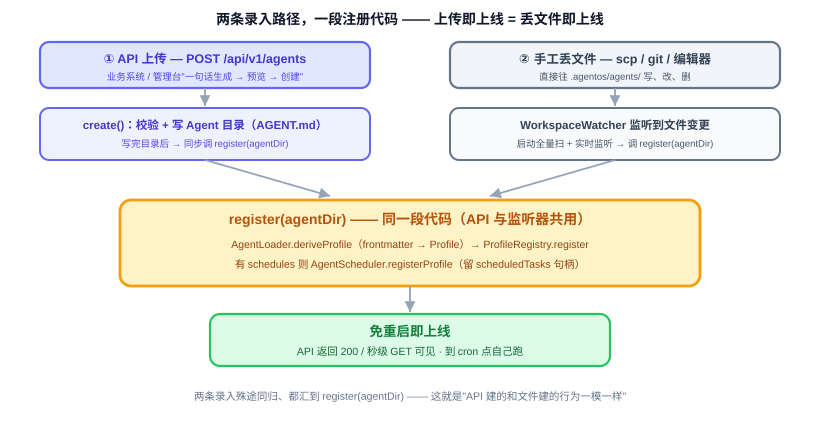

写完 Agent 目录后走的 `AgentLoader.deriveProfile → ProfileRegistry.register → AgentScheduler.registerProfile`，与启动扫描是**同一段代码**——保证"API 建的 Agent 和手工丢目录建的 Agent 行为一模一样"。`ProfileRegistry`（`register`/`remove`/`exists`）和 `AgentScheduler`（`registerProfile`/`unregisterProfile` + `scheduledTasks` 句柄表）的运行时注册方法在核心阶段就已立好，本阶段直接调；`generate` 走既有 `ProviderService`（并落 `llm_calls` 审计，审计行的 session_id 记本次 generate 会话 id）。

**一个目录、两条录入路径 + 实时监听。** `.agentos/agents/` 是**唯一真相源**，填充它两条路殊途同归：API 上传（校验 + 写 Agent 目录）、手工丢目录（scp/git/编辑器）。本阶段新增 `WorkspaceWatcher`（装配层一个守护线程，用 JDK `WatchService`；启动全量扫 + 之后实时监听 `.agentos/agents/` 变更），**它是统一注册入口**：任何 Agent 目录新增/改/删都调 `AgentLifecycleService.register(agentDir)`（与 API 上传写完目录后调的是**同一个方法**）或注销。于是"上传即上线 = 丢目录即上线、全程免重启"。此外 `WorkspaceApiController` 提供**只读**的工作区文件浏览（`GET /workspace/tree` 列 Agent 目录树、`GET /workspace/file?path=` 读文件内容，**必做防目录穿越**：`normalize()` 后 `startsWith(root)` 校验），供运维查看（核心阶段经 API/Swagger，管理台页面放扩展阶段）——钻进一个 Agent 目录看它的 `AGENT.md`/脚本/子指令。

### 11.4 为什么这几件事要打包在一起交付

单独做任何一件都拼不出"说一句话 / 调一次 API / 丢一个目录就上线一个会自动定时运行的新 Agent"这个闭环：少了目录写盘，派生不了 Profile；少了运行时注册，新 Agent 要等重启；少了定时注册，"会自己跑"是空话；少了一句话生成，运营还得手写 frontmatter。所以放在同一批一起交付，不拆开先做一半。

### 11.5 两个例子

下一章（12.1 Demo 一：每日天气 / 12.2 Demo 二：每日科技日报）的两个 Demo 各演一种 Agent 目录丰富度：天气 Agent 是光杆 `AGENT.md`；科技日报 Agent 绑定公共组稿 Skill，prompt 只注入元数据、正文按需读取。第三档丰富度（`AGENT.md + scripts/`）不设 Demo，以第四周最小链路手工演示验证（见 12.3 关于 scripts/ 脚本的说明）。

---

# 第三部分：整合与验证

## 12. 关键流程

早期按"一个 Demo 验证一个能力"拆过五个流程，现收敛为 DemandAnalysis.md - 13 验收标准 定义的**两个每日自动运行的端到端 Demo**：天气 = 光杆 `AGENT.md`、科技日报 = `AGENT.md` + 公共 Skill 软连接。两个 Demo 加起来覆盖全部五大核心能力加定时任务这个第三触发源。

### 12.1 Demo 一：每日天气（光杆 AGENT.md）

**场景：** 每天早上 8 点，Agent 自动查天气、生成穿搭建议，推送到企业 IM 群，不需要人工发起。

1. `AgentScheduler` 按 `AGENT.md` frontmatter 里 `schedules` 声明的 cron 表达式到点触发，生成一条消息，调 `AgentService.process`——每次触发创建一个新 Session（单轮会话），本次 session_id 记入 `task_executions` 行（Session 重构裁决 S1/S2，2026-09-21）；跟 `CliChannel`/`ApiController` 调用的是同一个方法，`ReActLoop` 不感知这次触发是"钟推"
2. `ReActLoop` 第一次迭代，`PromptBuilder` 通过 `ContextLoader` 组装 system prompt（`AGENT.md` 正文即这个 Agent 的指令 + Bootstrap）（按 4.2 模块组成的五部分，此处略 Memory 注入与 Tool 列表）
3. `ProviderService` 调 MiniMax（原生腿），返回包含 `http_get` 的 Tool 调用
4. `ToolExecutor` 对 `HttpTools` 申报的动作统一过白名单校验，执行 `http_get` 拿到天气 JSON，并写 `tool_invocations`
5. 结果追加到 Session 进入第二次迭代，MiniMax 看到天气生成穿搭建议，按 `AGENT.md` 正文指定的渠道名称调用 `notify(channel="team-lark", content="...")`；`NotifyTools` 从 SQLite 的 `notify_channels` 全局注册表解析适配器和 URL
6. `ToolExecutor` 再次执行（NOTIFY 动作同经统一校验、走 `notify.allowed_domains` 独立白名单），`NotifyTools` 委托给 `WebhookNotifyAdapter` 推送，成功后写第二条 `tool_invocations`
7. 无更多 Tool 调用，循环结束，最终响应留在这次自动触发的 Session 里

**验收要点：** 全程不需要人工触发；两次涉外调用都过 Sandbox 白名单且都有审计记录；`GET /api/v1/sessions/{id}` 查得到本次触发这轮会话的完整 messages（钟推单轮 Session，messages 全量返回、无物理裁剪；session_id 从 `task_executions` 执行历史取得）且 `tool_invocations`/`llm_calls` 审计记录完整；同一个 Agent 也能通过 `agentos chat` 或 `POST /agents/{name}/invoke` 手动补跑一次，验证"人推"和"钟推"走同一条链路。光杆 `AGENT.md`、不带子指令 / 脚本。

涉及能力一（Provider）+ 能力二（ReAct）+ 能力四（内置 HTTP Tool + `NotifyTools` + Sandbox）+ 定时任务（`AgentScheduler`）+ 能力五（Session 查询兜底）。

### 12.2 Demo 二：每日科技日报（AGENT.md + 公共 Skill 绑定）

**场景：** 每天早上 9 点，Agent 自动汇总当日科技新闻并推送，日报内容会体现用户之前提过的关注方向。业务方全程不写 Java 代码。

1. 业务方创建 `.agentos/agents/daily-tech-digest/AGENT.md`，并把 `skills/digest-format` 绑定为指向 `.agentos/skills/digest-format/` 的相对软连接；需要新闻聚合 MCP 就在 `mcp_servers.yaml` 配一条
2. 用户此前说过"更关注 AI 和芯片方向"，MiniMax 调 `save_memory` 写入 `<daily-tech-digest, 用户>` 档的归档区（默认 Markdown 档；SQLite 档则入 `memory_entries` 归档分区；示例 AGENT.md 的 `schedules` 需配 `user` 与该用户一致，使钟推读到同一档）
3. 到点后 system prompt 注入 `AGENT.md` 正文、Bootstrap、记忆、Skill 元数据，以及 digest-format 的 name/description/本地绝对路径（按 4.2 模块组成的五部分，此处略对话历史与 Tool 列表）；组稿规范正文不预载
4. LLM 根据描述命中该 Skill，调用 `read_file("<agent绝对路径>/skills/digest-format/SKILL.md")`，正文此时才作为工具结果进入上下文
5. LLM 按规范调新闻工具（`http_get` 或新闻 MCP——MCP 工具以 `<server 名>__<工具名>` 全名出现在工具列表，`McpToolAdapter` 按映射转发）拉当日科技新闻；因为看到记忆里的偏好，组稿时自然侧重 AI 和芯片方向——AgentOS 不解析任务步骤
6. LLM 调内置 `notify(content="...", channel="<AGENT.md 正文指定的渠道名>")` 推送（channel 必填，见 6.8 通知推送），`ToolExecutor` 写 `tool_invocations`

**验收要点：** prompt 只有 Skill 元数据、没有正文；`tool_invocations` 有对 Agent 本地软连接路径的 `read_file`；未绑定 Skill 不可见；日报体现记忆偏好（读写的同一档验证）。

涉及 Agent 目录子指令（`read_file` 按需读）+ 能力四方式二（MCP）+ 内置 `NotifyTools` + 能力三（Memory）+ 定时任务。

### 12.3 关于 scripts/ 脚本的说明

`AGENT.md + scripts/` 这种更丰富的 Agent 目录形态仍是架构支持的（11.1 术语 / 11.2 核心阶段），只是不再单设验收 Demo。跑脚本分两条路径：

- **推荐路径：** 需要捆绑脚本的 Agent，把脚本封装为专用 Tool 或 MCP server（即 Plugin Tool 方式二/三）——Tool 自己定义输入参数、限制脚本的文件/网络访问范围，只把产出的 JSON 返回给模型，脚本代码本身不进上下文。核心阶段即可安全使用。
- **止损路径：** 通用 `shell` 调用管理员显式白名单内的解释器（Python、Bash、Node 等），仅限可信单机部署。

脚本的信任边界不变（呼应 11.1 术语 与 AiProgrammingGuide.md - 4.6 实施过程中的协作模式 纠偏表：Agent 目录不是 Tool，加载归 ContextLoader）：通用 `shell` 调用白名单内解释器，等于授予模型 AgentOS 进程所属操作系统用户的代码执行权限。argv 直传只阻止 Shell 语法拼接，不会隔离解释器的文件或网络行为。对不可信或多租户代码，应使用未来基于容器/microVM 的 `execute_code` Runner；在此之前，只能在可信单机部署中启用解释器。

`AGENT.md + scripts/` 形态（Agent 目录第三档丰富度）不设独立验收 Demo，但在第四周收尾做一次**最小链路手工演示**（约 15 分钟）：建一个带 `scripts/` 的 Agent 目录，验证目录能加载、脚本能经推荐或止损路径调起、产出进入上下文、`tool_invocations` 有记录。

---

## 13. 实施节奏（4 周）

实施按 DemandAnalysis.md - 11 里程碑规划 的 4 周节奏组织，每周 3 小时，合计 12 小时。每周对应一组核心能力，每周末有可演示成果。

### 13.1 第一周（3 小时）：核心能力一 + 能力二（对接 LLM + ReAct 循环）

- 搭 Maven 多模块骨架（9 个模块）、`agentos init`、AGENT.md frontmatter 解析
- 装配写法不另设 spike：多 `ChatModel` Bean 注入与按 name 选择的推荐写法已由 `spike/007-react-loop` 两组实测（第二组 V5 四键并存、Bean 名确认），结论已回填 3.2 Provider 名到 ChatModel 的显式映射
- `ProviderService` 包装 Spring AI 官方 starter（先跑通 MiniMax——MiniMax 原生 starter `spring-ai-starter-model-minimax` 主用（第二组 D5），openai/anthropic 两条兼容腿保留、正好当两个 `ChatModel` 验证 provider name 映射；DeepSeek/Kimi 属后续新增 Provider，凭证与环境变量命名规则详见 docs/design/detail/model-config.md；依赖坐标照 D2 清单加第二组 D5 增补引入，手动循环路径（D3）与显式映射（D4）已经 `spike/007-react-loop` 实测，结论见 `spike/007-react-loop/README.md`）
- `ReActLoop` + `PromptBuilder` + `ToolExecutor`、一个内置 HTTP Tool（含 `SandboxChecker` 简化版：仅 URL 域名白名单，完整版第二周补齐，见 6.7 Sandbox 检查）、`CliChannel`
- Session 内存版（第三周 Web Service 阶段加 SQLite）

**可演示：** `agentos chat` 多轮对话，Agent 调 HTTP Tool 完成简单任务。

### 13.2 第二周（3 小时）：核心能力三 + 能力四（Memory + Tool）

- `MemoryService` 三层门面 + `LongTermMemoryStore` 接口及默认 `MarkdownMemoryStore` 后端（`MEMORY.md` 读写，按 `<agent>/<user>/` 分档）、`save_memory` + `recall_memory`
- `PromptBuilder` 加 Memory 注入
- 文件 Tool + Shell Tool（`Sandbox` 接口 + `SandboxChecker` 应用层白名单）、`McpClientService`（连接外部 MCP server；依赖坐标照 `spike/008-mcp/README.md` D1——经 spring-ai-mcp 传递引入 mcp 0.17.0，starter 不引入（D6）；最小行为照 D7、子进程最小 env 照 D8 安全发现，职责定义见 6.4 Plugin Tool 方式二）
- `ContextLoader` 加载 `AGENT.md` 正文（及 Agent 目录里的子指令按需读）
- Plugin Tool 方式三 @Tool 注解 Java Bean 示例跑通（DemandAnalysis.md - 13.1 功能验收）

**可演示：** Agent 记住偏好并后续用到，调本地文件读写、调外部 MCP server 完成跨工具任务。

### 13.3 第三周（3 小时）：核心能力五 Web Service

- `WebServer`（Spring MVC + virtual thread）、六个 `ApiController`（基础 10 个端点——会话管理四端点按 Session 重构裁决调整为 POST 创建 / GET 列表 `?cnt=<N>` / POST messages / GET 单查，`DELETE /sessions/{id}` 归档端点移扩展阶段，总数 10 不变，见 7.2 核心阶段端点），`NotifyChannelApiController`/`ScheduleApiController` 随第四周收尾端点一起交付
- `GlobalExceptionHandler`、`ConfigLoader`（配置与密钥加载）
- Session 持久化到 SQLite（含 `tool_invocations`、`llm_calls` 写入）
- `ContextLoader` 的 Bootstrap 加载、Picocli 13 个命令补齐（新增 `session show --session-id=<SID>` 单查命令，与既有 `session list` 同批交付；命令清单见 8.7 命令行工具）
- springdoc OpenAPI 文档（`/swagger-ui`）

**可演示：** 外部系统通过基础 10 个 REST 端点完整调用 AgentOS，会话数据跨重启保留、可查询与续聊（Web 凭 session_id）。

### 13.4 第四周（3 小时）：多 Agent 演示 + 工程化收尾

- 多 Agent 演示（两个不同 Profile 的 Agent 在同一实例并存）
- 结构化日志
- `AgentScheduler` 第三触发源（`ThreadPoolTaskScheduler` + `CronTrigger`，Profile `schedules` 字段驱动）
- 收尾 8 个端点（notify-channels CRUD 4 个 + schedules 管理 4 个）及 `NotifyTools`/`WebhookNotifyAdapter`、`notify_channels`/`scheduled_tasks`/`task_executions` 表、`ScheduledTaskStore`（见 6.8 通知推送 / 8.5 定时任务 / 9.2 SQLite 关系型数据）
- 项目主页（VitePress 或类似）
- scripts/ 最小链路手工演示（见 12.3 关于 scripts/ 脚本的说明）
- 跑通两个验收 Demo（12.1 Demo 一：每日天气 / 12.2 Demo 二：每日科技日报）

**可演示：** 多 Agent 并存可用，CLI 体验流畅，Bootstrap 影响 Agent 行为，会话数据跨重启保留、可查询与续聊（Web 凭 session_id），定时任务到点自动触发、`task_executions` 有执行记录，主页可访问，带 scripts/ 的 Agent 目录最小链路演示通过。

---

核心阶段结束后 AgentOS 1.0 是一个可演示的最小完整 AgentOS 运行时内核，五大核心能力全部跑通。之后转入开源社区维护，扩展功能（多 Channel、Memory 向量检索、情景记忆、Skill 体系、MCP server 暴露、Tool Policy、完整 Sandbox、Web Service 剩余端点（含会话数据删除/清理——原核心阶段 `DELETE /api/v1/sessions/{id}` 归档端点移入，届时语义为真删除/清理，见 7.3 扩展阶段补齐的端点）、Web 仪表板、SSO 和多租户、完整审计、集群高可用）以及让 AgentOS 成为真正企业级 AgentOS 的治理层由社区陆续推进。

---

## 14. 性能和可扩展性考虑

性能目标在 DemandAnalysis.md - 8 非功能需求 已定义，这里说明怎么达到。目标为单节点并发 Session ≥100（DemandAnalysis.md - 8.1 性能），本章按 1000（10 倍余量）论证架构可行性，非承诺值。

#### (1) Java 21 virtual thread 撑高并发

每个 Agent 是内存里的 Profile 对象加 Session 列表占用极少，virtual thread 让每个并发请求跑在独立虚拟线程，OS 线程数维持几十个就够支撑几千并发（按 DemandAnalysis.md - 8.1 性能 目标的 10 倍余量；指并发 LLM 等待，写路径受 SQLite 单写者约束，量级以压测为准），LLM 调用 IO 阻塞时 virtual thread 自动让出 OS 线程。

#### (2) 1000 个并发 Session 内存可控

1000 个 Session 平均 50KB 共 50MB 没问题（存储侧消息行随轮次永久增长、落 SQLite 的 `session_messages` 行表、不占堆内存；堆内存按活跃 Session 工作集估算，长会话全量历史在库按需读取、prompt 注入按 `max_history_turns` 截断——存储与注入两口径分离）。SQLite 写入按轮原子提交（正常完成整轮一次事务，见 9.2 SQLite 关系型数据）+ 审计表逐次写入触发。

#### (3) Memory 文件 IO

每次组装 prompt 读一次 `MEMORY.md`（按 `<agent>/<user>/` 分档后单档更小），文件几 KB 到几十 KB 每次读 1 到 2ms，1000 并发可接受（论证针对默认 Markdown 档；SQLite 档为查库、Mem0 档为远程调用，时延另行评估）。扩展阶段加 cache 加文件 watch。

#### (4) 启动时间

Spring Boot 在 JDK 21 下启动 2 到 4 秒，对常驻服务没问题，对 CLI 工具太慢。核心阶段 CLI 命令分两类，不需要 Spring 的直接用标准 API 操作文件，需要的才启动 Spring。扩展阶段用 GraalVM Native Image 把启动降到 100ms 以下。

---

## 15. 总结

AgentOS 技术方案核心：**JDK 21 + Spring Boot 3.x** 单体应用，自实现 ReAct 循环，基于 **Spring AI 官方 starter** 做 LLM 调用（SAA 只以 BOM 管版本；只用其协议转换和 schema 生成，不用其自动 tool 执行），SQLite 持久化加 `MEMORY.md` 文件，Picocli 命令行。

方案围绕五大核心能力展开：

1. **能力一** 对接 LLM（Provider 抽象加显式 provider name 映射）
2. **能力二** ReAct 循环（Agent 的大脑，引擎约数十行 Java）
3. **能力三** Memory 三层记忆（统一门面，核心阶段交付 Markdown 默认档 `MEMORY.md`（按 `<agent>/<user>/` 分档）加两个内置 Tool，向量检索放扩展，接口预留升级空间）
4. **能力四** Tool 体系（内置 9 个 Tool 加 Plugin Tool 三档接入，主推 `AGENT.md` 目录 加 MCP 零代码，`NotifyTools` 对称补上出站通知能力，核心阶段 Tool 相关三合一为一个模块）
5. **能力五** Web Service（REST API 八类操作，基础 10 + 第四周收尾 8 共 18 个端点——会话管理四端点构成按 Session 重构裁决调整为创建/列表/发消息/单查，DELETE 归档移扩展阶段，端点总数与类目数不变，见 7.2 核心阶段端点；业务系统集成的唯一通道）

五大能力加支撑模块是**底座**（第一部分），本身不是某个具体的业务 Agent。真正定义一个业务 Agent 靠的是 Skill（做什么）加 Profile（怎么跑），核心阶段手动改文件，扩展阶段统一到 `POST /api/v1/agents` 一个入口（第二部分，第 11 章定义一个 Agent）——这条边界线是这版技术方案跟早期版本最大的结构性调整。

实施按 4 周组织每周 3 小时：第一周对接 LLM + ReAct，第二周 Memory + Tool，第三周 Web Service，第四周多 Agent 演示 + 定时任务 + 工程化收尾。每周末有可演示成果，第四周末跑通两个验收 Demo（每日天气、每日科技日报），覆盖五大核心能力、Skill 渐进式披露与定时任务第三触发源。

**存储选型：** 核心阶段 SQLite + `MEMORY.md` + 关键词检索跑通最短链路（MEMORY.md 默认档为核心阶段交付，按 `<agent>/<user>/` 分档；SQLite/Mem0 档见第 5 章核心能力三：Memory 三层记忆），向量检索放扩展（LanceDB Java GA、pgvector、JVector 三选一），`MemoryService` 接口预留升级空间。

**承接定位：** 核心阶段交付运行时内核，能力上对齐业界开源 Agent OS 基础层，企业级治理差异化在扩展阶段补齐。架构上为治理层预留扩展点（Tool Policy、多租户、审计查询、SSO 都有对应的预留位置）。

**核心理念不变：** AgentOS 五大能力扎实落地，业务方写一个 `AGENT.md` 目录 加 MCP server 就能解决业务问题，通过 Web Service 接入已有系统，不需要写 Agent 后端代码。
