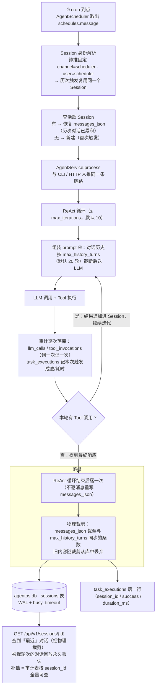
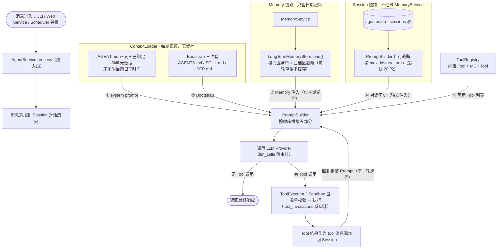
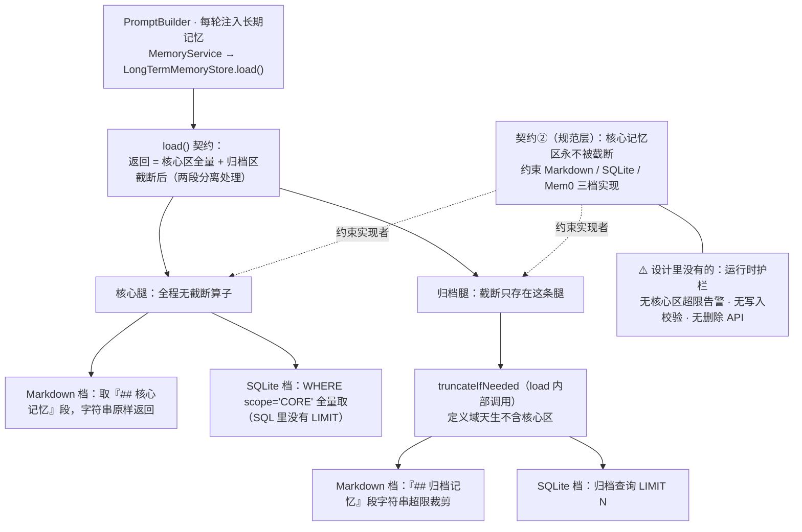
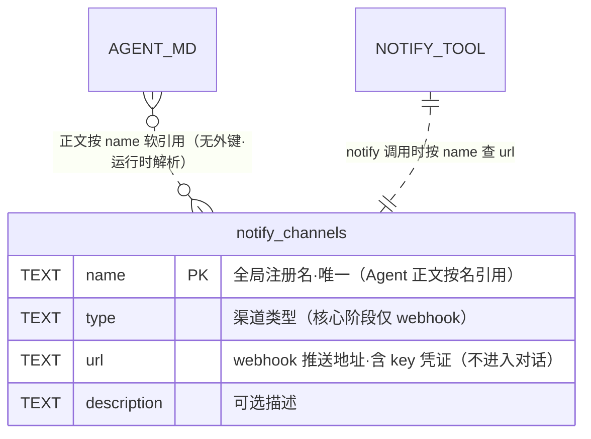
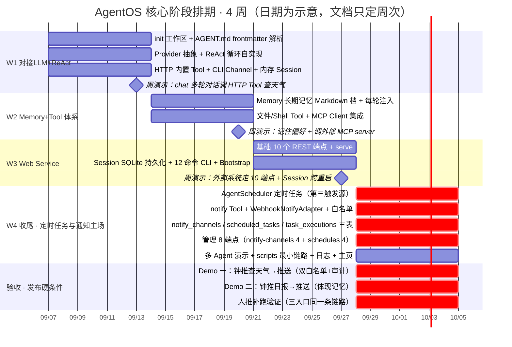

**文档**：AgentOS 需求与技术方案评审纪要
**评审时间**：2026-09-01 至 2026-09-03（两个 Session，63 轮问答）
**评审对象**：docs/DemandAnalysis.md（需求）、docs/TechnicalSolution.md（技术方案）
**文档定位**：实施对照手册——实施过程中随时回来对照需求边界、设计决议、风险与 Action Item

## 1. 评审概述

### 1.1 评审背景与方式

评审以"逐块对比 + 逐点追问"方式进行：先与需求初稿做整体差异梳理，再按暴露出的疑点逐条澄清设计动机、边界与文档口径，累计 63 轮问答。评审期间当场完成了两类动作：一类是文档修正与口径收敛（见 2.1），另一类是把暂不决议的问题记入未决事项挂账（见 2.2）。

需要先说明的一个背景：评审中大量问答以"与需求初稿对比"的形式展开，但对比只是手段——真正沉淀下来的是每个技术点的当前定案。本纪要因此全部以"技术决策与设计点"为主线组织，不再保留版本对照叙述。

### 1.2 总体结论

| # | 结论 | 说明 |
|---|---|---|
| 1 | 两份权威文档可按其实施 | 正确性层面自洽，所有数字、交付时点、表清单都能交叉验证；验收标准（DA 第 13 章）与技术方案完全对得上 |
| 2 | 浮出的问题是"留白"，不是设计错误 | 集中在未定义参数：工具输出上限、归档区裁剪参数、`llm_calls` 失败记录形态、`WebhookNotifyAdapter` 报文细节等（见 2.3 风险清单） |
| 3 | 最重要的元发现：需求文档曾滞后于技术方案 | `schedules` 字段、Profile 定性、每轮注入、notify 设计、`mcp_servers.yaml` 漏列等，同属"技术方案设计完了、需求文档没跟上"一个病根；本次评审已完成口径收敛 |
| 4 | 版本风险是评审最重要的新发现 | Spring AI 2.0 已移除 `internalToolExecutionEnabled` 开关，会破坏"ReAct 自持 + 禁用自动 tool 执行"的设计，实现时必须避开 2.0 线；**2026-09-06 晚决议变更：主线定为 SAA 1.1.2.0 + Spring AI 1.1.2（Boot 3.5.x 官方配套），开关在 1.0.x / 1.1.x 都存在，见 8.2 / 2.6** |
| 5 | 最大交付风险在第四周 | 定时任务 + 通知推送整条线押在第四周里，降级预案已验证可行（见 9.2、9.3） |

### 1.3 名词与约定

| 名词 | 含义 |
|---|---|
| AGENT.md / frontmatter（配置头） | 每个 Agent 的全部定义就是一个目录里的 AGENT.md：正文写给模型的指令，开头那段 YAML（frontmatter）写给底座的运行参数 |
| 工作区 `.agentos/` | 程序运行时的家目录，Agent 定义、记忆、数据库都在里面 |
| 钟推 / 人推 | 钟推=定时调度器到点自动触发；人推=人工触发（CLI 或 HTTP） |
| Provider | 大模型接入层，统一对接 DeepSeek、Kimi 等各家模型 |
| `messages_json` | 数据库 `sessions` 表里的一列，JSON 序列化的对话历史 |
| 流水表（审计表） | `tool_invocations`（工具调用流水）、`llm_calls`（大模型调用流水），审计追责用 |
| Profile | 从 AGENT.md frontmatter 派生出来的运行参数对象，不是文件也不是表 |
| Skill | Agent 可绑定的公共技能；每轮只把名字和简介放进提示词，正文按需读文件 |
| MCP | 社区通用的"外部工具服务器"协议，用 `mcp_servers.yaml` 登记要连哪些 |
| Sandbox（沙箱） | 本项目中=工具执行前的白名单校验层，不是隔离执行环境 |
| Tool Policy | 控制 Agent 能用哪些工具的规则；核心阶段用 frontmatter `tools` 字段充当雏形 |
| Channel / 通知渠道 | Channel=消息怎么进来（入站）；通知渠道（`notify_channels`）=结果推到哪里去（出站），两者是两个方向 |

## 2. 评审发现的问题与 Action Item

### 2.1 评审期间已完成的修正

#### (1) agentos.db 注释修正（DA 5.1）

结论：已改。需求文档 5.1 目录树里 `agentos.db` 的注释原本把 `notify_channels` 和第三周的三张表一起归为"核心表"、只用分号标注调度两表"收尾补齐"，暗示了错误的建表时点；且"核心表"数量口径与技术方案 9.2 不一致（一处 4 张、一处 6 张）。

修正后的注释口径（两份文档已统一）：

> SQLite（核心阶段 6 张表：sessions、tool_invocations、llm_calls 随第三周 SQLite 落地，notify_channels、scheduled_tasks、task_executions 随第四周收尾交付；另预留 memory_entries 条件表，扩展阶段 SQLite 记忆档启用时才建。见 10 数据模型与技术方案 9.2）

#### (2) 会话截断口径收敛

结论：会话截断的唯一机制是**按 `max_history_turns`（默认 20 轮）轮数预算截断，不探测 context window**（上下文窗口=模型一次能读的最大文字量）。需求文档中曾出现"超过 LLM context window 上限时截断"的表述，但该上限在设计里没有任何获取来源——没有配置字段、没有模型元数据表、没有探测接口，属于落不了地的模糊表述。该口径已统一修正，机制本身与技术方案始终一致（技术方案写的从来就是轮数截断），属于措辞修正而非行为变更。

### 2.2 未决事项挂账（备忘录性质）

#### (1) 挂账清单

全部记入 DemandAnalysis.md 第 12 章"未决事项"、决议时间同为"核心阶段结束后"；TechnicalSolution.md 在对应位置补了引用块标注现状与去向，两文档互锁。

| # | 挂账项 | 现状（已写死的核心阶段规格） | 待决议问题 |
|---|---|---|---|
| 1 | 各触发源下的 Prompt 组装策略（本次新增） | 三个触发源（人推 `chat`/`invoke`、钟推 `AgentScheduler`）共用同一套组装策略 | 受 LLM 上下文窗口限制，人推、钟推及后续触发方式（如 Webhook）下组装内容是否差异化（Bootstrap、长期记忆注入量、对话历史轮数）；技术方案 4.3 已补"触发源差异化（未决）"标注 |
| 2 | 工具返回结果的裁剪策略（本次新增） | Tool 返回结果不论体积、内容全部进入 Session messages 并随每轮 prompt 进入 LLM 请求，无体积上限、裁剪、淘汰、压缩、截断机制 | 后续需补裁剪能力；技术方案 4.3"消息累积"段后已补"工具结果裁剪（未决）"标注 |
| 3 | GraalVM 引入时机（既有未决项） | 核心阶段不引入 GraalVM（把 Java 编译成本地程序的技术） | 何时引入 |

小尾巴如实记录：挂账 2 条目行尾的举例句仍是旧枚举"（截断、过滤、摘要等）"，是否同步为"淘汰、压缩、摘要等"新口径，评审中提出过但未拍板。

#### (2) 挂账的性质与后续走向

这三条都是"挂账备忘录"，**不影响核心阶段的代码实现**：

- **对实现者零歧义**：每条挂账的"现状"都是当前规格里明确写死的做法，照技术方案做即可，不需要也不应该现在去解决这些开放问题。
- **不改变任何任务与验收**：US 拆分、模块设计、验收标准都没有引用这些条目，核心阶段交付物边界不变。
- **决议时点就是"核心阶段结束后"**：届时拿真实运行数据（比如实测发现某些工具返回动辄几十 KB 挤爆上下文、或钟推场景记忆注入冗余）做决定，这本身需要核心阶段跑起来的经验输入。
- **后续走向**：无论结论是"要做"还是"不做"，都进入新一轮**需求 → 设计 → 实现**循环落地（大概率归入扩展阶段 backlog），而不是回头改核心阶段已交付代码——除非实测证明核心阶段做法有硬伤，那属于缺陷修复，不在未决事项范畴。

### 2.3 风险清单（R1-R8）

评审浮出的风险与待办，一次收口如下（编号沿用评审现场记录）：

| 编号 | 风险 / 待办 | 说明 | 应对与时点 |
|---|---|---|---|
| R1 | Spring AI 版本与依赖引入风险 | 【2026-09-06 晚决议变更】主线 = SAA **1.1.2.0** + Spring AI **1.1.2** + Boot 3.5.x（官网版本页逐字"当前推荐"，工程 parent 3.5.16 直接配套，原"降 parent 或实测兼容"的决策消失）；SAA 1.0.0.2 线（Boot 3.4.x 配套，Spring AI 1.0.0 有 POM 依赖清单硬证据）降为对照备选。不变的底线：2.0 线已移除 `internalToolExecutionEnabled`，禁入；开关在 1.0.x / 1.1.x 都存在且默认开（v1.1.8 文档核验）。环境要求 Maven 3.6+（部分组件 3.8+，官方未点名阿里云镜像）；全部 pom 当前未引入 spring-ai（provider 模块注明"按第一周 spike 结论引入，此处不预引入"）。【2026-09-07 spike 实测】E1-E8 全绿：1.1.x 组合依赖解析零冲突、容器启动正常、开关关闭后无双执行、手动循环/工具链/双 Provider 全部实证通过（`spike/007-react-loop/README.md`），**本风险关闭** | 第一周 spike 决议（详见 8.2 / 2.6） |
| R2 | 工具输出无上限 | tool 结果全量进 `messages_json` 和 prompt，单条大输出（`read_file` 大文件 / shell 大日志）可撑爆上下文，轮数截断对单条巨型消息无效——设计留白 | 实现时需自加输出上限 |
| R3 | 归档记忆区裁剪参数未定义 | 机制有（`truncateIfNeeded`、md 裁字符串 / sqlite `LIMIT N`），但预算数值、裁剪方向（保新弃旧？）、粒度（字符 vs 条目）均留白；且 md/sqlite 两档粒度语义不一致 | 参数留白，实现时自行填补（见 5.5） |
| R4 | 核心区无上限、无删除 API | `LongTermMemoryStore` 四方法不含 delete，写错只能手工修 MEMORY.md / 改库 | 无机制补救，只能手工修（见 5.4） |
| R5 | `llm_calls` 无 success/error 列 | LLM 调用失败时该表的记录形态未定义（对比 `tool_invocations` 有 success/error_message） | 小留白，实现时明确 |
| R6 | `WebhookNotifyAdapter` 实现留白 | 各 IM 报文模板映射、成败判定（HTTP 200 + errcode≠0）需实现者自行决定 | 实现者在核心阶段内拍板（见 7.3） |
| R7 | W4 排期超载 | 主线四（AgentScheduler + notify + 8 端点 + 三表 + 两个 Demo 验收）全押在最后一周 | 风险表已有"末段功能挪扩展"的应对，主线四即首要候选（见 9.2/9.3） |
| R8 | 文档小瑕疵（nit） | DA 5.6 沙箱小节的 bullet 仍写"Shell：命令白名单"，与同节工具表"可执行文件白名单"措辞不一致 | 可顺手统一 |

### 2.4 Action Item 汇总

| 时点 | Action Item | 关联 |
|---|---|---|
| 第一周 spike | 锁定 SAA 1.1.2.0 + Spring AI 1.1.2（Boot 3.5.x 官方配套，parent 3.5.16 直接可用；2026-09-06 变更）；1.0.0.2 + Spring AI 1.0.x 为对照备选线 | R1、8.2、2.6 节 |
| 实现期 | 为工具返回结果增加输出上限（避免单条大输出撑爆上下文） | R2 |
| 实现期 | 确定归档区裁剪三参数（预算数值、裁剪方向、粒度），并统一 md/sqlite 两档粒度语义 | R3 |
| 实现期 | `WebhookNotifyAdapter` 落地时拍板报文模板映射与 errcode 成败判定 | R6 |
| 实现期 | 明确 `llm_calls` 在 LLM 调用失败时的记录形态 | R5 |
| 实现期 | 顺手统一 DA 5.6 沙箱小节"Shell：命令白名单"措辞 | R8 |
| 核心阶段结束后 | 决议挂账 1：是否按触发源差异化组装 Prompt | 2.2 |
| 核心阶段结束后 | 决议挂账 2：工具结果裁剪机制（体积上限、裁剪、淘汰、压缩、截断） | 2.2 |
| 发布后补验 | 性能压测（验收标准里有、未排进任何周次） | 9.2 节 |
| 扩展阶段 | GraalVM 引入时机（既有未决项） | 2.2 |

### 2.5 Context7 文档复核修正（2026-09-06）

背景：纪要写作时 Context7 不可用。2026-09-06 在 Context7 可用条件下，对第 8 章的 9 条 Spring AI 生态论断做了逐条独立复核（每条一验一对抗复核，2 条争议由官方源仲裁），报告见 `chat/temp/20260906-spring-ai-alibaba-api-validation-check.md`。**主结论全部坐实，第一周 spike 主决议不变**；下列修正已同步回正文：

| # | 位置 | 修正内容 |
|---|---|---|
| 1 | 8.2 选型表 | 2.0.0-M1.1 实际配套 Spring AI 2.0.0-M1 + Boot 4.0.0（GitHub Release Notes 逐字），原表"↔ 1.1.x 分支"有误；Spring AI 1.1.x 线绑定的是 SAA 1.1.x（1.1.2.0 ↔ 1.1.2 ↔ Boot 3.5.x），已补进选型表 |
| 2 | 8.2 选型表 / R1 / 冲突点 | "Boot 3.4.5"精确数字官方材料查无原文，统一改为"Boot 3.4.x + spike 时以依赖解析为准"；SAA 1.0.0.2 ↔ Spring AI 1.0.0 配套升级为 POM 依赖清单硬证据 |
| 3 | 8.1(3) | 手动循环的标准回灌路径 = `ToolCallingManager.executeToolCalls()` + `conversationHistory()` 重建 Prompt；原"手工构造 `ToolResponseMessage`"降为"允许但未示例"的自定义路径 |
| 4 | 8.1(1) | DeepSeek-R1 可经 DashScope/百炼托管直调；"不靠 SAA 直连"收紧为"不提供专属 ChatModel 实现类"；"spring-ai-extensions 社区仓库"删除待核 |
| 5 | 8.2 环境 / R1 | Maven 要求 3.6+（部分组件 3.8+），原"3.6.3"无原文；"建议配阿里云镜像"非官方要求 |
| 6 | 8.2 结论 | "2.0 移除开关"坐实（javadoc 方法清单级证据），并修正升级表述：自研 ReAct 循环在 2.0 仍是官方一等支持形态，升级只需删旧开关换新路径（见 8.2 复核注） |

### 2.6 版本主线决议变更（2026-09-06 晚）

决议：主线从「SAA 1.0.0.2 + Spring AI 1.0.x + Boot 3.4.x」切换为「**SAA 1.1.2.0 + Spring AI 1.1.2 + Boot 3.5.x**」；1.0.0.2 线降为对照备选（spike E9 触发时使用）。评审输入（本轮新核验证据）：

| # | 证据 | 出处 |
|---|---|---|
| 1 | 官网版本页逐字："**1.1.2.0**（当前推荐）｜Spring AI 1.1.2｜Extensions 1.1.2.1 或 1.1.2.0｜Boot 3.5.x" | java2ai.com/docs/versions（firecrawl 抓取原文） |
| 2 | 官方 quickstart = 双 BOM：`spring-ai-alibaba-bom:1.1.2.0` + `spring-ai-bom:1.1.2`（+ extensions-bom 1.1.2.1）——与 spike 002 原双 BOM 结构同构 | 同上 |
| 3 | SAA 官方仓库自述技术栈 "built upon Spring Boot 3.5.x and Spring AI 1.1.x" | SAA 仓库 CLAUDE.md（Context7） |
| 4 | Spring AI 1.1.8 文档：`internalToolExecutionEnabled` 存在、默认开（"execution is enabled if internalToolExecutionEnabled is true"）、手动循环官方标准路径与 1.0.x 完全同构（完整 while 示例） | spring-ai v1.1.8 api/tools.adoc（Context7） |
| 5 | Maven Central：1.1.2.0 BOM 在架；1.1.x 补丁已到 1.1.2.3；1.0.x 有 1.0.0.3 / 1.0.0.4 及 CVE 补丁 1.0.0.3-20260305-cve | repo1.maven.org |

连带变更：8.2 结论 / 选型表 / 版本锁定 / 冲突点 / R1、2.4 Action Item、10.3 决策日历已同步；spike 001 已重写主线并重定义 E9 为 1.0.0.2 对照线（原 E10 信息收集任务被主线吸收，删除）；spike 002 / 003 已删除、待基于新主线重新生成。

## 3. 存储与持久化

### 3.1 存储选型：SQLite 单文件定案

结论：持久化收拢为工作区根目录下**全局唯一的单文件** `.agentos/agentos.db`（启用 WAL 模式，一种支持并发读写的开关；运行时旁边伴生 `agentos.db-wal` / `agentos.db-shm` 两个文件），由 JPA（`ddl-auto=update`）在首次启用 SQLite 持久化时自动建表。没有第二个库。

#### (1) 为什么是 SQLite 而不是 H2

两者都是可嵌入轻量数据库。核心差别一句话：SQLite 是 C 语言实现的文件型嵌入式库（Java 里经 JDBC/JNI 调本地库），H2 是纯 Java 实现的数据库（直接跑在应用自己的 JVM 里）。

| 维度 | SQLite | H2 |
|---|---|---|
| 实现语言 | C（本地库） | 纯 Java |
| 进程形态 | 独立文件库，经 JNI 绑定调用 | 内嵌在应用 JVM 进程内 |
| Java 依赖 | `sqlite-jdbc` 需带平台相关 native 二进制（按 OS/CPU 架构区分） | 一个 jar 即可，零原生依赖，天然跨平台 |
| 数据形态 | 单个 `.db` 文件，格式是业界通用标准 | 文件或纯内存模式，格式自有 |
| 外部工具 | `sqlite3` CLI、各类图形工具直接打开，生态极广 | 自带 Web 控制台，外部工具支持少 |
| 兼容性 | 自有 SQL 方言（较精简） | 提供 MySQL/PostgreSQL 等兼容模式，便于以后迁移 |
| 成熟度 | 20+ 年、世界上部署量最大的数据库，极强抗毁性 | 轻量稳定，但生产端实战规模远小于 SQLite |

选 SQLite 的决定性理由：数据以**标准文件形态**落盘，运维和排查时用任意工具都能直接查会话/审计记录——对应"数据留企业、随时可人工核查"这个核心诉求。代价是要接受 JDBC 驱动里的平台相关 native 库。H2 的优势（纯 Java 零原生依赖、兼容模式好迁移）换来的短板是文件格式私有、外部工具链弱，在这个诉求下不合适。

#### (2) 定位边界与演进口子

- **现在的定位（文档明确）**：核心阶段零外部依赖跑原型。技术方案 9.1 写得很直白——不接向量库/外部 PG，因为"不符合单二进制部署的定位"，先用 SQLite + 文件跑通最短链路。
- **迁外部数据库**：只有 Memory 给了明确预留（`LongTermMemoryStore` 三档切换，扩展阶段接 LanceDB/pgvector/Milvus 做语义检索）；Session/审计表的迁移**没有明文承诺**。但因为整个持久化走 Spring Data JPA + Hibernate 方言，换 PostgreSQL 是顺理成章的低成本路径——架构上留了口子，只是没写成正式升级路径。
- **集群化的必然性**：多节点 + Nacos/ETCD 那种集群部署时，SQLite 单文件 + WAL 本质是单机方案，必然要换共享数据库。
- **"支持大数据量"别高估**：核心阶段反而刻意限制单库数据增长（钟推 Session 裁到 20 轮，见 3.4）。SQLite 的角色是"原型够用、中小规模够用"，不是奔着大数据量设计的。

### 3.2 agentos.db：6 张核心表 + 1 张条件表

结论：核心阶段最终 6 张表——第三周先有 3 张，第四周收尾补 3 张；外加 1 张条件表 `memory_entries`（扩展阶段把记忆后端切到 SQLite 档时才建）。全部由 JPA `ddl-auto=update` 首次自动创建。

#### (1) 表清单与建表时点

| 表 | 存什么 | 建表时点 |
|---|---|---|
| `sessions` | 会话元数据 + JSON 序列化的对话历史（`messages_json`） | 第三周 |
| `tool_invocations` | 每次 Tool 调用审计（入参、结果、耗时、成败） | 第三周 |
| `llm_calls` | 每次 LLM 调用审计（Provider、模型、token 用量、耗时） | 第三周 |
| `notify_channels` | webhook 通知渠道注册表 | 第四周收尾 |
| `scheduled_tasks` | 定时任务登记与运行状态 | 第四周收尾 |
| `task_executions` | 定时任务每次执行的历史 | 第四周收尾 |
| `memory_entries`（条件表） | SQLite 记忆档启用时才存在 | 扩展阶段 |

其中 `scheduled_tasks` / `task_executions` 只存**状态 + 历史**，不作为定时任务的定义源——任务定义在 AGENT.md frontmatter 里，重启时从文件重新注册（见 7.1）。

#### (2) 不进数据库的文件

Agent 目录（AGENT.md）、Bootstrap 三件套（AGENTS.md / SOUL.md / USER.md）、MEMORY.md 长期记忆默认档、`mcp_servers.yaml`、日志——这些仍走文件系统，保留"可直接编辑、git 跟踪、可备份"的待遇（技术方案 9.3 的文件系统哲学）。

#### (3) 一次口径澄清（表数量）

评审中曾把表数说成"8 张"——那是按需求文档第 10 章的数据模型条目数粗算的，其中 Profile 是 `AgentLoader.deriveProfile()` 派生的**内存对象**（不落库）、Memory 核心阶段是 **MEMORY.md 文件**（不在库里），都不能算表。严谨口径就是上面表的 **6 张核心表 + 1 张条件表**。

### 3.3 会话入库：损失与补偿

结论：会话从目录形态收进数据库，损失集中在两点——文件形态的可见性和按会话粒度的备份运维；真正的**数据级损失只有一条**：钟推 Session 的 `messages_json` 物理裁剪，早期对话内容会从库里删掉。补偿是把"完整留痕"移交给了粒度更细的审计表。

#### (1) 失去什么（文件形态的运维便利）

| 维度 | 影响 | 可弥补性 |
|---|---|---|
| 可浏览性 | `messages_json` 是转义 JSON 长文本，要 sqlite3 加解析才能读，`ls` 即见的直观性没有了 | 用 sqlite3 / 图形工具部分弥补 |
| 备份/恢复粒度 | 只能整库备份；WAL 模式下运行中只拷 `.db` 主文件可能丢最近事务，得连 `-wal/-shm` 一起拷或先 checkpoint | 备份脚本弥补 |
| 删除/归档 | SQL DELETE 后空间不自动回收（要 VACUUM） | 定期 VACUUM |
| 按会话冷备 | 不能"拷走某个会话"归档 | 可接受 |

其中"目录可见性"这一项实际权重比看起来更小：工作区里那个独立的会话目录本来就是一个预留空目录（文档标注"备用（会话已入 SQLite）"），从未承载过独立内容。

#### (2) 真正的数据损失：钟推物理裁剪

钟推（定时触发）Session 每次落盘时，`messages_json` **物理裁剪到与 `max_history_turns` 同步的条数，旧内容随裁剪从库中丢弃**。也就是说定时任务跑了三个月后，第 1 周的对话流已经不在 `sessions` 表里了。人推（CLI/HTTP）Session 不受影响，完整保留——截断只发生在拼 prompt 时，内存里裁、库里不裁。

#### (3) 换来了什么、补偿在哪、边界在哪

- **为什么值得**：钟推每几十分钟跑一次、永远复用同一 session_id，不裁剪 `messages_json` 会无限增长——这是裁剪的直接动机。配套明确了落盘节奏"ReAct 循环结束后落一次，不逐消息重写"（单列大 JSON 反复重写太贵；代价是循环中途崩溃时本次消息不落库）。
- **补偿**：完整留痕由 `tool_invocations` / `llm_calls` 审计表承担——day one 就写入，粒度是每次 LLM/Tool 调用的输入输出，比对话流更细。会话与审计、调度、通知渠道表同库，事务一致。
- **边界（要知道的限度）**：**审计 ≠ 对话回放**。`llm_calls` 只记调用元数据（provider、model、token 数、耗时），不存 LLM 的输入输出文本；靠 `session_id` 串联能还原"那次定时任务跑了哪些调用、成没成、花多少 token"，但还原不出完整对话文本——丢掉的对话流是真丢了。如果场景需要"回放某次定时任务的完整对话"，当前设计给不了。

### 3.4 钟推 Session 机制

结论：钟推 Session 的设计哲学是"**绝不另起炉灶**"——身份复用人推公式、存储复用 sessions 表、截断复用 `max_history_turns`；唯一的特殊处理是落盘时的物理裁剪，把"无限增长的隐患"换成"对话流可弃、审计链永在"的明确取舍。

#### (1) 机制全貌

| 维度 | 设计 |
|---|---|
| 身份规则 | `session_id` = channel + user + profile 联合生成；钟推的 channel 和 user 都固定为 `scheduler` → 同一 Profile 的历次定时触发**永远复用同一个 Session** |
| 设计原则 | "不为钟推新设任何概念"——完全复用人推的 Session 机制，没有独立的"任务执行记录"会话类型 |
| 内容构成 | 与人推相同的三类消息：user（= `schedules.message` 那句话）/ assistant（含 tool_call）/ tool 结果 |
| 落盘节奏 | ReAct 循环**结束后落一次**，不逐消息重写 `messages_json`（防写放大） |
| prompt 侧增长控制 | 每轮组装时按 `max_history_turns`（默认 20 轮）截断，LLM 只看到最近 20 轮——历次触发的上下文天然延续（这次能看到上次跑了什么），直到滚出窗口 |
| 存储侧增长控制 | 每次落盘时 `messages_json` 物理裁剪至与 `max_history_turns` 同步的条数，旧内容从库中丢弃 |
| 并发保护 | WAL 模式 + `busy_timeout`（virtual thread 并发写库时的等待保护） |
| 中断处理 | 总超时（300s）返回 504 时，已执行的审计照常落库，Session 标记 `interrupted` 不丢弃 |
| 查询口径 | `GET /api/v1/sessions/{id}` 查到"经物理裁剪后的**最近**对话"；Demo 一验收即按此口径 |

#### (2) 处理流程



### 3.5 审计与调用流水

结论：两张流水表构成"每次 LLM 调用 + 每次工具调用"的完整账本，**核心阶段 day one 就写入**（查询接口和报表放扩展阶段）；写入发生在 `AgentService.process` 统一路径内，人推/钟推/失败调用走同一条审计路径。

#### (1) 表结构

| 字段 | 说明（`llm_calls`，每次 LLM 调用一行） |
|---|---|
| `id` | 主键 |
| `session_id` | 关联 Session（软关联，借它间接拿到 profile/channel/user） |
| `provider` | Provider 名称（deepseek / kimi…） |
| `model` | 模型名 |
| `prompt_tokens` / `completion_tokens` / `total_tokens` | 输入/输出/总 token 数 |
| `duration_ms` | 调用耗时（毫秒） |
| `created_at` | 调用时间 |

| 字段 | 说明（`tool_invocations`，每次 Tool 调用一行，成功失败都记） |
|---|---|
| `id` | 主键 |
| `session_id` | 关联 Session |
| `tool_name` | 工具名 |
| `input_json` / `result_json` | 入参、结果 |
| `success` / `error_message` | 成败与错误信息 |
| `duration_ms` / `created_at` | 耗时与时间 |

#### (2) 设计要点

- **一次调用一行**：写入时机是 ReAct 循环内**每次**调用即时落库（区别于 `messages_json` 的"循环结束落一次"），与钟推物理裁剪无关——所以是永不丢的计费流水。
- **没有 Agent/Profile 列**：归属信息靠 `session_id` JOIN `sessions` 表拿（`sessions.profile_name`）——规范化设计，查账要连表。
- **没有成本列**：只记 token 不记金额——单价随 Provider/模型/汇率变，框架不猜价格，费用由外部按 token × 单价计算。
- **`llm_calls` 没有 success/error 列**（对比 `tool_invocations` 有）：LLM 调用失败时这表记什么，文档未细说——留白（R5）。

#### (3) 审计链与查账

链路关系：一次钟推执行 → `task_executions.session_id` → 同一 `session_id` 下的所有 `llm_calls` / `tool_invocations` 记录，审计链就是这么串起来的。

查账示例（"每个 Agent 本月花了多少 token"）：

```sql
SELECT s.profile_name, SUM(l.total_tokens) AS tokens, COUNT(*) AS calls
FROM llm_calls l
JOIN sessions s ON s.session_id = l.session_id
WHERE l.created_at >= '2026-09-01'
GROUP BY s.profile_name;
```

## 4. 上下文与 Prompt 组装

### 4.1 触发源与统一处理链路

结论：核心阶段三个触发入口，全部汇入同一个 `AgentService.process`——不管从哪触发，处理逻辑只有一套，审计与 Session 语义一致；`ReActLoop`（自研的 ReAct 循环）不感知消息从哪来。

| 触发方式 | 入口 | 推法 |
|---|---|---|
| CLI Channel | `agentos chat`（含 `--message` 单条模式） | 人推 |
| Web Service | `POST /api/v1/sessions/{id}/messages`、`POST /api/v1/agents/{name}/invoke` | 人推 |
| AgentScheduler | cron 到点自动发消息 | 钟推 |

另有一个手动变体：管理端点 `POST /schedules/{id}/run` "立即执行一次"，本质是"人推的钟推"（走 Scheduler 的 runNow，**无视启用状态**），仍属同一条链路。

扩展阶段会新增的触发方式：Webhook（告警/CI 事件驱动）、IM Channel（企业微信/飞书/钉钉/Slack，走 Channel Adapter 插件，底层都调 Web Service 的 Agent 接口）、AgentOS 自身作为 MCP server 被外部调用、Agent 间任务委托。

### 4.2 PromptBuilder 五部分

结论：发给 LLM 的请求由 `PromptBuilder` 按**五部分固定顺序**拼接，**每轮迭代都重新组装**（ReAct 循环有工具调用就回到组装步骤继续）。

#### (1) 五部分构成

| # | 部分 | 内容 |
|---|---|---|
| ① | system prompt | AGENT.md 正文（该 Agent 的指令）+ 已绑定 Skill 的 name/description/本地读取路径元数据，**末尾附当前日期时间** |
| ② | Bootstrap | AGENTS.md / SOUL.md / USER.md 三个引导文件 |
| ③ | Memory 注入（仅长期记忆） | 核心记忆区全量 + 归档区截断，由 `MemoryService` 提供；会话历史**不在这一段**——它由第 ④ 段独立注入一次，避免重复 |
| ④ | 对话历史 | 按 `maxHistoryTurns` 截断后的 Session messages（含本循环累积的 LLM 响应和 Tool 结果） |
| ⑤ | 可用 Tool 列表 | Function Calling 格式，来自 Profile `tools` 字段声明的工具池（内置 Tool + MCP Tool 经 `ToolRegistry` 统一暴露） |

两个结构性细节：**system prompt 末尾附当前日期时间**——LLM 不知道今天几号，定时场景的"今天"全靠这一行；**Skill 正文不进 prompt**——只注入元数据，正文和附属资源由模型按需经 `read_file`/`shell` 取（渐进式披露，控制上下文体积）。

#### (2) 关键特性：全链路现读无缓存

`ContextLoader` 每轮重读 AGENT.md 正文、Bootstrap、重扫 skills/ 软连接；`MemoryService` 每轮重新取记忆。所以改文件、`save_memory` 写入后**下一轮立即生效**。

#### (3) 组装流程



### 4.3 会话历史截断：轮数预算定案

结论：对话历史的截断**只看轮数、不看 token**——保留 system prompt 和最近 N 轮对话，超出部分丢弃，N = `max_history_turns`（默认 20），不探测 context window、没有 token 计量；真正按 token 预算的上下文管理（总结压缩）明确放在扩展阶段。

#### (1) 定案与配置

- **配置项**：AGENT.md frontmatter 的 `settings.max_history_turns`，默认 20，经 `AgentLoader.deriveProfile()` 派生进 Profile，**每个 Agent 可以各配各的**；文档里没有全局配置开关。
- **设计含义**："不探测 context window"意味着设计上直接绕开了"需要知道模型上限是多少"这个前提——文档全篇没有任何获取模型上下文窗口的地方（无配置字段、无 model→窗口大小的元数据表、无调 Provider API 探测）。
- **钟推联动**：钟推 Session 的物理裁剪按"与 `max_history_turns` 同步的条数"执行，改大这个值，库里保留的钟推历史就相应变多。

#### (2) 边界：20 轮仍可能超限（已知取舍）

轮数预算是唯一兜底。如果 20 轮内容仍然撑爆上下文（典型风险源：某轮 `read_file`/`shell` 拉回超大工具输出——工具输出没有体积上限，见 R2），会发生的是：

- LLM 调用直接报错（Provider 层原样抛出，context length exceeded 之类），**不是静默丢弃，也没有自动降级重试**；
- 该次失败照常走审计链路：`llm_calls` 记一笔、钟推场景 `task_executions` 记 `failed` + error_message；调度器不受影响、下个触发点照常跑（失败处理原则"只记日志，不能让调度器本身崩溃"）；
- 唯一的间接缓解是 HTTP 入口的单条消息限 32KB，但这只管人推的单条输入，管不住工具产出的体积。

这是一个**已知取舍**：核心阶段用"配置纪律"代替"运行时保护"——运维上发现某 Agent 频繁超限，手段就是把这个 Agent 的 `max_history_turns` 调小，或收敛它绑定的工具输出。

#### (3) 若要补保护的四条现实路径（文档均未采用）

1. **自维护模型元数据表**：按模型名硬编码 context size，最常见做法，但新模型要人工更新；
2. **Provider models API 元数据**：OpenAI 兼容协议大多不返回窗口大小（Ollama 等返回），不可靠；
3. **超限错误自适应重试**：捕获 context length exceeded 后裁掉更早轮次重试一次——有效但每次多烧一次失败调用；
4. **运行时反馈**：`llm_calls` 已在记 `prompt_tokens`，理论上可用"上一轮实际消耗"做预算告警——这是现有设计里唯一已有的相关数据，但未接入截断决策。

### 4.4 messages_json：存什么、不存什么

结论：`messages_json`（`agentos.db` 里 `sessions` 表的一列，JSON 序列化的消息数组）是"对话过程的原样录像"，只存三类角色；每次演出临时搭的舞台布景（系统提示、记忆、工具清单）和后台台账（审计表、元数据列）都不进它。

#### (1) 进入历史的三类消息

| 角色 | 内容 | 何时写入 |
|---|---|---|
| `user` | 用户输入（CLI 打的字、HTTP 发的消息）、钟推触发时注入的 `schedules.message` 文本 | 消息到达时 |
| `assistant` | LLM **每次迭代**的响应——包括中间迭代里带 `tool_call` 请求的响应和最终文本回复 | ReAct 循环每次迭代 |
| `tool` | 每次 Tool 执行的结果（回灌给 LLM 继续推理用的那条） | 每次工具执行后 |

第三类值得注意：因为内置 Tool 什么都能干，`tool` 消息会让不少东西**间接**进入历史——`read_file` 读回的文件全文、`shell` 的输出、`save_memory` 的写入确认、MCP server 返回的数据（此条为从"Tool 结果作为 tool 消息追加"的合理推论，标注推导）。这就是"Session 的对话历史包含完整的 LLM 调用链和 Tool 调用链，对外可查可审计"的含义：历史不是干净的三行对话，而是含工具链快照的完整过程记录。也因此，工具输出没有体积上限意味着落库可能膨胀（R2）。

#### (2) 不进入历史的五类内容

1. **system prompt 全家**：AGENT.md 正文、Bootstrap 三件套、Skill 元数据、末尾的当前日期时间——每轮现读现拼，用完即弃；
2. **长期记忆内容**（见下条"记忆零拷贝"）；
3. **Tool 清单**：发给 LLM 的 Function Calling schema，只在请求里；
4. **审计元数据**：token 用量、耗时、成败、白名单校验结果——在两张审计表里。注意边界：tool 的**结果文本**会以 `tool` 消息进历史（因为要回灌），审计表记的是另一份更细的调用级台账（时长、成败、入参出参），两者并存，不是同一份；
5. **Session 与调度元数据**：`session_id`、`channel`、`user_id`、`status`、`created_at` 等——是 `sessions` 表的**其他列**，不在 `messages_json` 数组里；cron、`run_count`、执行历史在 `scheduled_tasks` / `task_executions` 表。

两个补充行为：**没有 `system` 角色的消息**（推导——系统提示每轮重拼、不作为消息持久化，原文未提及消息角色枚举）；**物理裁剪只作用于这个数组**（钟推裁、人推不裁，见 3.3）。

#### (3) 记忆零拷贝：注入 ≠ 追加进会话历史

长期记忆只进 prompt，不进 `messages_json`：存储层记忆的拷贝数是 **0**——注入发生在"拼装 LLM 请求"这个临时动作里，组装结果不落库，下一轮重新从源文件现读（契约①不缓存）；单次请求里记忆只出现 **1 次**，不会因为拉了 20 轮历史就变成 20 份。

需要分清的一个现象：无状态 LLM API 的本质是**每次调用都要把全量上下文重新发一遍**，所以一个 20 轮的会话，记忆确实会被向 LLM 重发 20 次——但对话历史本身也是每轮重发的，这是所有 chat 模型的工作方式，不是"记忆注入"引入的额外代价。想省掉这个是 Provider 侧 prompt caching 的事，与存几份拷贝无关。边缘情况：如果 LLM 在回复里复述了记忆内容，这句回复会作为 assistant 消息进历史——那是模型行为产生的衍生拷贝，不是框架写入的，且会随截断最终消失。

#### (4) 历史与请求的关系

| 维度 | Session 对话历史（messages_json） | 发送给 LLM 的请求 |
|---|---|---|
| 性质 | **持久数据**：落 `agentos.db`，跨重启恢复、可审计可查 | **临时对象**：每次 LLM 调用前现拼，用完即弃、不落库 |
| 内容构成 | 三种消息：user / assistant（含 tool_call）/ tool 结果 | 五段：系统提示 + Bootstrap + 长期记忆 + 历史截断版 + Tool 清单 |
| 记忆 | **0 份** | **1 份**（③，每次现读） |
| 历史完整性 | 完整调用链（人推不裁；钟推落盘时物理裁到 20 轮） | 最多最近 20 轮 |
| 增长方式 | 只追加，逐条变长 | 结构恒定，整包重发 |

一句话记住：**历史是账本，请求是照着账本每次现抄的一段摘要（最多 20 轮），抄的时候还要垫上系统提示、记忆和工具清单这三张"衬纸"——衬纸不进账本，账本也不会全文照抄。**
## 5. Memory 体系设计

### 5.1 LongTermMemoryStore 接口与三档后端

结论：长期记忆经统一存取接口 `LongTermMemoryStore`（可理解为"记忆柜台"，柜台后站谁可以换）访问，`memory.backend` 配置开关预留三档切换；**核心阶段只交付 Markdown 默认档**，SQLite/Mem0 档随后补齐——接口和配置开关先行保留。

#### (1) 四个接口方法

| 方法 | 职责 |
|---|---|
| `append(content, scope)` | 追加一条记忆，`scope` 指定写核心区还是归档区 |
| `load()` | 唯一的上层调用入口——`PromptBuilder` 每轮组装 prompt 时经 `MemoryService` 调用，返回"核心区全量 + 归档区截断后"的内容 |
| `recallByKeyword(...)` | 关键词检索，**只搜归档区**（核心区本来就每轮全量注入，无需检索） |
| `truncateIfNeeded` | 对**归档记忆区**执行超限截断，由 `load` 内部调用 |

`truncateIfNeeded` 没有独立的使用时机——调用方是 `load` 自己，不是上层模块选着用的。它被单列为接口第四个方法，意义在于把截断逻辑显式化、由各后端各自实现（Markdown 档裁字符串、SQLite 档 `LIMIT N`）。至于为什么单列成接口方法（而非藏在 load 里），文档没有明说；合理推断是便于各后端实现和单测截断行为（推导）。

#### (2) 四条行为契约（写给全部三档实现者的规约）

① 每轮重新读、不缓存（改文件、`save_memory` 写入下一轮立即生效）；② 核心记忆区**永不被截断**，截断只作用在归档区；③ 写核心还是写归档由 Agent 经 `scope` 显式指定，**系统不猜**；④ recall 只做关键词匹配，不做语义检索。

明确不做的（不做清单）：自动抽取、内置向量库、情景记忆、Memory Wiki、记忆压缩。

#### (3) 三档后端

| 后端 | 说明 |
|---|---|
| Markdown 档（默认，核心阶段交付） | MEMORY.md 按 `## 核心记忆` / `## 归档记忆` 两分区组织 |
| SQLite 档（随后补齐） | 复用已有 `agentos.db`，建条件表 `memory_entries`（`ddl-auto=update` 自动创建，与 sessions/审计表同口径） |
| Mem0 档（随后补齐） | 走自托管 REST 服务，接口方法翻译成 Mem0 的 add/get/search；提炼与语义分区依赖 Mem0 自带能力 |

设计承诺："换后端只改一行配置"——接口墙上层一个字不动。

### 5.2 CORE / ARCHIVAL 分区与 scope

结论：写核心区还是归档区，**系统不判断、判断主体是 LLM 自己**——调 `save_memory(content, scope)` 时自己填，框架不做任何自动判断，默认 ARCHIVAL（保守：拿不准就进归档）。

#### (1) scope 是什么

`scope` 就是 `save_memory` 的第二个参数——写入分区标记。类型为枚举 `MemoryScope.CORE` / `MemoryScope.ARCHIVAL`，二选一，默认 ARCHIVAL；Agent 侧表现为内置 Tool `save_memory` 的参数，接口层对应 `LongTermMemoryStore.append(content, scope)` 的第二参。

#### (2) 两区差异与判定判据

文档没有列出正式的判定清单，但两区的设计差异给出了清晰判据——**"在场性"**：

| | 核心区 CORE | 归档区 ARCHIVAL |
|---|---|---|
| 进入上下文的方式 | **每轮全量注入** prompt，永远在场 | 平时不在场，靠 `recall_memory` 关键词按需捞 |
| 截断 | **永不截断**，写进去就永久占位 | 超限被裁（`truncateIfNeeded`） |
| 检索 | 不参与 recall（在场所以不需要） | recall 的唯一搜索范围 |
| 该放什么 | 少量、稳定、每次对话都应影响行为的事实——用户身份级偏好、项目硬约定、长期有效的决策结论 | 量大、细节、备查性内容——事件经过、历史案例、一次性事实、时效性细节 |

可操作的判据一句话：**"这条记忆需不需要在每一次对话中都影响 Agent 的行为？"** 需要 → CORE；只是"记下来备查" → ARCHIVAL。

#### (3) scope 在三档后端的物理形态（语义不变，存储形态随后端而变）

| 后端 | scope 的物理形态 |
|---|---|
| Markdown 档 | 决定追加到 MEMORY.md 的哪个 header 段 |
| SQLite 档 | `memory_entries` 表的 `scope` 列（核心区读取就是 `WHERE scope='CORE'`） |
| Mem0 档 | Mem0 的 metadata 字段 |

#### (4) 三点现实约束

1. **代价不对称**：写进核心区的内容每轮都烧 token 且无法靠截断回收；四方法里**没有删除**——核心区写错了，Markdown 档靠用户手工编辑 MEMORY.md 修正，SQLite 档得手改库。
2. **分区质量靠 prompt 教学**：既然系统不猜，"什么时候该用 CORE"就成了 prompt 工程问题——规范玩法是在 AGENT.md 正文或绑定的 Skill 里写明分区原则，教会 LLM 这个判断。
3. **自动分区是扩展阶段的活**：让 LLM 在对话结束时自动提炼事实并决定分区的"自动抽取"明确放扩展阶段；若切到 Mem0 档，提炼和语义分区交给 Mem0 自带能力，用不用取决于是否切到该后端。

### 5.3 每轮注入，不缓存

结论：长期记忆**每轮组装 prompt 都注入**（核心区全量 + 归档区截断），每轮重读不缓存——`save_memory` 写完**下一轮立即生效**。

为什么这么设计：如果按"启动时注入一次"实现，会话中途写入的记忆本轮看不见、要下次重启才生效——"Agent 记住用户偏好、下次对话不需要重新解释"这个核心卖点会退化成"下次**重启**才生效"。"每轮注入 + 契约①不缓存"就是为堵这个洞。性能上论证过可接受：md 读小文件 / SQLite 查库 / Mem0 调 API，都在可接受范围。

职责切分要记牢：**MemoryService 只管长期记忆；会话历史由 PromptBuilder 按 `maxHistoryTurns` 截断后独立注入**——长期记忆和会话历史是两条独立链路（4.2 图中的 ③ 与 ④），Memory 门面不碰会话历史。

### 5.4 核心区：明文无上限、无删除

结论：核心记忆区是"**零上限、零淘汰**"设计——`save_memory(content, CORE)` 写进去就永久全量占每轮 prompt；四方法里没有 delete，也没有"满 N 条降级到归档"的逻辑，压缩也在不做清单里。

#### (1) "永不截断"靠什么强制

靠**结构性隔离**，不靠运行时校验——让裁剪代码的作用域天然够不到核心区，而不是写一个守卫去拦。分三层：

| 层 | 强制手段 |
|---|---|
| 接口定义层 | `truncateIfNeeded` 的定义域只有归档区（"对归档记忆区执行超限截断"）；`load` 的契约是两段分离处理——"核心区全量"和"归档区截断"是同一返回值里两条独立路径，截断逻辑只挂在归档路径上 |
| 实现层 | Markdown 档裁的是 `## 归档记忆` 段字符串，核心段不在裁剪代码的输入里；SQLite 档核心区与归档区是**两条不同的查询**——核心区 `WHERE scope='CORE'` 全量取（这条 SQL 里没有 LIMIT），LIMIT 只存在于归档那条查询 |
| 契约层 | 契约②约束 `LongTermMemoryStore` 全部实现（含 Mem0 档——Mem0 档如何保证这一点文档没细说，靠的就是这条契约 + 接口墙） |



#### (2) 边界（要知道的限度）

- **没有运行时护栏**：没有"核心区超限告警"、没有写入校验、没有单测之外的断言。如果某个后端实现把裁剪误写成整个文件，框架不会拦——这层保障只能靠代码评审和测试。
- **"强制不裁"的另一面是"无法收缩"**：四方法里没有 delete，核心区一旦写错内容，没有任何机制能回收，只能手工编辑 MEMORY.md（Markdown 档）或手改库（SQLite 档）。
- **风险**：核心区被写膨胀后，每轮请求无上限变重，最终把上下文撑爆——和"无 token 级保护"（4.3）是同一条风险线（R4）。

### 5.5 归档区：机制明文、参数留白

结论：归档区裁剪的**机制层有明文**（何时裁、裁哪、分后端怎么裁都写清楚了），但**三个实现参数全是留白**，实现时必须自己定（R3）。

| 环节 | 明文规则 |
|---|---|
| 触发时机 | `truncateIfNeeded` 对归档区执行超限截断，`load` 内部调用——即每轮注入检查一次 |
| 作用范围 | 只裁归档区，核心区碰都不碰（契约②） |
| 实现形态 | Markdown 档："截断是字符串裁归档段"；SQLite 档："截断变成归档查询的 `LIMIT N`" |
| 压缩 | 不做（不做清单里有"记忆压缩"） |

留白的三处：

1. **预算数值**：多少字/多少条算"超限"？全文档没有任何数字，连对应的配置项都没有（对比超时预算有完整明文：application.yaml 默认、Profile 可覆盖、不硬编码）；
2. **裁剪方向**："字符串裁归档段"没说保新弃旧还是保旧弃新；`LIMIT N` 没说 N 值和排序键；
3. **裁剪粒度**：Markdown 档按字符串裁，理论上可能把一条记忆**拦腰截断**；SQLite 档按条目——两档粒度语义不一致，文档没有调和。

## 6. 工具体系与安全边界

### 6.1 内置 Tool 与工具注册

结论：核心阶段共 **9 个内置 Tool**（含 `notify`），随启动自动注册进 `ToolRegistry`，**没有任何注册动作**；Agent 能用哪些由它自己的 frontmatter `tools:` 列表决定（列了才进它的工具池）。

- 内置 Tool 与 MCP Tool 对 ReAct 循环**长一个样、无差别调用**：MCP 工具由 `McpToolAdapter` 包装成统一的 `AgentOSTool` 注册进 `ToolRegistry`。
- `http_get` / `http_post` / `notify` 本身就是那三个内置 Tool，不存在"注册"问题；和它们的"配置"只有各自的白名单。
- 边界：MCP server 如果自己发 HTTP，走的是 server 进程，不经这三个内置 Tool。

### 6.2 mcp_servers.yaml 与 init 幂等

结论：`mcp_servers.yaml` 是工作区根下的**全局配置文件**，登记本实例可连接的所有外部 MCP server（用任何语言写的、通过 Model Context Protocol 暴露工具的独立进程）；`agentos init` 会生成一份**空模板**，且幂等——已存在绝不覆盖。

#### (1) 文件内容与两层引用

每条配置声明四样：`name`（名称）、`transport`（连接方式：stdio 或 SSE）、`command`（stdio 方式时的启动命令）、`env`（环境变量，比如 GitHub token）。

全局登记 ≠ 所有 Agent 都能用，两层引用关系：

| 层 | 管什么 |
|---|---|
| `mcp_servers.yaml`（全局，一份） | 管 "**有哪些**"——每台实例登记一次 |
| AGENT.md frontmatter 的 `mcp_servers:` 字段（每个 Agent） | 管 "**谁能用哪些**"——按名称引用清单的子集 |

运行链路：启动时 `McpClientService` 连接清单里的 server → 调 `tools/list` 拿工具列表 → 经 `McpToolAdapter` 包装注册进 `ToolRegistry`。

#### (2) init 幂等原则

`agentos init` 幂等：**已存在的目录和文件一律不覆盖**，对 `mcp_servers.yaml` 同样生效——文件已存在则跳过原样保留（手工配好的条目不受影响），不存在才生成空模板。所以重复执行 `agentos init` 是安全的（误跑第二次、升级后重跑都不会冲掉已有配置）。代价：想恢复出厂空模板，只能手动删掉文件再跑一次 init，没有"重置单个文件"的命令。

#### (3) 设计取向：为什么走文件而不是数据库

这是文件系统哲学（技术方案 9.3）的取舍：用户主动维护的数据要**可编辑、git 可跟踪、可备份**。对比 `notify_channels` 走 SQLite 表——那是运行时通过 REST API 动态注册的数据，所以落库。零代码扩展（"纯 markdown 上线一个新 Agent"）成立的前提，就是工具连接信息全部集中在这份 yaml 里，业务方一行 Java 都不用写。

### 6.3 shell 执行模型：argv 直接 spawn

结论：shell 工具**直接执行白名单内可执行文件与参数数组，不经 Shell 解释**——这是注入免疫的结构性来源；bash/python 这类解释器默认禁用，管理员显式列入白名单才可用。

#### (1) 机制

```java
// 不这么做：命令串交给 shell 解释（可被拼接注入）
new ProcessBuilder("/bin/bash", "-c", "git status; rm -rf /")

// 这么做：argv[0] = 白名单程序本体，参数逐个传入
new ProcessBuilder("/usr/bin/git", "status").start()
```

流程：LLM 返回 `{可执行文件, 参数数组}` → 按 `shell.allowed_commands` **精确比对**可执行文件路径（用绝对路径，防 PATH 劫持）→ 校验过了才 `exec`。

为什么这样就免疫注入：操作系统的 `exec` 系统调用本来就接收数组形式的 argv，每个元素原样作为一个独立参数，**中间没有解释层**。`;`、`&&`、`|`、`$()`、反引号这些字符之所以危险，是因为 shell 会把它们重新解析成控制符——不经解释器，它们就只是参数里的普通字符（`"status; rm -rf /"` 会作为一个整体参数传给 git，git 不认识就报错，仅此而已）。

#### (2) 保留的口子（警示原文要记住）

- **参数内容本身不校验**——只校验可执行文件；
- 解释器警示（设计文档原文）："**参数不校验——解释器一旦列入白名单即视为放通其全部文件/网络行为，文件白名单对其不生效；列入解释器属高危运维决策**"。`python -c "恶意代码"` 等于重新打开解释层，所以解释器默认禁用。

### 6.4 Sandbox 定性：前置校验层

结论：本项目的 Sandbox（沙箱）**不是隔离执行环境，是工具执行前的策略校验层**——只做"允不允许"的白名单判断；真正的隔离执行（容器/microVM）是扩展阶段另立的 `execute_code` Runner 接口的事。

| 维度 | 定案 |
|---|---|
| 接口 | `Sandbox.check(action)`——只做"允不允许"的判断，不假装自己会隔离执行 |
| 实现 | `SandboxChecker`（核心阶段唯一实现，白名单检查器）——命名即定性：它是检查器不是沙箱 |
| 动作枚举 | 5 值：FILE_READ / FILE_WRITE / SHELL_COMMAND / HTTP_REQUEST / **NOTIFY**（+NOTIFY 是为了配合通知独立白名单，见 7.2） |
| 能力边界 | 只有执行超时（Tool 单次 30s）；**资源占用限制随扩展阶段 `execute_code` Runner 引入**——应用层白名单根本做不到资源隔离，不做硬许诺 |
| 扩展路径 | 受控执行（容器 / microVM / WASM）走另立的 `execute_code` Runner 新接口承载；`Sandbox.check` 降格为前置校验保留——不让一个白名单接口假装两种能力 |

定位要说实话："劝阻级防线，防不住蓄意绕过"。

### 6.5 Tool Policy：雏形在 frontmatter

结论：正式的工具权限规则（Tool Policy，允许/拒绝规则）是**扩展阶段能力**；核心阶段由 frontmatter 的 `tools:` 字段充当雏形——Profile 按 `tools` 字段从 `ToolRegistry` **过滤出可用 Tool 子集**。

边界：这个雏形只能圈**白名单子集**，没有 deny 规则；"Sandbox 加白名单是核心阶段唯一的 Tool 治理手段，`tools` 字段算是雏形"。
## 7. 定时任务与通知推送

### 7.1 schedules：定义源与管理端点边界

结论：核心阶段**不能用 API 创建定时任务**——任务定义的唯一来源是 AGENT.md frontmatter 的 `schedules` 字段，改 cron / 新增任务要重启（或触发重新加载）才生效；管理 API 的 4 个端点全是**运行控制**，刻意不含创建/修改/删除。

#### (1) 创建一个定时任务的完整步骤

第 1 步，在 AGENT.md frontmatter 里声明 `schedules`（定义的唯一来源）：

```yaml
schedules:
  - id: daily-weather          # 任务 id，Agent 内唯一；管理端点用它寻址
    cron: "0 7 * * *"          # 每天早上 7 点
    timezone: Asia/Shanghai
    message: "查一下今天天气，生成穿搭建议"   # 到点发给 Agent 的那句话
```

第 2 步，重启进程（`agentos serve` / `gateway`）——`AgentScheduler` 扫描所有 Profile 的 `schedules` 逐个注册，并顺带登记进 `scheduled_tasks` 表（记下 `next_run_at` 等，默认 `enabled=true`）。

第 3 步，到点自动跑——触发消息走 `AgentService.process`（钟推 Session，channel/user 固定为 `scheduler`，见 3.4），和 CLI/HTTP 人推同一条链路；每次执行成败都写 `task_executions`。

注册表只是状态的影子——文档明说"这两张表只存**状态 + 历史**，不作为定义源，重启时从文件重新注册"。

#### (2) 管理 API 的 4 个端点（收尾阶段交付）

| 端点 | 干什么 | 典型场景 |
|---|---|---|
| `GET /api/v1/schedules` | 列出任务与运行状态（enabled / next_run_at / last_status / run_count） | 运营看"有哪些任务、下次几点跑" |
| `GET /api/v1/schedules/{id}/executions` | 查执行历史（成功失败都记） | "上周三那次为什么没推出来" |
| `POST /api/v1/schedules/{id}/run` | **立即执行一次**（runNow，**无视启用状态**） | 不等到点，手动补跑/验证一次 |
| `PUT /api/v1/schedules/{id}` | 启用 / 停用（写 `enabled` 开关） | 临时停一个任务；停用后到点跳过且不记执行 |

两个语义细节：`run` 是"手动触发一次已存在的任务"，不是创建；它无视停用状态，而正常到点触发会先检查 `enabled`（停用则跳过）。

#### (3) 为什么核心阶段不给创建 API + 两张调度表

不给创建 API 的理由：定义源是**文件**而非数据库——API 改不了"源头"，只能改影子（开关、状态）。要实现"纯 API 创建定时任务"需要一整套前置能力，文档已把它打包进扩展阶段：Agent 目录的上传/一句话生成 + 调度定义的增删改 + 实时监听。核心阶段的替代做法是"手动丢目录走通"：写好带 `schedules` 的 AGENT.md 放进 `.agentos/agents/<name>/`，重启即生效——Demo 二验证的正是这条纯 markdown 路径，全程不写 Java 代码、不调创建 API。

| 表 | 字段 | 解决什么 |
|---|---|---|
| `scheduled_tasks` | task_id（主键，来自 `schedules.id`）、profile_name、cron、zone、message、enabled、next_run_at、last_run_at、last_status、run_count、updated_at | 光"到点自动跑"不够，运营方要能看见有哪些任务、跑过几次、上次成没成，还要能临时停掉、手动补跑——4 个管理端点的状态都得有地方放，且重启不丢 |
| `task_executions` | task_id、session_id（本次钟推所用 Session）、started_at、success、error_message、duration_ms | 审计链入口：一次执行 → `session_id` → 该 Session 下的 `llm_calls`/`tool_invocations`；没有它，"上周三那次日报为什么没推出来"无从查起 |

### 7.2 notify_channels 与独立白名单

结论：推送目标集中登记在全局注册表 `notify_channels`（webhook 推送目标，如企业微信群机器人地址）；notify 推送走**独立白名单 `notify.allowed_domains`**，与 HTTP 白名单（`http.allowed_domains`，管 `http_get`/`http_post`）分离——**webhook URL 含 token 等凭证，不暴露给 `http_post`**。

#### (1) 注册表设计



要点：

- **孤立的注册表**：库里没有任何表用外键指向它，AGENT.md 正文和 `notify` 调用都是**按 name 软引用**——具体 webhook 地址不进对话、不进 frontmatter，增删改渠道不用动任何 Agent，凭证也不散落在各 AGENT.md 里；
- 它是纯配置表，不带运行状态（对比 `scheduled_tasks` 有一堆状态字段）；主键为"全局注册名"是从语义推定的（推导——文档只列了四个业务字段，未定义 PK/约束/时间戳）。

#### (2) 为什么推送要独立白名单（凭证隔离）

推送在实现上就是一次 HTTP 出网（`WebhookNotifyAdapter` 包好 JSON 发一次 POST），它必须过 Sandbox 域名白名单。关键在于推送目标自带门钥匙——如 `https://qyapi.weixin.qq.com/cgi-bin/webhook/send?key=693a...` 里的 `key` 就是凭证，拿到它任何人都能往这个群里发任意消息。

如果推送和普通 HTTP 查询共用一份白名单，"能推送的域名 = 能被 `http_post` 访问的域名"，风险链条是：

1. **key 会回流进上下文**：webhook URL（含 key）存在 `notify_channels` 表里；notify 调用的错误信息、重试日志可能带着完整 URL，以 `tool` 消息形态进入 session history——LLM 的上下文里就有了这把钥匙；
2. **`http_post` 变成伪造通道**：一旦 LLM 被诱导（prompt injection）或行为异常，`http_post` 因为同域在白名单内，可以直接打到 webhook endpoint——拿着上下文里的 key 仿冒 Agent 往群里发消息（钓鱼、假告警）；
3. **运维无法分账**：一份清单两种用途，想"锁死普通 HTTP、只留推送"或"放开 HTTP、收紧推送目标"都做不到。

独立白名单后互不传染：推送域名对 `http_post` 不可达，反之亦然——key 即使泄漏进上下文，`http_post` 也被域名挡在门外；两类出网行为分账、可独立收紧。发送前统一校验 `Sandbox.check(new SandboxAction(NOTIFY, url))`。

#### (3) 三个 HTTP 类工具的分界

| 工具 | 角色 | 场景 | 例子 |
|---|---|---|---|
| `http_get` | **拉**——读外部数据 | 查询 API、抓取公开数据（只读出网，URL 由 LLM 现场给定） | `GET https://api.weather.com/today?city=shanghai` |
| `http_post` | **写**——向外部系统提交/触发 | 调内部系统 POST 接口、提交表单、触发 CI | `POST https://cmdb.internal/api/change` 提交变更登记 |
| `notify` | **送**——把结果送到人眼前 | 经 IM 群机器人 webhook 推消息（按名引用注册表里的渠道） | `notify(channel="ops群", content="今天 28°C 晴")` → 企微群收到消息 |

一句话记忆：**get 拉数据、post 办事、notify 报信**；前两者走 `http.allowed_domains`，报信的走独立的 `notify.allowed_domains`。

- 为什么推消息不用 `http_post` 直接打 webhook？三个理由——webhook URL 含 key 凭证，`notify` 把它隔离在注册表和独立白名单里（URL 不进对话、`http_post` 摸不到该域名）；各家 IM 的 JSON 报文格式由 adapter 统一封装；渠道改名/换地址不用改 Agent。
- 反过来，`notify` 也不抢 `http_post` 的活：它只统一"最常见的纯文本 webhook 推送"，要发企微富文本卡片这类复杂格式，仍走 MCP 方式二自接专用 server——两条路并存。
- 白名单粒度：文档只定义了**域名级**白名单，没有 URL 级/路径级/方法级；文件和 Shell 各有自己的路径/可执行文件白名单。

### 7.3 Notify Tool 实现设定：已定与留白

结论：设计文档把 Notify Tool 写到了"接口签名 + 行为契约 + 模块归属 + 安全门禁"的粒度，实现者可以直接照着搭骨架；**对外契约已闭环，对内报文留白**——留白是核心阶段内实现者要自己拍板的细节，不是延期到扩展的内容。

#### (1) 已设定的（可直接照做）

| 层面 | 设定内容 |
|---|---|
| Tool 签名 | `@Tool notify(content: String, channel: String)`，channel **必填**（全局注册名） |
| 调用链路 | LLM 传 `channel` + `content` → `NotifyTools` 从 `notify_channels` 注册表**解析适配器和 URL** → 发送；Agent 正文按名引用，URL 不进对话 |
| 适配器接口 | `NotifyChannelAdapter.send(NotifyTarget target, String content)`，`NotifyTarget = { channelType, config }`——接口先行 |
| 核心阶段实现 | **唯一实现** `WebhookNotifyAdapter`：把 content 包成 webhook 约定格式发一次 POST；逐家专用 API（签名、AccessToken 刷新）明确不做 |
| 安全门禁 | 发送前过 `Sandbox.check(NOTIFY, url)`，走独立 `notify.allowed_domains`，不与 http_post 共用 |
| 模块归属 | `agentos-tool` 模块（与 FileTools/ShellTools/HttpTools 同居） |
| 注册/配置 | 渠道经 `/api/v1/notify-channels` CRUD（收尾 4 端点），落 `notify_channels` 表；frontmatter 不含 notify_channels |
| 审计 | 复用 `ToolExecutor` 现有路径写 `tool_invocations`，不新增审计逻辑 |
| 超时 | 复用通用预算：Tool 单次 30s，失败返回可重试标识由 LLM 决定重试 |
| 实施落点 | `NotifyTools` + 适配器落 `agentos-tool`；`SandboxChecker` 补 `checkNotifyUrl`（NOTIFY case） |

#### (2) 留白的（实现时要自己定）

1. **各 IM 的报文模板**：只说"包成对方 webhook 约定的 JSON 格式"——但企微（`{"msgtype":"text","text":{...}}`）、飞书、钉钉格式各不相同，`type` 字段如何映射到报文模板、核心阶段内置几种模板，没有定义；
2. **NotifyTarget 的装配细节**：注册表里的 `type`/`url` 怎么填进 `NotifyTarget{channelType, config}`（`config` 里放什么 key）未写死；
3. **成败判定**：企微等 webhook 常见"HTTP 200 但 body 里 errcode≠0"，按 HTTP 状态码还是解析 body 判成功——未定义；
4. **HTTP client 选型**（RestClient/WebClient/HttpClient）——留作实现自由。

#### (3) scope 澄清与能力边界

- **接口和实现类都在核心阶段**：`WebhookNotifyAdapter` 是核心阶段**唯一实现**、且被两个验收 Demo 硬依赖——如果只写接口不写实现，notify 就是空壳，两个 Demo 直接挂掉。真正出 scope 的只有一句话：**webhook 之外的第二、第三个实现类**（专用渠道 Adapter）。同类模式还有两处：Sandbox 接口 + 核心阶段唯一实现白名单检查器；Memory 接口 + 核心阶段只交付 Markdown 默认档。
- **`WebhookNotifyAdapter` 是"带行为说明的空类名"，不是半成品骨架**：文档没有为它规划任何内部方法结构（没有"`buildPayload()` 留给实现者"这类条目），只定义了黑盒行为——"包成对方约定的 JSON 格式发一次 POST + 发送前过白名单"。类内部是一个 `send()` 全包还是拆几个私有方法，是实现者的自由度。
- **能力边界：核心阶段的 notify = "万能 webhook 转发器"**。手里有任意群机器人 webhook URL（企微/飞书/钉钉的自定义机器人）→ 先注册成渠道，就能发；飞书"**应用**"通道（App Credentials、官方 im/v1 API、消息卡片、@人、OAuth）→ 不能，要等扩展阶段的专用 Adapter，或自己写一个飞书 MCP server 走 Plugin 方式二。

### 7.4 多 webhook 差异的合规实现路径

结论：不同 webhook 的报文和成败判定各不相同，框架里留了正经的扩展点，**不需要出圈**——设计意图就是"type 路由到不同 Adapter"（`notify_channels.type` 字段 + `NotifyTarget.channelType` + "解析适配器"）。分两层做：

| 层 | 场景 | 做法 |
|---|---|---|
| 第一层：单 Adapter 内策略分发 | 同为 webhook 家族，只是报文格式/成败判定不同 | 对外仍只有一个 `WebhookNotifyAdapter`，内部按 `type` 分发到小策略（formatter / success judge 的映射表，每策略几行 lambda）；未知 `type` 走兜底模板或注册时明确报错；新增一种 bot 加一条映射，不污染主流程。塞进去的是**分发骨架**，格式知识各自隔离在策略里 |
| 第二层：新 Adapter 实现类 | 协议真正不同（AccessToken 刷新、签名计算、官方 API） | 新写一个 `XxxAdapter implements NotifyChannelAdapter`，在 `NotifyTools` 的 **type → Adapter 解析表**加一行（Spring 下注入 `Map<String, NotifyChannelAdapter>` 最自然）；文档"扩展阶段新增专用渠道 Adapter"就是给这条路径背书——可以按扩展的标准写，只是不必挤进核心阶段交付 |

三条硬约束别越过（框架的硬约束）：

1. **白名单门禁每条路都要过**：不管几个 Adapter，发送前 `Sandbox.check(NOTIFY, url)` + `notify.allowed_domains` 是统一前置（建议放在 `NotifyTools` 统一做，Adapter 不各自绕行）；
2. **`config` 别当报文 DSL 用**：`NotifyTarget.config` 的本意是连接参数（url 等），协议差异是**代码**问题，塞进配置变成字符串模板引擎就过度设计了；
3. **审计不动**：所有 Adapter 的调用都走同一条 `ToolExecutor → tool_invocations` 路径，新 Adapter 不自建留痕。

### 7.5 渠道注册与测试方式

结论：渠道注册不是配置文件，是**调 API 写库**；文档没有提供独立的"测试发送"端点，验证靠三条现成路径。

- **注册**：`POST /api/v1/notify-channels`（body：name / type / url / description，url 即群机器人 webhook 地址，含 key），数据落 `notify_channels` 表。核心阶段用 API/Swagger 手工注册（管理台页面在扩展阶段）。Agent 的 AGENT.md **正文**里按 name 引用（"推送到 ops 群"），frontmatter 不含 notify_channels。
- **测试**：① 人推补跑——`agentos chat --message` 或 `POST /agents/{name}/invoke` 让 Agent 执行一次含 notify 的任务；② 钟推验证——`POST /api/v1/schedules/{id}/run` 立即执行一次；③ 查证——群里收到没收到 + `tool_invocations` 里有没有 notify 调用记录。

## 8. Provider 与框架集成

### 8.1 对接层落点：ChatModel

结论：对接大模型落在 **ChatModel** 这一层（Spring AI 本体的核心接口），Provider 抽象 = "provider 名 → ChatModel 实例"的显式映射，禁止类型扫描 Bean；选这层的核心目的，是让自研 ReAct 循环握住工具调度的全部控制权。

#### (1) 归属澄清（经官方核验修正后）

```
Spring AI（框架本体）：定义 ChatModel 接口（org.springframework.ai.chat.model.ChatModel，call(Prompt) → ChatResponse）
                      —— 所有厂商连接器的统一契约
Spring AI Alibaba（SAA）：提供 ChatModel 的实现类（直连 DashScope/通义系）
AgentOS：按 provider 名 → ChatModel 实例做显式映射，包装成自己的 Provider
```

核验微修正（2026-09-06 Context7 复核后进一步收紧）：SAA 直连的是 DashScope/通义系；SAA 不提供 DeepSeek/Kimi 专属 ChatModel 实现类——但 DeepSeek-R1 可经 DashScope/百炼平台托管直调（SAA 官方博客演示 `spring.ai.dashscope.chat.options.model=deepseek-r1`）；独立部署的 DeepSeek/Kimi 走 Spring AI 的 OpenAI 兼容 starter（配 base-url，DeepSeek 官方示例 `https://api.deepseek.com`；Kimi 同机制，系 OpenAI 兼容示例外推，无逐字引文）——注意环境变量按 Provider 命名：DeepSeek/Kimi 将来作为独立 Provider 各用一组四元组（`DEEPSEEK_*` / `KIMI_*`），与 `OPENAI_*` / `ANTHROPIC_*` 并列、互不覆盖（详见 docs/design/detail-supplement/001-model-config-export.md）；原表述中的"社区扩展仓库（spring-ai-extensions）"在官方文档未命中，删除待核——即"SAA + Spring AI 生态"，SAA 的价值在它提供的实现类。

#### (2) 为什么落在 ChatModel（归因修正）

评审前的一句归因"ChatClient 会自作主张、ChatModel 不会"经官方核验后**需要修正**：自动执行工具是 Spring AI 的**框架行为**——`ToolCallingManager` + `internalToolExecutionEnabled`（**默认 true**，工具在 call 内部自动执行），该开关在 ChatModel options 层即可设置，**两层都能设**，不是 ChatClient 特有。

修正后的真实价值：

| 考虑 | 说明 |
|---|---|
| **控制点放最薄的一层**（最主要） | 显式关闭内部执行 + 显式管理每轮 Prompt/响应，工具调度控制权全在自家的 `ReActLoop` + `ToolExecutor` 手里——与"循环必须自持"的决策绑定，不被任何高层门面的默认运行时绑架 |
| **审计边界清晰** | `llm_calls` 要按"每次 LLM 调用"记 provider / model / token / 耗时——面对 ChatModel 的单次往返，usage 和计时拿得最直接，"一次模型往返"与一条审计记录一一对齐；隔着门面封装（advisors 等中间件）边界会变模糊 |
| **实例级映射顺手** | ChatModel 是实例级接口，正适合"每个 Provider 一个实例、各带 api_key / base_url / model"的显式映射表用法（实现时密钥按槽位名从环境变量读取、base-url 直接写 yaml 且不带 /v1——Spring AI 的 OpenAiApi 会自动追加 /v1/chat/completions，详见 docs/design/detail-supplement/001-model-config-export.md）；ChatClient 是构建器风格门面，包一层反而绕 |
| **ChatClient 没被扔掉** | 门面仍可用于装配便利，只是不让它成为循环的承载层——分界线在"每次模型往返发生在哪一层" |

#### (3) 核验结论与可行性

| # | 论断 | 核验结果 |
|---|---|---|
| 1 | ChatModel 是 Spring AI 本体核心接口、SAA 提供实现类 | 成立（SAA 官方定位是 Spring AI 的扩展） |
| 2 | 自动执行是框架行为，`internalToolExecutionEnabled` 默认 true | 成立——机制成立，但归因从"ChatClient 特有"修正为"框架行为、两层都能设" |
| 3 | 关闭自动执行即可让 ReAct 循环自持 | 成立，且有官方路径：`internalToolExecutionEnabled(false)` 进入手动模式，调用方检查 `ChatResponse` 中的工具调用请求，自行执行后经 `ToolCallingManager.executeToolCalls()` 取回更新后的对话历史再次调用模型（2026-09-06 复核收紧：官方示例走 ToolCallingManager 路径；手工构造 `ToolResponseMessage` 属"文档允许但未示例"的自定义路径） |
| 4 | SAA 已做好主流 LLM 的 connector | 部分准确（修正为 SAA 直连 DashScope，其余走 OpenAI 兼容 starter + 社区仓库） |
| 5 | 不用 SAA 更高层的编排抽象 | 成立——SAA 自带 Graph 多智能体编排框架（LangGraph 风格），自实现 ReAct 循环意味着绕开它，避免锁进它的编排模型 |

**可行性：高**。手动工具执行循环是 Spring AI 官方文档支持的标准模式（v1.0.3 文档 "User-Controlled Tool Execution" 独立小节 + 两段官方示例），不是 hack。落地要点：`ProviderService` 用 `Map<String, ChatModel>` 显式构建；循环内 `ChatModel.call(prompt)` → 检查 `chatResponse.hasToolCalls()` → `ToolCallingManager.executeToolCalls(prompt, chatResponse)` 执行工具 → 用返回的 `conversationHistory()` 重建 Prompt → 再 `call`（2026-09-06 复核修正：这是官方示例的标准路径，比原设想的"手工构造 `ToolResponseMessage` 追加"更省事），与设计文档的 ReAct 步骤一一对应；`@Tool` 注解仅取 schema 生成（`ToolCallbacks.from(...)` 注册，定义解析与执行在 `ToolCallingManager` 层架构解耦），配合开关关闭内部执行。

### 8.2 版本风险与工程现状

结论（2026-09-06 晚决议变更后）：**实现时锁定 SAA 1.1.2.0 + Spring AI 1.1.2 + Boot 3.5.x（parent 3.5.16 直接可用）**——该组合是 SAA 官网版本页逐字"当前推荐"，且开关行为已在 Spring AI 1.1.8 文档同构核验（`internalToolExecutionEnabled` 存在、默认开、手动循环官方标准路径与 1.0.x 一致）；原决议（1.0.0.2 + Spring AI 1.0.x）降为对照备选线。不变的底线：Spring AI 2.0 已移除 `internalToolExecutionEnabled` 开关（改为可组合的工具调用架构），按 1.x 语境写的"ReAct 自持 + 禁用自动 tool 执行"代码无法编译（`.internalToolExecutionEnabled(false)` 直接编译不过），2.0 线禁入。这是本次评审最重要的新发现（R1）。

> **2026-09-06 Context7 复核注**：本条坐实——2.0.0 官方 javadoc 的 `ToolCallingChatOptions.Builder` 方法清单已无该开关（警惕误读：2.0.0 弃用清单里另一组 `ChatModel.Builder.toolCallingManager(...)` 方法标着"deprecated since 2.0.0, for removal in 3.0.0"，那是另一个 API 面，不代表本开关仍存续）。官方升级指引给出两条推荐迁移路径：① ToolCallingAdvisor 经 ChatClient（配 `spring.ai.chat.client.tool-calling.enabled=false` 或 `AdvisorParams.toolCallingAdvisorAutoRegister(false)` 关自动注册）；② 直接用 ChatModel 自驱循环——2.0 已删除模型内部执行，直接调用天然不自动执行工具。**自研 ReAct 循环的架构方向在 2.0 仍是官方一等支持形态**：原"升级 2.0 需按新机制重写工具调度段"据此修正为"删除旧开关调用 + 换用上述路径"，改动范围小于原表述；迁移窗口在 2.0→3.0。

工程现状（刻意留空，不是遗漏）：

- 根 `pom.xml`：parent = `spring-boot-starter-parent` **3.5.16**，Java 21，唯一自定版本属性只有 picocli 4.7.7；
- 全部 9 个模块的 pom 里 grep 不到任何 `spring-ai` 引用；`agentos-provider/pom.xml` 的 description 明文写着："Spring AI / Spring AI Alibaba 依赖**按 TS 13 第一周 spike 结论引入，此处不预引入**"。

spike 时的选型参考与决策点：

| Spring AI Alibaba | Spring AI | Spring Boot |
|---|---|---|
| **1.1.2.0**（**主线**，2026-09-06 决议变更；官网版本页逐字"当前推荐"） | 1.1.2（spring-ai-bom 1.1.2，官方 quickstart 双 BOM 同款） | **3.5.x**（工程 parent 3.5.16 直接可用） |
| 1.0.0.2（对照备选线；1.0 GA 首版，POM 硬证据配套 Spring AI 1.0.0） | 1.0.0 GA | 3.4.x（精确补丁版本官方查无原文） |
| 2.0.0-M1.1（里程碑，prerelease） | **2.0.0-M1**（2026-09-06 复核修正：原表误写为 1.1.x） | **4.0.0** |

注（Maven Central，2026-09-06 查）：1.1.x 补丁已到 1.1.2.3；1.0.x 有 1.0.0.3 / 1.0.0.4 及 CVE 补丁 1.0.0.3-20260305-cve（提示 1.0.0.2 附近存在已知漏洞修复）。

- **版本锁定（2026-09-06 变更）**：选 `com.alibaba.cloud.ai:spring-ai-alibaba-bom:1.1.2.0` + `spring-ai-bom:1.1.2`（官方 quickstart 双 BOM 同款）——开关在 1.0.x / 1.1.x 都存在且默认开（v1.1.8 文档核验），2.0 才删除；
- **冲突点已消失（2026-09-06 变更）**：1.1.x 官方配套就是 Boot 3.5.x，工程 parent 3.5.16 直接可用，E1 依赖树确认即可；若切 1.0.0.2 对照线，才会面对"降 3.4.x 还是实测 3.5.x"的老问题；
- **环境**：Maven 3.6+（admin 等部分组件要求 3.8+；官方文档未点名"阿里云镜像"，仅提示通配镜像需排除 spring-milestones 仓库——2026-09-06 复核修正，镜像按社区经验可选）；
- **模型接入前置（2026-09-06 定稿）**：spike 跑真实模型调用前，先 `source ~/.agent-os-poc/script/agent-os-env.sh` 加载密钥（密钥只放仓库外脚本、权限 600，仓库内任何文件只写 `${环境变量名}` 占位符）；MiniMax 双兼容端点均支持工具调用，MiniMax-M3 思考内容默认混在返回文本的 `<think>` 标签里、断言前先剥离，Anthropic 兼容腿用 `thinking: adaptive` 参数控制思考（详见 docs/design/detail-supplement/001-model-config-export.md）；
- **附带风险**：多 provider 时 connector 分属不同仓库，需逐一回归——缓解措施（先锁 OpenAI 协议跑稳）设计文档已有。

### 8.3 gateway 收窄与 Channel / 通知渠道的方向区分

#### (1) gateway 定案：serve + 预挂 CLI

`gateway` = `serve` 的 HTTP API + 把仅有的一个 Channel（CLI）预挂进同一进程，**HTTP 行为与 serve 完全一致，没有新增任何能力**；多 Channel（企微/飞书/钉钉/Slack）在扩展阶段启用，届时每个 IM Channel 走 Adapter 插件，且底层都调 Web Service 的 Agent 接口，不重复实现 Agent 逻辑。

| 模式 | 命令 | 入站来源 | 备注 |
|---|---|---|---|
| 交互对话 | `agentos chat` | 仅 CLI | 开发调试主方式 |
| HTTP API | `agentos serve` | 仅 HTTP | 默认 8080 |
| 守护进程 | `agentos gateway` | **HTTP + 预挂 CLI** | = serve + CLI 合体；HTTP 与 serve 完全一致 |

"预挂的 CLI Channel"就是 `CliChannel` 模块：`agentos chat` 的实现体——读 stdin、写 stdout 的交互式命令行会话，维护当前 Session，每行输入调一次 `AgentService.process`，`/quit` 退出；`--message "xxx"` 单条消息后退出。gateway 下预挂它，相当于守护进程自带一个本地控制台入口，方便就地调试。

#### (2) 入站与出站别混：Channel 和通知渠道是两个方向

设计文档专门澄清过这组概念：**`ChannelAdapter` 解决"什么触发 Agent 开始跑"（入站），`NotifyChannelAdapter` 解决"Agent 跑完把结果送到哪"（出站）——语义方向相反，所以分开建模**；同一个企业微信群，可能同时是某个 Agent 的入站 Channel、又是另一个 Agent 的出站通知目标。

| 出口 | 去向 | 归谁管 |
|---|---|---|
| CLI 会话的响应 | 打到 **stdout**（眼前的终端） | CliChannel |
| HTTP 调用的响应 | 同步返回给**调用方**（HTTP response） | Web Service |
| `notify` 的消息 | 发到 **`notify_channels` 注册表里登记的 webhook 目标**（Agent 正文按 name 引用） | NotifyChannelAdapter——与 Channel 体系无关，走独立白名单 |

典型串联：gateway 模式下钟推"每日天气"到点自动跑——没有任何"人"在等响应，结果去向就两条：落进 Session（可查）+ Agent 调 `notify` 推到企业微信群。

## 9. 需求边界与排期

### 9.1 三档分级与实施范围

结论：这两份文档的实施范围**只锚定核心阶段**，所有标"扩展阶段"的功能都不在本次实现范围内；文档按三档分级写，是为了回答 What + 演进方向，不是实施承诺。

| 档 | 内容 | 实施含义 |
|---|---|---|
| 核心阶段 | 4 周实施；完成后 AgentOS 1.0 是一个可演示的最小完整 Agent OS 运行时内核，五大核心能力全部跑通，之后转入开源社区维护 | **这就是按文档实施的全部范围**：五大能力 + 18 端点 + 收尾的定时任务/推送 + 两个钟推 Demo 硬条件验收 |
| 扩展阶段 | 多 Channel、向量检索、Tool Policy、完整 Sandbox、Web 仪表板、SSO 多租户……由社区陆续推进 | **不实施**。文档只做两件事：记下方向和触发条件（信号驱动升级：出现要跑不可信代码或多租户时上容器隔离）；要求核心阶段**预留接口缝**（`LongTermMemoryStore` 三档、`memory.backend`、`Sandbox.check` vs 未来 `execute_code` Runner、`memory_entries` 条件表）——留缝但不做 |
| 社区共建 | 不在主线开发计划内，不规定时间表 | 连路线图都只是意向 |

一句话：**文档 = 三档的完整需求说明书；实施 = 只兑现第一档，第二档留缝，第三档留名**。例证：notify-channels 的管理手段核心阶段只有 4 个 API 端点（用 Swagger/HTTP），Web 仪表板管理台页面属于扩展阶段——是写给"以后某个有真实信号的贡献者"的路线图条目，不是这 4 周的活。

### 9.2 4 周排期与主线四

#### (1) 排期口径

排期为 4 周，只排"开发 + 当周演示"：**设计零排期**（规格已固化在两份文档里，先于实施）；**测试验收内嵌在每周的可演示成果里**，最终以第四周的两个钟推 Demo 为发布硬条件。



#### (2) W4 风险与应对

W4 是全排期最挤的一段：一周要同时装下开发（AgentScheduler、notify、三张表、8 个管理端点）和验收（3 个 Demo/清单）。另注意：性能压测（10 Agent 4 小时等）在验收标准里有、但**没有排进任何周次**——属于发布后补验。

风险表第一条的应对就是为这种情况准备的："**某周完不成时立刻把末段功能挪到扩展功能，保证每周有可演示成果**"——主线四正是典型的"末段功能"，整条线押在最后一周里，一旦 W1-W3 打滑，它就是第一个被砍进扩展阶段的候选。

### 9.3 降级交付：砍主线四的边界

结论：如果时间来不及，**W1-W3 的产物是一个自洽、可运行、可演示的交付包**，可以先行交付——主线四是从"能用的内核"到"能打动人的自动运行 Demo"之间的增强层，砍掉它损失的是惊艳度，不是可用性。

#### (1) W1-W3 完成时手里有什么

| 能力 | 交付周 | 演示方式 |
|---|---|---|
| 对接 LLM（能力一） | W1 | Provider 抽象 + 多模型 |
| ReAct 循环（能力二） | W1 | chat 多轮对话、工具自主调用 |
| Memory 三层记忆（能力三） | W2 | 记住偏好、跨对话 recall |
| Tool 体系（能力四） | 主体在 W2（8 个工具 + MCP + 白名单检查） | 文件/Shell/HTTP/MCP 全通 |
| Web Service（能力五） | W3（基础 10 端点） | 外部系统 HTTP 接入、Session 跨重启恢复 |

这恰好就是需求文档第 5 章开篇对核心功能的定义——"配置一个 Agent、跟它对话、它能调用 LLM 和工具完成任务，并能通过 REST API 对外暴露"，本身就是一个完整能演示的产品。

#### (2) 为什么砍得动（无损降级）

主线四对前面是**单向依赖**，反过来不成立：钟推只是三个入口之一，`AgentService.process` 统一链路下少一个入口，CLI 和 HTTP 完全不受影响；`notify` 只是工具池里第 9 个工具，ReAct 循环不感知工具数量；三张表是 JPA 按实体自动建的——实体不写，表就不建，`agentos.db` 自动缩成 3 张（sessions / tool_invocations / llm_calls），没有半成品 schema；API 停在基础 10 端点，本身是完整闭环（W3 的周演示就是拿它验收的）。

#### (3) 代价（要诚实写进交付边界）

1. **四项发布硬条件无法打勾**（验收标准第 13 章）：定时任务 AgentScheduler、18 端点、内置 Tool 含 notify、两个钟推 Demo——所以只能叫"运行时内核阶段成果"，不能宣称核心功能 1.0 完整发布；
2. **Agent 失去"自主性"卖点**：没有钟推就没有"到点自己跑"，所有动作要人推或系统调 HTTP 触发；没有 notify 就不能主动外推——而 IM Channel 本来就在扩展阶段，所以外部拿结果只能靠轮询 `GET /sessions/{id}` 或人推；
3. **W4 的非主线四产物也一起没了**：scripts/ 最小链路演示（好在"不设独立 Demo"）、结构化日志收尾、项目主页——对外门面缺失对开源发布影响不小，真要砍，主页反而比主线四更该保。

### 9.4 API / Tool / CLI 总览与验收口径

结论：核心阶段对外面 = **18 个 REST 端点 + 9 个内置 Tool + 12 个 CLI 命令**；核心阶段无鉴权（内网假设）。

| API 类别 | 数量 | 构成 |
|---|---|---|
| 基础端点 | 10 | sessions 创建/发消息/查询/删除、agents invoke、profiles、memory、tools、health、info |
| 通知渠道管理 | 4 | `notify-channels` 的列表 / 注册 / 更新 / 删除 |
| 定时任务管理 | 4 | 列任务状态 / 查执行历史 / 立即执行 / 启停 |

注：端点路径里 `{name}` / `{id}` 的寻址形式是从"按名称/id 寻址"语义做的推定（推导），文档原文只写了动作清单，未给出精确路径模板。

验收口径要点：

- Demo 一：钟推查天气 → 推送；`GET /api/v1/sessions/{id}` 查到（经物理裁剪后的）**最近**对话，且 HTTP 与 notify **双白名单分别过**、审计记录完整；
- Demo 二：钟推日报 → 推送，体现此前 `save_memory` 的偏好；
- 人推补跑验证：三入口走同一条 `AgentService` 链路；
- 功能验收清单逐项打勾（18 端点 / 9 Tool / 钟推）；
- "`AGENT.md + scripts/`"第三档丰富度做手工演示（不设独立 Demo）；
- Provider 至少跑通**一个**（DeepSeek / Kimi 等）。按 2026-09-06 定稿的接入现实，首个跑通的是 MiniMax——以 `MINIMAX_*` Provider 注册自己，并经 OpenAI / Anthropic 两条兼容腿接入，密钥经仓库外脚本环境变量注入（详见 docs/design/detail-supplement/001-model-config-export.md）。

## 10. 三视角补充

### 10.1 需求人员视角

#### (1) 病根：需求文档滞后于技术方案

本次评审反复出现同一个模式——技术方案先演进、需求文档没跟上：`schedules` 字段（示例用了、正文没定义）、Profile 定性（术语表已改口、数据模型章还挂着旧标签、链接锚点还是死的）、每轮注入、notify 设计（技术方案完整、需求文档工具表没有）、`mcp_servers.yaml`（树里漏列、示例里却在用）、notify-channels CRUD（有表定义、无端点收编无排期）。它带来的直接后果是文档自相矛盾、读者（包括评审者自己）被绊倒。**纪律：改设计必须同步需求文档**，否则迟早出现"树里没有、示例里却在用"这类硬伤。

#### (2) 值得延续的写法：两文档互锁

需求文档挂账（第 12 章未决事项）、技术方案在对应位置标注"现状与去向"（4.3 的两处引用块），条目一一对应；验收标准以 DA 第 13 章为唯一依据，实现细节以 TS 为准。这套"谁权威、谁标注"的分工让"未决"不产生实现歧义，值得保持。

#### (3) 口径与措辞纪律

三条教训：**同一数字/术语两份文档必须同数**（"核心表"一处 4 张一处 6 张的教训）；**措辞不能欠定义**（"超过 context window 上限时截断"——上限无任何获取来源，落不了地）；**风险警示要落在权威章节并被引用**（解释器高危警示写在 TS 6.7，需求文档关键处加"见技术方案 6.7/7.4"交叉引用，避免单独存在宽松解读）。

### 10.2 开发人员视角

#### (1) 实现时必须自己拍板的留白（汇总）

| 留白点 | 要定什么 | 关联 |
|---|---|---|
| 工具输出上限 | `ToolResult` 序列化前做不做输出截断、二进制怎么处理——不自行加上限就等于接受"单条大输出撑爆上下文"的风险 | R2 |
| 归档区裁剪三参数 | 预算数值、裁剪方向、粒度（并统一 md/sqlite 两档语义） | R3 |
| `llm_calls` 失败记录形态 | LLM 调用失败时这表记什么 | R5 |
| Notify 报文模板映射 | 企微/飞书/钉钉各自的 JSON 模板、`type` → 模板映射、内置几种 | R6 |
| Notify 成败判定 | HTTP 200 但 body errcode≠0 算不算失败 | R6 |
| `NotifyTarget.config` 装配 | 注册表的 url/type 怎么填进 config | R6 |
| HTTP client 选型 | RestClient / WebClient / 裸 HttpClient | R6 |
| 端点寻址模板 | `{name}` / `{id}` 路径形式是推定，实现时按动作语义定 | 9.4 |

#### (2) 实现红线（评审确认的设计约束）

- **禁用 Spring AI 自动 tool 执行**：`internalToolExecutionEnabled(false)`——否则工具被调两次（框架自动执行一遍 + 自研循环再执行一遍）；
- **超时不硬编码**：llm_call 60s / tool 30s / total 300s 三档预算，`application.yaml` 默认 + Profile `settings.timeout` 覆盖；
- **白名单门禁统一前置**：notify 所有发送路径统一在 `NotifyTools` 做 `Sandbox.check(NOTIFY, url)`，Adapter 不各自绕行；
- **审计不自建**：所有工具调用走同一条 `ToolExecutor → tool_invocations` 路径；
- **`NotifyTarget.config` 别当报文 DSL**：协议差异用代码（策略/新 Adapter）解决，不塞配置。
- **密钥只走环境变量**：模型 API Key 只从环境变量读取，仓库内任何文件只写 `${环境变量名}` 占位符，密钥不明文写进配置；日志与命令行最多输出前 5 位前缀（导出脚本与 Provider 命名详见 docs/design/detail-supplement/001-model-config-export.md）。

#### (3) 关键不变量速查

钟推复用同一 `session_id`（channel/user=scheduler）；审计表每次调用即时落库、day one 写入；Prompt 组装全链路每轮现读无缓存；核心记忆区不裁剪、归档区才裁；`messages_json` 只存 user/assistant/tool 三类消息；`save_memory` 下一轮生效。

#### (4) 记忆分区靠 prompt 教学

系统不猜分区（契约③），所以"什么时候该写 CORE"要在 AGENT.md 正文或绑定的 Skill 里写明分区原则，教会 LLM 判断——这是 prompt 工程任务，不是框架功能。

### 10.3 技术经理视角

#### (1) 排期监控与降级预案

监控点就是 **W1-W3 是否打滑**——一打滑即启动风险表第一条的预案："末段功能挪到扩展功能，保证每周有可演示成果"，主线四是首要候选。降级路径已论证可行（9.3）：W1-W3 自洽可演示，代价边界清晰（四项硬条件、自主性卖点、W4 门面产物）。另记住性能压测是发布后补验项，不占这 4 周。

#### (2) 验收硬条件清单

两个钟推 Demo（每日天气、每日日报）、18 端点全通、内置 Tool 含 notify、HTTP 与 notify 双白名单分别过、审计落库（`llm_calls` / `tool_invocations` / `task_executions`）、Session 查询口径为"最近对话"。这四项硬条件正是降级时无法打勾的那四项。

#### (3) 决策时点日历

| 时点 | 要决的事 |
|---|---|
| 第一周 spike | Spring AI 版本锁定（已决，2026-09-06 变更：SAA 1.1.2.0 + Spring AI 1.1.2，Boot 3.5.x 官方配套）；1.0.0.2 对照线备用 |
| 实现期 | 工具输出上限、归档区裁剪三参数、Notify 报文模板与成败判定、`llm_calls` 失败记录形态 |
| 核心阶段结束后 | 挂账 1（触发源差异化组装）、挂账 2（工具结果裁剪）——拿实测数据决议 |
| 扩展阶段（按信号触发） | 容器/microVM 受控执行、完整 Tool Policy、Web 仪表板、多 Channel、向量检索、SSO 多租户、GraalVM 引入时机 |

#### (4) 发布后事项与长期留口

发布后补验：性能压测（10 Agent 4 小时等）。长期留口（架构留了缝、但没有正式承诺，别当成已排期事项）：SQLite → 外部共享数据库的迁移（集群化时必然要做，经 JPA 换 PG 是低成本路径）；Session/审计数据的对外查询接口与报表。
