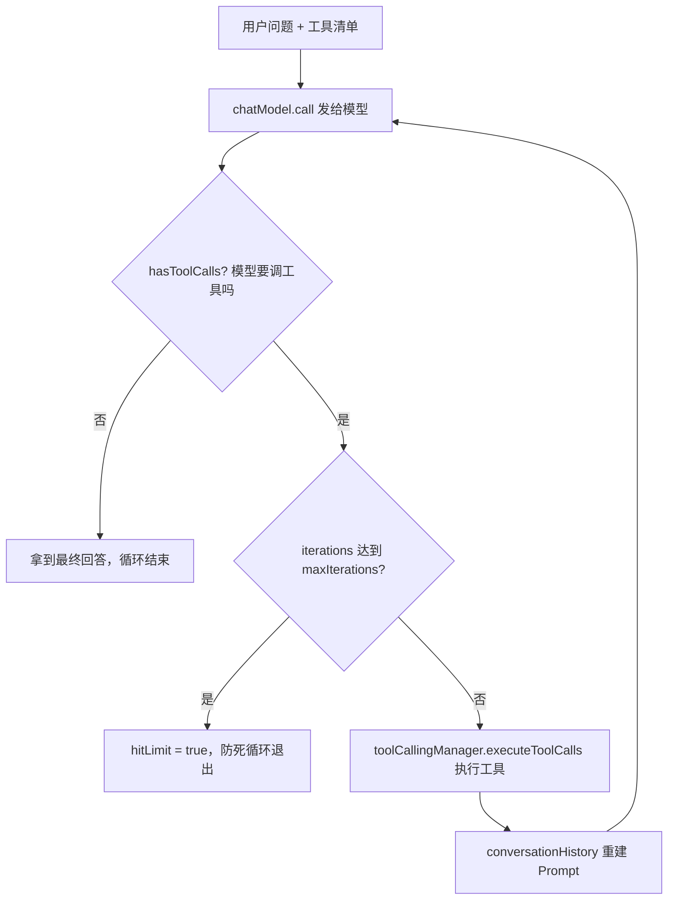
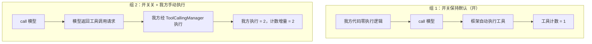
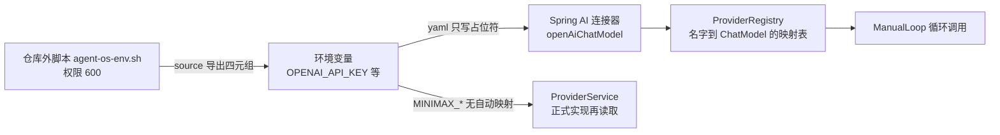

# 把工具执行权拿回代码里：手写 ReAct 循环的 8 项实证与版本主线定盘（提交 2a01bee）

> 读完你能带走什么：
>
> - 一套"不让框架替你执行工具"的手写 ReAct 循环：五步标准路径，以及防止同一个工具被执行两次的开关用法
> - 两个可以直接抄走的验证手法：A/B 对照实验证明"没有双执行"，确定性夹具加计数断言证明"严格串行"
> - 一份多模型接入的落地三件套：双 BOM 依赖坐标、按名字映射模型实例、密钥环境变量四元组
> - 四个已经踩过的坑：`/v1` 双写 404、同类型双 Bean 注入歧义、`<think>` 思考标签混进正文、source 与直接执行脚本的差别

## 1. 变更全貌

结论先行：本提交把两个此前只有文档论据的问题——"选哪条 Spring AI 版本线""手写 ReAct 循环走不走得通"——升级成了可复跑的代码证据，并且一次带回三项配套产出：版本主线决议改写、模型接入环境变量设计定稿入库、全套文档同步。

项目背景一句话：AgentOS 是一个 Java 写成的 Agent 运行时，设计上要求**自研 ReAct 循环**（ReAct 循环的解释见第 2.1 节），不使用框架自带的 Agent 抽象；Spring AI 只被借用模型连接接口与工具描述生成两项能力，工具的实际执行必须由项目代码接管。

**Spike**（调研实验）是本次工作的形式：写正式代码前，用独立的小项目实际跑代码来验证技术方案——这个定义来自本次新增的 [spike/CLAUDE.md](https://github.com/fangkun119/agent-os-poc/commit/2a01bee7f87576b10077ab32af5571254aeb510a/spike/CLAUDE.md)。本次 spike 编号 007，主题 react-loop，实验代号为 E1 到 E8，八项全部通过（结论文件 [README.md](https://github.com/fangkun119/agent-os-poc/commit/2a01bee7f87576b10077ab32af5571254aeb510a/spike/007-react-loop/README.md)）。

全部改动来自提交 [2a01bee](https://github.com/fangkun119/agent-os-poc/commit/2a01bee7f87576b10077ab32af5571254aeb510a)（提交日期 2026-09-09）：30 个文件，新增 1823 行、删除 29 行。文件按功能分组如下，下表"文件"列的链接直达本提交中对应文件的改动页：

| 档 | 分组 | 文件 | 规模 | 提交 |
|---|---|---|---|---|
| 核心 | 实验主代码 | [ManualLoop.java](https://github.com/fangkun119/agent-os-poc/commit/2a01bee7f87576b10077ab32af5571254aeb510a/spike/007-react-loop/src/main/java/spike/reactloop/loop/ManualLoop.java) 93 行、[ChainTools.java](https://github.com/fangkun119/agent-os-poc/commit/2a01bee7f87576b10077ab32af5571254aeb510a/spike/007-react-loop/src/main/java/spike/reactloop/tool/ChainTools.java) 56 行、[CountingTools.java](https://github.com/fangkun119/agent-os-poc/commit/2a01bee7f87576b10077ab32af5571254aeb510a/spike/007-react-loop/src/main/java/spike/reactloop/tool/CountingTools.java) 50 行、[ProviderRegistry.java](https://github.com/fangkun119/agent-os-poc/commit/2a01bee7f87576b10077ab32af5571254aeb510a/spike/007-react-loop/src/main/java/spike/reactloop/provider/ProviderRegistry.java) 22 行、[ThinkStripper.java](https://github.com/fangkun119/agent-os-poc/commit/2a01bee7f87576b10077ab32af5571254aeb510a/spike/007-react-loop/src/main/java/spike/reactloop/util/ThinkStripper.java) 18 行、[LoopResult.java](https://github.com/fangkun119/agent-os-poc/commit/2a01bee7f87576b10077ab32af5571254aeb510a/spike/007-react-loop/src/main/java/spike/reactloop/loop/LoopResult.java) 16 行、[application.yaml](https://github.com/fangkun119/agent-os-poc/commit/2a01bee7f87576b10077ab32af5571254aeb510a/spike/007-react-loop/src/main/resources/application.yaml) 16 行 | +271 | [2a01bee](https://github.com/fangkun119/agent-os-poc/commit/2a01bee7f87576b10077ab32af5571254aeb510a) |
| 核心 | 对照实验测试（7 个） | [E3AutoExecComparisonTest.java](https://github.com/fangkun119/agent-os-poc/commit/2a01bee7f87576b10077ab32af5571254aeb510a/spike/007-react-loop/src/test/java/spike/reactloop/E3AutoExecComparisonTest.java) 94 行、E8 57 行、E5 55 行、E6 53 行、E4 51 行、E7 50 行、E1E2 34 行 | +394 | [2a01bee](https://github.com/fangkun119/agent-os-poc/commit/2a01bee7f87576b10077ab32af5571254aeb510a) |
| 核心 | 依赖坐标（工程清单） | [pom.xml](https://github.com/fangkun119/agent-os-poc/commit/2a01bee7f87576b10077ab32af5571254aeb510a/spike/007-react-loop/pom.xml) | +78 | [2a01bee](https://github.com/fangkun119/agent-os-poc/commit/2a01bee7f87576b10077ab32af5571254aeb510a) |
| 核心 | 模型接入设计定稿 | [model-config.md](https://github.com/fangkun119/agent-os-poc/commit/2a01bee7f87576b10077ab32af5571254aeb510a/docs/design/detail-supplement/001-model-config-export.md) | +345 | [2a01bee](https://github.com/fangkun119/agent-os-poc/commit/2a01bee7f87576b10077ab32af5571254aeb510a) |
| 次要 | 实验结论与规格 | [README.md](https://github.com/fangkun119/agent-os-poc/commit/2a01bee7f87576b10077ab32af5571254aeb510a/spike/007-react-loop/README.md) 71 行、spec/001-expirement.md 212 行、spec/002-spec.md 192 行、spec/003-plan.md 136 行 | +611 | [2a01bee](https://github.com/fangkun119/agent-os-poc/commit/2a01bee7f87576b10077ab32af5571254aeb510a) |
| 次要 | 文档联动 | [001-tech-review-based-on-requirement.md](https://github.com/fangkun119/agent-os-poc/commit/2a01bee7f87576b10077ab32af5571254aeb510a/docs/review/001-tech-review-based-on-requirement.md) ±65、[CLAUDE.md](https://github.com/fangkun119/agent-os-poc/commit/2a01bee7f87576b10077ab32af5571254aeb510a/CLAUDE.md) ±18、[spike/CLAUDE.md](https://github.com/fangkun119/agent-os-poc/commit/2a01bee7f87576b10077ab32af5571254aeb510a/spike/CLAUDE.md) +22、[DemandAnalysis.md](https://github.com/fangkun119/agent-os-poc/commit/2a01bee7f87576b10077ab32af5571254aeb510a/docs/design/DemandAnalysis.md) ±11、[AiProgrammingGuide.md](https://github.com/fangkun119/agent-os-poc/commit/2a01bee7f87576b10077ab32af5571254aeb510a/docs/design/AiProgrammingGuide.md) ±8、[TechnicalSolution.md](https://github.com/fangkun119/agent-os-poc/commit/2a01bee7f87576b10077ab32af5571254aeb510a/docs/design/TechnicalSolution.md) ±8、[IndustryResearch.md](https://github.com/fangkun119/agent-os-poc/commit/2a01bee7f87576b10077ab32af5571254aeb510a/docs/design/IndustryResearch.md) ±2 | ±134 | [2a01bee](https://github.com/fangkun119/agent-os-poc/commit/2a01bee7f87576b10077ab32af5571254aeb510a) |
| 次要 | 忽略规则 | [根 .gitignore](https://github.com/fangkun119/agent-os-poc/commit/2a01bee7f87576b10077ab32af5571254aeb510a/.gitignore) +3、spike/007-react-loop/.gitignore +4 | +7 | [2a01bee](https://github.com/fangkun119/agent-os-poc/commit/2a01bee7f87576b10077ab32af5571254aeb510a) |
| 噪音 | 启动模板 | [SpikeApp.java](https://github.com/fangkun119/agent-os-poc/commit/2a01bee7f87576b10077ab32af5571254aeb510a/spike/007-react-loop/src/main/java/spike/reactloop/SpikeApp.java) | +12 | [2a01bee](https://github.com/fangkun119/agent-os-poc/commit/2a01bee7f87576b10077ab32af5571254aeb510a) |

四个核心变更各占一章（第 2 章到第 5 章）；次要变更在第 6 章合讲；SpikeApp.java 是 12 行的 Spring Boot 标准启动模板，零业务逻辑，只在本表点名、不再展开。

## 2. 核心变更一：手写 ReAct 循环——把工具执行权从框架拿回代码

结论先行：新增的 [ManualLoop.java](https://github.com/fangkun119/agent-os-poc/commit/2a01bee7f87576b10077ab32af5571254aeb510a/spike/007-react-loop/src/main/java/spike/reactloop/loop/ManualLoop.java)（93 行）用一条 while 循环实现了 ReAct 循环，并且靠一个开关关掉了框架的自动工具执行；执行权完整落在项目代码手里。E3 对照实验用两组数字证明了这条路径没有副作用。

### 2.1 为什么改：默认行为会让同一个工具被执行两次

**ReAct 循环**（Reasoning + Acting，推理加行动）是大模型应用里最核心的运转方式：模型先推理"我缺什么信息"，向程序发出**工具调用**（tool calling，把程序里的函数登记给模型，由模型决定何时调用并填参数）请求；程序执行函数，把结果塞回对话；模型基于结果继续推理——如此往复，直到给出最终回答。打个比方：你请一位助理办手续，助理说"我先查一下政策"，你去查、把结果念给助理听，助理接着往下办。模型是助理，你的程序是跑腿的人。

Spring AI 框架里，这条链路有一个默认行为：框架会替你自动执行工具。控制这个默认行为的是开关 **internalToolExecutionEnabled**（内部工具执行开关），默认是开的。

本项目的设计红线是关掉这个开关、自己写循环。你可能会问：框架都替你做好了，为什么反而要关掉自己写？本提交内的证据给出了答案：

1. [ManualLoop.java](https://github.com/fangkun119/agent-os-poc/commit/2a01bee7f87576b10077ab32af5571254aeb510a/spike/007-react-loop/src/main/java/spike/reactloop/loop/ManualLoop.java) 源码注释直接写着"第一红线：禁用框架自动执行"；
2. 提交信息写明验证目标是"开关闭止后无双执行"，也就是确保关掉开关之后，工具不会被框架和我方各执行一次；
3. 仓库根 [CLAUDE.md](https://github.com/fangkun119/agent-os-poc/commit/2a01bee7f87576b10077ab32af5571254aeb510a/CLAUDE.md) 非协商原则第 4 条写得更直白（原则条目本身非本提交改动）：自动执行开启会导致工具被调两次，项目里发现工具重复执行先查这条原则。

双执行的机理：框架自动执行一轮之后，我方循环拿到对话历史再执行一轮——同一个工具被调用两次，计数翻倍、日志重复、审计失真。对 AgentOS 来说还有第二层原因：循环每一步要落审计表、要按步计费，执行权不在自己手里就做不到。

### 2.2 改动走读：五步标准路径

ManualLoop 的核心是五步：构建带开关的选项 → 调模型 → 检查有没有工具调用请求 → 没有就结束、有就执行工具 → 用更新后的对话历史重建请求再调。涉及三个新名词：

- **ChatModel**：Spring AI 里代表"一条模型连接"的接口，call 方法收一个 Prompt（提示词加选项的请求对象）、返回一个 ChatResponse（响应对象）。
- **ToolCallback**：工具回调对象。方法上标注 **@Tool** 注解后，Spring AI 会按注解描述生成一份工具说明书（参数名、类型、描述的 JSON Schema），包装成 ToolCallback 交给模型。
- **ToolCallingManager**：Spring AI 里专职"执行工具、把结果拼回对话历史"的组件，本项目虽然禁用了自动执行，执行动作本身仍然借用这个组件完成。

先看循环本体，摘自 [ManualLoop.java](https://github.com/fangkun119/agent-os-poc/commit/2a01bee7f87576b10077ab32af5571254aeb510a/spike/007-react-loop/src/main/java/spike/reactloop/loop/ManualLoop.java) 的 run 方法（逐字摘录，省略处以注释标明）：

```java
ChatOptions options = ToolCallingChatOptions.builder()
        .toolCallbacks(toolCallbacks)
        .internalToolExecutionEnabled(false) // 第一红线：禁用框架自动执行
        .build();

Prompt prompt = new Prompt(userText, options);
ChatResponse response = null;
int iterations = 0;
boolean hitLimit = false;

while (true) {
    long start = System.nanoTime();
    response = chatModel.call(prompt);
    durationsMs.add((System.nanoTime() - start) / 1_000_000);
    iterations++;
    // ……省略：本轮 token 用量采集（usageSummaries）……
    if (!response.hasToolCalls()) {
        break; // 最终回答，循环结束
    }
    // ……省略：收集本轮工具名，追加进 toolCallRounds……
    if (iterations >= maxIterations) {
        hitLimit = true;
        break; // 迭代上限：防死循环（001 §4.3），不抛异常
    }

    var result = toolCallingManager.executeToolCalls(prompt, response);
    prompt = new Prompt(result.conversationHistory(), options);
}
```

整条链路画出来是这样：



两个值得注意的细节：

1. `conversationHistory()` 是 Spring AI 返回的完整对话历史（包含模型请求、工具执行结果），直接拿 conversationHistory() 的返回值重建下一轮 Prompt——这是官方文档的标准回灌路径，不需要手工拼消息。评审纪要 2.5 节（[001-tech-review-based-on-requirement.md](https://github.com/fangkun119/agent-os-poc/commit/2a01bee7f87576b10077ab32af5571254aeb510a/docs/review/001-tech-review-based-on-requirement.md)）记录了这层修正：原先设想的"手工构造 ToolResponseMessage"降级为文档允许但未示例的自定义路径。
2. 迭代上限防死循环：达到 `maxIterations` 时置 `hitLimit = true` 后退出、不抛异常，循环永远有底。

配套的 [LoopResult.java](https://github.com/fangkun119/agent-os-poc/commit/2a01bee7f87576b10077ab32af5571254aeb510a/spike/007-react-loop/src/main/java/spike/reactloop/loop/LoopResult.java)（16 行，Java record）是循环结果载体，逐轮记录四样东西：模型请求的工具名列表、每轮 token 用量（**usage**，一次调用消耗的输入/输出 token 数）、每轮毫秒耗时、是否触上限。这是为正式实现预埋的审计口径——一次模型调用对应一组用量加耗时，将来直接落审计表。

### 2.3 证据：E3 对照实验怎么证明"没有偷偷执行两次"

E3 的实验设计（[E3AutoExecComparisonTest.java](https://github.com/fangkun119/agent-os-poc/commit/2a01bee7f87576b10077ab32af5571254aeb510a/spike/007-react-loop/src/test/java/spike/reactloop/E3AutoExecComparisonTest.java)，94 行）是标准的 A/B 对照：



关键道具是夹具类 **CountingTools**（实验专用的确定性工具，固定返回、每次执行计数）：真实模型返回什么不可控，夹具让"工具被执行了几次"变成一个确定的数字。看 [CountingTools.java](https://github.com/fangkun119/agent-os-poc/commit/2a01bee7f87576b10077ab32af5571254aeb510a/spike/007-react-loop/src/main/java/spike/reactloop/tool/CountingTools.java) 里天气工具的写法：

```java
@Tool(description = "查询指定城市和日期的天气，返回固定内容")
public String getWeather(
        @ToolParam(description = "城市名，例如：北京") String city,
        @ToolParam(description = "日期，格式 yyyy-MM-dd") String date) {
    weatherCalls.incrementAndGet();
    lastArgs.put("city", city);
    lastArgs.put("date", date);
    return "晴，12°C";
}
```

`@ToolParam` 的 description（参数描述）是写给模型看的——模型靠这段话决定填什么值。E6 实验验证的就是这段描述够不够用，结果是第 1 次尝试即命中 `city=北京, date=2026-09-07`（见 [README.md](https://github.com/fangkun119/agent-os-poc/commit/2a01bee7f87576b10077ab32af5571254aeb510a/spike/007-react-loop/README.md) 打勾表）。

组 2 的断言只看两个数是否相等，摘自 [E3AutoExecComparisonTest.java](https://github.com/fangkun119/agent-os-poc/commit/2a01bee7f87576b10077ab32af5571254aeb510a/spike/007-react-loop/src/test/java/spike/reactloop/E3AutoExecComparisonTest.java)：

```java
int after = tools.totalCount();
// 判定：执行次数 = 我方执行的工具调用数（无双执行 = 框架侧计数贡献为 0）
assertThat(executedByUs).isGreaterThanOrEqualTo(1);
assertThat(after - before).isEqualTo(executedByUs);
```

实测结果（[README.md](https://github.com/fangkun119/agent-os-poc/commit/2a01bee7f87576b10077ab32af5571254aeb510a/spike/007-react-loop/README.md) 打勾表 E3 行）：组 1 工具计数=1——框架确实在自动执行；组 2 我方执行=2、计数增量=2——增量全部来自我方代码，框架侧贡献为 0，无双执行坐实。

### 2.4 其余实验：单工具、三步链、参数、用量

E4 到 E7 覆盖循环的其余关键行为，结论均出自 [README.md](https://github.com/fangkun119/agent-os-poc/commit/2a01bee7f87576b10077ab32af5571254aeb510a/spike/007-react-loop/README.md) 打勾表：

| 实验 | 验证什么 | 实测结果 |
|---|---|---|
| E4 单工具闭环 | 最简单的"问天气"两轮走通 | 2 轮迭代，工具请求轮次 `[getWeather]`，最终回答含"晴，12°C" |
| E5 多轮工具链 | 有依赖关系的工具按序执行 | `[getCity, getDate, getWeather2]` 三步严格串行，4 轮迭代，未触上限 |
| E6 参数填充 | 模型按参数描述填值 | 第 1 次尝试即命中 `city=北京, date=2026-09-07` |
| E7 用量与耗时 | 一次调用对应一组数据 | usages=[in=359,out=115, in=494,out=74]，durationsMs=[6063, 2750]（毫秒） |

E5 的夹具 **ChainTools**（[ChainTools.java](https://github.com/fangkun119/agent-os-poc/commit/2a01bee7f87576b10077ab32af5571254aeb510a/spike/007-react-loop/src/main/java/spike/reactloop/tool/ChainTools.java)，56 行）设计得比较巧：三个工具构成依赖链——查城市（getCity）返回"北京"、查日期（getDate）要拿城市做参数、查天气（getWeather2）要拿城市加日期做参数。模型跳步或并行乱猜，只会拿到"缺少参数，请先调用 getCity"这类引导文案。调用日志 `getCity,getDate,getWeather2` 严格串行，就证明模型老老实实按依赖顺序走了。

E5 还留下一条诚实的失败记录（README"失败与修复记录"第 2 条）：首跑断言失败——工具链行为完全正确，但模型最终回答只汇总了第三步结果，没带城市和日期。修复办法是把提示词硬化为"最终回答必须同时包含三项信息"。归因是断言与提示词设计问题，不是框架问题。

E7 的数字对正式实现最有用：一次模型调用稳定对应一组（用量，耗时），审计表按这个口径落库即可对齐。

### 2.5 影响什么

1. **决议 D3 落定**：手动循环五步路径实证成立。正式实现时 ReActLoop 与 ToolExecutor 两个类按 ManualLoop 的路径重写——README 明确写"不拷代码，spike 已封存"，实验代码只做参照。
2. **审计口径确定**：LoopResult 的逐轮采集直接对应正式实现的 llm_calls 审计表（README"结论 → 正式实现落点"表）。
3. **仓库导航加速**：根 [CLAUDE.md](https://github.com/fangkun119/agent-os-poc/commit/2a01bee7f87576b10077ab32af5571254aeb510a/CLAUDE.md) 新增一行指针——正式实现 Provider 与 ReAct 前，先读 spike/007-react-loop/README.md 的 D1-D4 决议。

## 3. 核心变更二：Provider 显式映射——一次注入失败换来的实证

结论先行：新增的 [ProviderRegistry.java](https://github.com/fangkun119/agent-os-poc/commit/2a01bee7f87576b10077ab32af5571254aeb510a/spike/007-react-loop/src/main/java/spike/reactloop/provider/ProviderRegistry.java)（22 行）确立了"按名字取模型连接"的模式；必要性不是推理出来的，而是 E3 首跑注入失败现场撞出来的。

### 3.1 为什么改：同类型的对象有两个，按类型注入必然失败

**Provider**（供应商接入通道）是本项目的自定义概念：一组"协议 + 端点 + 密钥 + 缺省模型"。当前只有 MiniMax 一家模型的账号，但 MiniMax 提供两种协议兼容端点——说 OpenAI 协议的、说 Anthropic 协议的——所以配置上长出两条腿：**OPENAI Provider**（缺省模型 MiniMax-M2.7）与 **ANTHROPIC Provider**（缺省模型 MiniMax-M3）。

两条腿在 Spring 容器里就是两个 **Bean**（Spring 容器创建并管理的对象），而且类型相同——都是 ChatModel。E3 首跑就栽在这里（README"失败与修复记录"第 1 条原话）：ChatModel 按类型注入失败——容器里有 openAiChatModel 与 anthropicChatModel 两个 Bean，Spring 不知道你要哪个。

你可能会问：Spring 不是会自动装配吗，怎么会失败？自动装配的前提是"按类型能唯一确定"。两个同类型 Bean 摆在那里，类型失去分辨力，必须按名字指定（**@Qualifier** 注解，按 Bean 名字挑选）。

修复过程本身成了最有说服力的证据：既然按类型找不到、必须按名字找，正式实现就把"名字到实例"的映射做成显式的一张表——E8 验证的 D4 决议由此而来。

### 3.2 改动走读：一张名字到实例的映射表

[ProviderRegistry.java](https://github.com/fangkun119/agent-os-poc/commit/2a01bee7f87576b10077ab32af5571254aeb510a/spike/007-react-loop/src/main/java/spike/reactloop/provider/ProviderRegistry.java) 全文（package 与 import 省略）：

```java
@Configuration
public class ProviderRegistry {

    @Bean
    public Map<String, ChatModel> providerRegistryMap(
            @Qualifier("openAiChatModel") ChatModel openAi,
            @Qualifier("anthropicChatModel") ChatModel anthropic) {
        return Map.of("openai", openAi, "anthropic", anthropic);
    }
}
```

要点就一条：容器里两个同类型 Bean，各按名字注入，再装进一个 Map——key 是小写 Provider 名，value 是对应实例。使用方一律 `providerRegistryMap.get("openai")` 按名取用，全程不出现"扫描容器里所有 ChatModel 再猜"这类隐式逻辑。E8 实测两条腿各自闭环跑通（README 打勾表 E8 行）。

E8 首跑还贡献了第二个失败记录（README 第 3 条）：`BeanDefinitionOverrideException`——配置类名与 Bean 方法名都叫 providerRegistry，Spring 判定为两个同名定义冲突。修复是方法改名 providerRegistryMap、测试按名注入。这条记录解释了代码里那个略显别扭的方法名从哪来。

### 3.3 影响什么

1. **决议 D4 落定**：正式实现的 ProviderService 按"Map<Provider 名, ChatModel>"显式映射实现（README"结论 → 正式实现落点"表）。
2. **红线有了现场证据**：评审纪要与设计文档里"禁止类型扫描 Bean"的约定，从此有 E3 首跑失败这个可指认的反例支撑。
3. **附带结论入档**：`spring.ai.anthropic.base-url` 属性经 E8 实测生效（第 4.2 节展开）。

## 4. 核心变更三：依赖坐标与配置接线——版本主线定盘 1.1.x

结论先行：[pom.xml](https://github.com/fangkun119/agent-os-poc/commit/2a01bee7f87576b10077ab32af5571254aeb510a/spike/007-react-loop/pom.xml) 与 [application.yaml](https://github.com/fangkun119/agent-os-poc/commit/2a01bee7f87576b10077ab32af5571254aeb510a/spike/007-react-loop/src/main/resources/application.yaml) 把版本主线从"Spring AI 1.0.x 加 Boot 3.4.x"切换为"Spring AI Alibaba 1.1.2.0 加 Spring AI 1.1.2 加 Boot 3.5.16"，同时定下了两条接线规则：双 BOM 引依赖、密钥只写环境变量占位符。

**Spring AI Alibaba**（下称 **SAA**）是建立在 Spring AI 之上的扩展，由阿里巴巴维护，价值在提供通义系模型连接实现与配套 BOM（评审纪要 8.1 节口径）。

### 4.1 为什么改：五条新证据推翻旧决议

旧决议（评审纪要 8.2 节原文）：锁定 Spring AI 1.0.x 加 SAA 1.0.0.2，因为 Spring AI 2.0 删掉了 internalToolExecutionEnabled 开关，会破坏"禁用自动执行"的设计；代价是 Boot parent 要从 3.5.16 降到 3.4.x，或实测兼容。

[001-tech-review-based-on-requirement.md](https://github.com/fangkun119/agent-os-poc/commit/2a01bee7f87576b10077ab32af5571254aeb510a/docs/review/001-tech-review-based-on-requirement.md) 新增的 2.6 节记录了改判的五条证据：

| # | 证据 | 出处 |
|---|---|---|
| 1 | SAA 官网版本页逐字写明"1.1.2.0（当前推荐）｜Spring AI 1.1.2｜Boot 3.5.x" | java2ai.com/docs/versions |
| 2 | 官方快速上手示例就是双 BOM：spring-ai-alibaba-bom 1.1.2.0 加 spring-ai-bom 1.1.2 | 同上 |
| 3 | SAA 仓库自述"built upon Spring Boot 3.5.x and Spring AI 1.1.x" | SAA 仓库 CLAUDE.md |
| 4 | Spring AI 1.1.8 文档确认 internalToolExecutionEnabled 存在、默认开，手动循环标准路径与 1.0.x 完全同构 | Spring AI v1.1.8 文档 |
| 5 | Maven 中央仓库在架：1.1.2.0 BOM 可下载，1.1.x 补丁已到 1.1.2.3，1.0.x 有 1.0.0.4 | repo1.maven.org |

三条线的去留就此定盘（评审纪要 8.2 与 R1 同步改写，R1 风险项标注"spike 实测后关闭"）：

| 线 | 组合 | 处置 |
|---|---|---|
| 主线 | SAA 1.1.2.0 + Spring AI 1.1.2 + Boot 3.5.16 | 采纳，E1-E8 全绿 |
| 对照线 | SAA 1.0.0.2 + Spring AI 1.0.x + Boot 3.4.x | 降为备选，仅当对照实验 E9 被触发时启用，优先 1.0.0.4 |
| 禁入 | Spring AI 2.0 线 | 开关已删除，`.internalToolExecutionEnabled(false)` 直接编译不过，禁入不变 |

评审纪要 2.5 节还给 2.0 留了一句公道话：自研 ReAct 循环的架构方向在 2.0 仍是官方支持的形态，将来升级只需删掉旧开关调用、换新路径，改动范围比原先预想的小。

### 4.2 改动走读：双 BOM 与两条接线规则

先看 [pom.xml](https://github.com/fangkun119/agent-os-poc/commit/2a01bee7f87576b10077ab32af5571254aeb510a/spike/007-react-loop/pom.xml) 的版本声明与 BOM 导入（逐字摘录，parent 块省略）：

```xml
<properties>
  <java.version>21</java.version>
  <spring-ai.version>1.1.2</spring-ai.version>
  <spring-ai-alibaba.version>1.1.2.0</spring-ai-alibaba.version>
</properties>

<dependencyManagement>
  <dependencies>
    <dependency>
      <groupId>org.springframework.ai</groupId>
      <artifactId>spring-ai-bom</artifactId>
      <version>${spring-ai.version}</version>
      <type>pom</type>
      <scope>import</scope>
    </dependency>
    <dependency>
      <groupId>com.alibaba.cloud.ai</groupId>
      <artifactId>spring-ai-alibaba-bom</artifactId>
      <version>${spring-ai-alibaba.version}</version>
      <type>pom</type>
      <scope>import</scope>
    </dependency>
  </dependencies>
</dependencyManagement>
```

**BOM**（Bill of Materials，物料清单）是一份只管版本的依赖清单：import 之后，清单里登记过的依赖都不用再写版本号。类比餐厅的进货价目表——后厨做菜（引依赖）时报菜名就行，不用每次问价。双 BOM 各管一摊：spring-ai-bom 管框架构件，spring-ai-alibaba-bom 管 SAA 构件。引入的依赖只有三个 starter（**starter**，Spring Boot 的开箱即用依赖包）：spring-ai-starter-model-openai、spring-ai-starter-model-anthropic，外加 test 范围的 spring-ai-alibaba-graph-core。

graph-core 这一条容易被看漏：scope 是 test，注释写明"只看依赖树解析版本，不 import 其类"——这是 E1 的探针手法。想知道 SAA 1.1.2.0 这条线解析出来的版本对不对，引一个 SAA 独有构件、看依赖树里落的是哪个版本号，1.1.2.0 出现即证明 BOM 仲裁生效，一行代码不用写。E1 实测：依赖树零冲突，graph-core 探针落 1.1.2.0，Boot 3.5.16 容器正常启动（[README.md](https://github.com/fangkun119/agent-os-poc/commit/2a01bee7f87576b10077ab32af5571254aeb510a/spike/007-react-loop/README.md) 打勾表 E1 行）。

再看 [application.yaml](https://github.com/fangkun119/agent-os-poc/commit/2a01bee7f87576b10077ab32af5571254aeb510a/spike/007-react-loop/src/main/resources/application.yaml)（16 行全文，逐字摘录）：

```yaml
spring:
  application:
    name: react-loop-spike
  ai:
    openai:
      api-key: ${OPENAI_API_KEY:placeholder}        # 密钥：环境变量，E1/E2 离线项可用占位默认值
      base-url: https://api.minimax.cn              # 非敏感：明文 yaml，不带 /v1（定稿 5.3）
      chat:
        options:
          model: ${OPENAI_DEFAULT_MODEL:MiniMax-M2.7}
    anthropic:
      api-key: ${ANTHROPIC_API_KEY:placeholder}
      base-url: https://api.minimaxi.com/anthropic  # 属性名未获文档确认，E8 实测（002 §6 开放项）
      chat:
        options:
          model: ${ANTHROPIC_DEFAULT_MODEL:MiniMax-M3}
```

`${OPENAI_API_KEY:placeholder}` 是**占位符**写法：冒号后面是缺省值，环境变量不存在时用 placeholder 顶上——这样 E1、E2 这类不起真实模型调用的离线实验也能启动容器。密钥的真实值永远不出现在仓库文件里，规则见第 5 章。

base-url 这两行藏着一个大坑。你可能会问：base-url 不就是接口地址吗，带不带 `/v1` 有什么关系？关系在于两类客户端的 URL 拼接习惯不同（定稿文档 5.3 节考证，出处 SAA 官方测试代码注释）：

- OpenAI 官方 SDK：base_url 带 `/v1`，SDK 只追加 `/chat/completions`；
- Spring AI 的 OpenAiApi：base-url 不带 `/v1`，框架自己追加完整的 `/v1/chat/completions`。

把带 `/v1` 的值直接映射给 Spring AI，拼出来就是 `/v1/v1/chat/completions`——路径重复，请求 404。所以规则定为：环境变量 `OPENAI_BASE_URL` 按 OpenAI SDK 惯例带 `/v1`（给 SDK 与 curl 用），Spring AI 的 yaml 里 base-url 明文写、不带 `/v1`。base-url 不是敏感信息，明文合规；只有密钥必须走环境变量。

anthropic 腿的 base-url 还有一层特别意义：`spring.ai.anthropic.base-url` 这个属性名在 Spring AI 文档页查不到（评审纪要记录了 3 次检索均未命中），只能按同构惯例先写 yaml 再实测。E8 实测属性生效——anthropic 腿成功闭环到 MiniMax 端点，没有出现请求打到 api.anthropic.com 的报错；"手动构造 AnthropicApi"的备选方案无需启用（README"附带实测结论"）。本提交与改写前版本的内容差异恰好就在这里：这条"实测生效"结论连同定稿文档里对应两行，是改写时回填的（详见第 8 章设计决策记录）。

### 4.3 影响什么

1. **决议 D1、D2 落定**：parent 保持 3.5.16 不动；正式实现第一周在 agentos-provider 模块按 D2 依赖坐标清单照单引入（README"结论 → 正式实现落点"表）。
2. **风险项关闭**：评审纪要 R1（Spring AI 版本与依赖引入风险）标注 2026-09-07 spike 实测后关闭。
3. **接线规则可复制**：双 BOM 加占位符加 base-url 规则，构成正式工程 pom 与 yaml 的直接模板。

## 5. 核心变更四：模型接入环境变量设计定稿

结论先行：新建的 [model-config.md](https://github.com/fangkun119/agent-os-poc/commit/2a01bee7f87576b10077ab32af5571254aeb510a/docs/design/detail-supplement/001-model-config-export.md)（345 行，定稿状态）把"密钥放哪、变量怎么起名、yaml 怎么写"三件事一次定死，核心是四元组命名加密钥唯一落点两条规则。

### 5.1 为什么改

现状是接入现实倒逼出来的：项目只有 MiniMax 账号，却要按两种协议接入（第 3.1 节的双腿来历）；同时密钥安全有硬约束——不进代码库、不进日志。此前的文档只有一句"敏感凭证经环境变量注入"，缺一份可执行的落地规则。这份定稿补的就是从"原则"到"操作手册"的空档。

### 5.2 改动走读：四元组、唯一落点、三级模型选择

**Provider 四元组**：一个 Provider 一组四个环境变量——密钥 `*_API_KEY`、端点 `*_BASE_URL`、缺省模型 `*_DEFAULT_MODEL`、可用模型清单 `*_MODEL_LIST`。现有 OPENAI、ANTHROPIC、MINIMAX 三个 Provider 并列、互不覆盖（编者注：此为提交 2a01bee 时点口径；2026-09-15 起 ZHIPU 转正，现行四家 OPENAI、ANTHROPIC、MINIMAX、ZHIPU 并列，见 TechnicalSolution.md - 3.2 Provider 名到 ChatModel 的显式映射）。model-config.md - 3.3 密钥占位示例 给出的注册区样例（逐字摘录，密钥以占位文本表示）：

```bash
OPENAI_API_KEY='<你的 API Key>'   # 当前值 = MiniMax 的 key（取值来源见 2.1 节）
OPENAI_BASE_URL='https://api.minimax.cn/v1'
OPENAI_DEFAULT_MODEL='MiniMax-M2.7'
OPENAI_MODEL_LIST='MiniMax-M3,MiniMax-M2.7,MiniMax-M2.7-highspeed'
```

注意 OPENAI_* 这组变量的"取值来源"是 MiniMax 的兼容端点——文档 0.x 术语表管这叫**兼容腿**：Provider 名字表达的是"接入哪个协议"，与背后是哪家供应商解耦。好处是将来拿到原生 OpenAI 账号，直接改脚本注册区四个值即可，变量名与代码零改动。

**密钥唯一落点**：真实密钥在磁盘上只存在一处——仓库外的脚本 `~/.agent-os-poc/script/agent-os-env.sh`，权限 600（仅本人可读写）。你可能会问：密钥写进配置文件不是最省事吗？定稿文档第 1 节把这条路堵死了，理由是防泄密：配置文件会进 git 仓库、会被日志打印，泄漏面不可控。配套三条细则：

1. 仓库内任何文件只允许写 `${环境变量名}` 占位符（第 4.2 节的 yaml 已示范）；
2. 日志与命令行最多输出密钥前 5 位前缀（如 `sk-cp***`）；
3. 加载必须用 **source** 命令、不能直接执行——source 是在当前 shell 里逐条执行脚本内容，export 的变量留在当前终端；直接执行会开一个子进程，变量随子进程退出而消失，等于白加载。

从脚本到模型实例的完整链路：



> 编者注：图中 “MINIMAX_* 无自动映射、ProviderService 正式实现再读取” 为提交时点口径；2026-09-15 起 MiniMax 走原生 minimax starter（spring-ai-starter-model-minimax），MINIMAX_* 经 spring.ai.minimax.* 属性族自动映射（spike/007-react-loop/README.md D5 决议，2026-09-15 执行），正式实现不再手工读取。

**三级模型选择**（定稿文档 5.2 节）：Provider 与 model 是两个维度，同一个模型连接可以服务多个模型。选哪只模型有三层，从静到动：

| 级 | 谁决定 | 配置位置 |
|---|---|---|
| 1. Provider 缺省 | 部署方 | 环境变量 `*_DEFAULT_MODEL`，写入连接实例缺省选项 |
| 2. Agent 覆盖 | Agent 作者 | AGENT.md frontmatter 的 settings.model，派生进 Profile 后每次调用带上 |
| 3. 运行时动态 | 独立路由组件 | 按任务特征、成本、可用性输出选择，写入每次调用的 options |

所以 `*_MODEL_LIST` 的用途边界很窄：只做校验（防写错模型名）与发现（看这家能跑什么）。运行时切换模型靠每次调用的 options 参数，不靠环境变量——第 4.2 节 yaml 里的 `${OPENAI_DEFAULT_MODEL:MiniMax-M2.7}` 就是第 1 级的落点。

### 5.3 影响什么

1. **CLAUDE.md 红线节重写**：根 [CLAUDE.md](https://github.com/fangkun119/agent-os-poc/commit/2a01bee7f87576b10077ab32af5571254aeb510a/CLAUDE.md) 的"模型接入环境变量"一节按定稿全文重写，含 `/v1` 双写警告。
2. **四份设计文档同步**：DemandAnalysis 补环境变量注记与验收措辞、TechnicalSolution 改写 Provider 配置与 ConfigLoader 两个模块的描述、AiProgrammingGuide 更新实施示例、IndustryResearch 的凭证原则补落地规则——改动都是补引用与收紧措辞，不动结构。
3. **ConfigLoader 有了实现依据**：密钥只从环境变量读取、非敏感配置明文写 yaml、日志只出 5 位前缀，三类规则在 TechnicalSolution 的 ConfigLoader 模块条目里全部落字。

## 6. 次要变更合讲

结论先行：其余 13 个文件分四类——实验的过程文档、仓库规则、文档联动、忽略规则，都服务于"结论可追溯"这一个目的。

| 文件 | 规模 | 一句话说明 |
|---|---|---|
| [ThinkStripper.java](https://github.com/fangkun119/agent-os-poc/commit/2a01bee7f87576b10077ab32af5571254aeb510a/spike/007-react-loop/src/main/java/spike/reactloop/util/ThinkStripper.java) | +18 | 剥离思考标签的 18 行工具类。MiniMax-M3 会把思考过程混在回答文本的 `<think>...</think>` 标签里（README"附带实测结论"），断言前必须先用正则 `(?s)<think>.*?</think>` 剥掉（仅限 spike 测试断言场景）；正式实现核心阶段对思考标签原样透传、不剥离（ProviderService 出口后处理边界，2026-09 裁决，见 docs/design/TechnicalSolution.md §3.1"响应文本后处理边界（决策记录）"），W1 实测输出形态后再决定是否引入剥离 |
| [README.md](https://github.com/fangkun119/agent-os-poc/commit/2a01bee7f87576b10077ab32af5571254aeb510a/spike/007-react-loop/README.md) | +71 | 实验结论落盘：E1-E8 打勾表、D1-D4 四项决议、失败与修复记录 3 条、结论到正式实现落点的映射表 |
| [spec/001-expirement.md](https://github.com/fangkun119/agent-os-poc/commit/2a01bee7f87576b10077ab32af5571254aeb510a/spike/007-react-loop/spec/001-expirement.md) | +212 | 实验流程规格：每个实验的目标、步骤、判定标准（文件名为仓库既有拼写，按实名引用） |
| [spec/002-spec.md](https://github.com/fangkun119/agent-os-poc/commit/2a01bee7f87576b10077ab32af5571254aeb510a/spike/007-react-loop/spec/002-spec.md) | +192 | spike 代码规格：ManualLoop 五步路径、夹具设计、Provider 映射的依据出处 |
| [spec/003-plan.md](https://github.com/fangkun119/agent-os-poc/commit/2a01bee7f87576b10077ab32af5571254aeb510a/spike/007-react-loop/spec/003-plan.md) | +136 | 任务计划：实验执行顺序与产出物 |
| [spike/CLAUDE.md](https://github.com/fangkun119/agent-os-poc/commit/2a01bee7f87576b10077ab32af5571254aeb510a/spike/CLAUDE.md) | +22 | spike 区规则：独立 Maven 工程、pom 永不进根 modules、结论必须写 README |
| [001-tech-review-based-on-requirement.md](https://github.com/fangkun119/agent-os-poc/commit/2a01bee7f87576b10077ab32af5571254aeb510a/docs/review/001-tech-review-based-on-requirement.md) | ±65 | 新增 2.5 节（文档复核修正 6 条）与 2.6 节（版本主线决议变更，5 条证据）；R1 风险关闭；8.2 选型表同步 |
| [CLAUDE.md](https://github.com/fangkun119/agent-os-poc/commit/2a01bee7f87576b10077ab32af5571254aeb510a/CLAUDE.md) | ±18 | 新增"Spike 结论指针"一行；"模型接入环境变量"节按定稿重写 |
| [DemandAnalysis.md](https://github.com/fangkun119/agent-os-poc/commit/2a01bee7f87576b10077ab32af5571254aeb510a/docs/design/DemandAnalysis.md) / [AiProgrammingGuide.md](https://github.com/fangkun119/agent-os-poc/commit/2a01bee7f87576b10077ab32af5571254aeb510a/docs/design/AiProgrammingGuide.md) / [TechnicalSolution.md](https://github.com/fangkun119/agent-os-poc/commit/2a01bee7f87576b10077ab32af5571254aeb510a/docs/design/TechnicalSolution.md) / [IndustryResearch.md](https://github.com/fangkun119/agent-os-poc/commit/2a01bee7f87576b10077ab32af5571254aeb510a/docs/design/IndustryResearch.md) | ±29 | 四份文档补 Provider 命名规则、spike 结论引用、密钥红线细则（每份 2-11 行，均为措辞收紧与引用补充） |
| 根 [.gitignore](https://github.com/fangkun119/agent-os-poc/commit/2a01bee7f87576b10077ab32af5571254aeb510a/.gitignore) / spike/007-react-loop/.gitignore | +7 | 忽略 logs/（实验日志不进仓库）与 docs/**/workspace/（文档工作区不进仓库） |
| [SpikeApp.java](https://github.com/fangkun119/agent-os-poc/commit/2a01bee7f87576b10077ab32af5571254aeb510a/spike/007-react-loop/src/main/java/spike/reactloop/SpikeApp.java) | +12 | Spring Boot 标准启动类，模板代码，噪音档 |

值得单独一提的是 README 里的"失败与修复记录"：E3 首跑注入失败、E5 首跑断言失败、E8 首跑 Bean 撞名——三条失败全部留档并写明归因。这个习惯让后来者能分辨"哪条结论是被失败逼出来的"（比如 D4），比一排全绿的打勾表值钱。

## 7. 收尾：学到什么、怎么迁移

本次变更能带走的，按可迁移程度排：

1. **验证手法（最通用）**：当你要确认"框架行为与我方预期是否一致"时，抄这套组合——确定性夹具（固定返回加执行计数）把不可控的真实模型输出变成确定数字；A/B 对照（开关开一组、关一组）隔离出单一变量；断言只盯等式（计数增量等于我方执行数）。E3 的 94 行测试就是完整样板。
2. **手写循环五步路径（Spring AI 1.x 项目通用）**：`internalToolExecutionEnabled(false)` 构建 ToolCallingChatOptions → `new Prompt(text, options)` → `call` → `hasToolCalls()` 判断 → `executeToolCalls` 加 `conversationHistory()` 重建再调。官方标准路径，不是绕过框架的歪招。
3. **接入三件套（多模型项目通用）**：依赖用双 BOM 管（框架清单加扩展清单各管一摊）；实例用名字映射表（同类型多 Bean 时按类型注入必然失败）；密钥用环境变量四元组（仓库外唯一落点，yaml 只写占位符）。
4. **坑位清单（提前避开省半天）**：base-url 带 `/v1` 会在 Spring AI 侧拼出 `/v1/v1` 双写 404；思考型模型的 `<think>` 标签会混进正文，比对前先剥；环境变量脚本必须 source 不能直接执行；文档查不到的配置属性（如 anthropic 的 base-url）按同构惯例写上再实测，而不是放弃。

迁移时的版本注意：五步路径与开关在 Spring AI 1.0.x 与 1.1.x 都成立；2.0 已删除开关，届时按评审纪要 2.5 节记录的两条迁移路径改写。

## 8. 设计决策记录

1. **核心四组的圈定依据**：实验主代码、对照实验测试、pom.xml、模型接入设计定稿四组承担了本提交的全部新结论（D1-D4、接线规则、密钥规则）；README、spec 三件套、评审纪要属"结论与过程记录"，作为证据来源引用、不开节深讲；SpikeApp.java 归噪音（12 行 Spring Boot 标准启动模板，零业务逻辑），仅在全貌表点名。
2. **测试文件未逐个深读**：E1E2、E4、E5、E6、E7、E8 六个测试文件按主题合并处理，实验结论一律取自提交内文件 spike/007-react-loop/README.md 的打勾表（每行都标了日志文件出处）。深读按 8 个主题批次执行：主代码、pom 加 yaml、E3 加夹具、README、模型接入定稿、CLAUDE.md 批、四份设计文档批、评审纪要批，符合深读上限。
3. **提交改写的事实核对**：本篇基准 2a01bee 是原 spike 闭环提交 6c20e8e 的改写版。git 实测（`git diff 6c20e8e 2a01bee`）：两提交内容仅差 2 个文件、+4/-4 行——docs/design/detail/model-config.md 的 2.3 节表格两行与 5.5 节事实表第 8 行、spike/007-react-loop/spec/001-expirement.md 的 4.2 节第 ③ 条，改动方向一致：`spring.ai.anthropic.base-url` 属性从"待实测、复核中"改为"E8 实测生效、备选方案无需启用"。6c20e8e 已不在当前分支历史（2a01bee 的父提交是 d3ea9a3）。既有教程 chat/tutorials/20260908_spike_react_loop.md 覆盖的是旧哈希 6c20e8e；本篇以 2a01bee 为基准重写，第 4.2 节的"实测生效"闭环结论即为两版差异点。
4. **日期口径**：提交（commit）日期 2026-09-09 16:14:47 +0800 是本次圈定依据；作者（author）日期 2026-09-07 17:33:27 +0800 与 README 自述"执行日期 2026-09-07"一致——实验执行于 9 月 7 日，改写提交落盘于 9 月 9 日。文内"2026-09-09 的提交"均指提交日期。
5. **代码片段政策**：全文 7 个代码块全部逐字取自提交内文件，省略处以"……省略……"注释标明；最长一块为 ManualLoop 循环本体 26 行，无超过 30 行的块。
6. **术语口径**：SAA 首次出现声明为 Spring AI Alibaba；"兼容腿"沿用定稿文档 0.x 术语表自带的口语简称并在首次出现处解释；spec/001-expirement.md 的文件名拼写（expirement）为仓库既有状态，按实名引用、不擅自更正。
7. **动机来源边界**：禁用自动执行的双执行机理，以提交信息（"开关闭止后无双执行"）、ManualLoop 源码注释（"第一红线：禁用框架自动执行"）、E3 测试注释与本提交新增的 CLAUDE.md 行为界；仓库根 CLAUDE.md"工具被调两次"的既有表述已注明非本提交改动。
8. **编者注（2026-09-22，非本提交内容）**：本文 yaml 片段（4.2 节）两处随后续实测/裁决过时——① `api.minimaxi.com/anthropic` 为国际站域名，2026-09-14 已统一改用国内站 `api.minimax.cn/anthropic`；② 片段行内注释「属性名未获文档确认」已过时，`spring.ai.anthropic.base-url` 属性名经 2026-09-07 E8 实测确认生效（见 docs/design/detail/model-config.md §5.5 第 8 条）。照抄配置时以现行口径为准。
